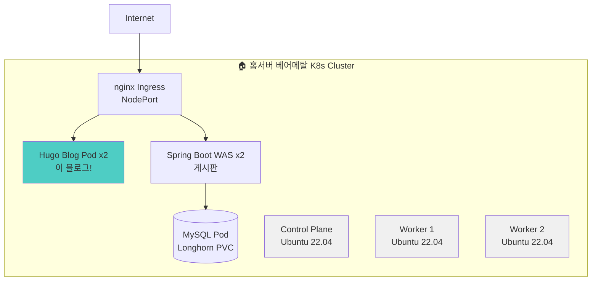
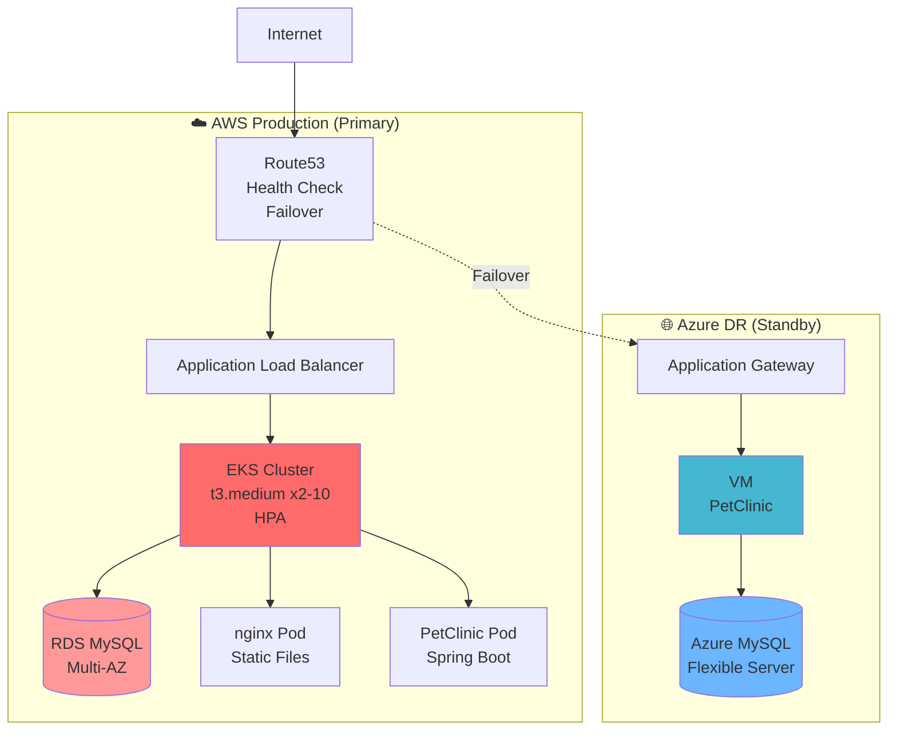

# 인프라 아키텍처 Overview

> **두 개의 독립적인 프로젝트를 운영 중입니다**

---

## 🎯 프로젝트 구분

### Project 1: 홈서버 Kubernetes (이 블로그)

```
목적: 베어메탈 K8s 학습 + 블로그 운영
환경: 홈서버 (3노드 클러스터)
애플리케이션: Hugo 블로그 + Spring Boot 게시판
비용: 무료 (전기료만)
운영: 54일+
```

### Project 2: AWS EKS + Azure DR (PetClinic)

```
목적: 프로덕션급 HA + Multi-Cloud DR 구축
환경: AWS EKS + Azure (Failover)
애플리케이션: PetClinic (샘플 앱)
비용: $258/월
운영: 90일+
```

**핵심:** 이 두 프로젝트는 **서로 연결되어 있지 않습니다**. 각각 다른 학습 목적으로 독립적으로 운영 중입니다.

---

## 🏠 Project 1: 홈서버 Kubernetes Cluster

### 아키텍처



### 클러스터 구성

| 컴포넌트 | 세부 사항 |
|---------|----------|
| **노드 구성** | Control Plane 1개 + Worker 2개 (총 3노드) |
| **OS** | Ubuntu 22.04 LTS |
| **K8s 버전** | v1.31.13 |
| **Container Runtime** | containerd 2.1.5 |
| **CNI** | Cilium (eBPF 기반) |
| **Storage** | Longhorn (3-replica 분산 스토리지) |
| **Ingress** | nginx-ingress |
| **Monitoring** | Prometheus + Grafana |
| **운영 기간** | 54일 (무중단) |

### 블로그 시스템 구조

```
┌─────────────────────────────────────────────┐
│      Namespace: blog-system                 │
├─────────────────────────────────────────────┤
│                                             │
│  [nginx Ingress]                            │
│    ↓                                        │
│  Path Routing:                              │
│    /       → WEB Service (Hugo 블로그)      │
│    /board  → WAS Service (Spring Boot)     │
│                                             │
│  ┌─────────────────┐  ┌─────────────────┐ │
│  │ WEB Pod x2      │  │ WAS Pod x2      │ │
│  │ nginx:alpine    │  │ Spring Boot 3.2 │ │
│  │ Hugo static     │  │ 게시판 CRUD     │ │
│  └─────────────────┘  └────────┬────────┘ │
│                                 │          │
│                        ┌────────▼────────┐ │
│                        │ MySQL Pod       │ │
│                        │ Longhorn PVC    │ │
│                        └─────────────────┘ │
└─────────────────────────────────────────────┘
```

### 운영 워크로드 (현재)

| Pod | Replicas | 상태 | 운영 시간 |
|-----|----------|------|----------|
| **WEB** (Hugo 블로그) | 2 | 🟢 Running | 2시간+ |
| **WAS** (Spring Boot) | 2 | 🟢 Running | 6시간+ |
| **MySQL** | 1 | 🟢 Running | 21시간+ |

### 왜 홈서버 K8s를 구축했나?

**배울 수 있는 것:**
- ✅ **베어메탈 클러스터 구축** (kubeadm)
- ✅ **CNI 직접 설치/관리** (Cilium)
- ✅ **분산 스토리지 구축** (Longhorn)
- ✅ **Ingress Controller 설치** (nginx)
- ✅ **실제 서비스 운영** (이 블로그!)

**장점:**
- 💰 **비용 무료** (전기료만)
- 🔧 **완전한 제어** (모든 레이어 직접 관리)
- 📚 **무한 실습** (언제든 재구축 가능)
- 🚨 **진짜 트러블슈팅** (장애 발생 시 직접 해결)

**단점:**
- ⚠️ 단일 장애점 (하드웨어 고장 시 다운)
- ⚠️ 외부 접속 제한 (NAT, 방화벽)
- ⚠️ 관리 부담 (업데이트, 백업 직접)

---

## ☁️ Project 2: AWS EKS + Azure DR

### 아키텍처



### 인프라 구성

#### AWS (Primary)

| 컴포넌트 | 세부 사항 |
|---------|----------|
| **Region** | ap-northeast-2 (Seoul) |
| **EKS 버전** | v1.31 |
| **Node Group** | t3.medium x2-10 (HPA) |
| **VPC** | 10.0.0.0/16 (Public/Private Subnet) |
| **Database** | RDS MySQL (Multi-AZ) |
| **Networking** | VPC CNI, ALB Ingress |
| **GitOps** | ArgoCD |
| **Deployment** | Canary (Argo Rollouts) |
| **Monitoring** | CloudWatch + Prometheus |

#### Azure (DR Standby)

| 컴포넌트 | 세부 사항 |
|---------|----------|
| **Region** | Korea Central |
| **Compute** | VM (PetClinic 수동 배포) |
| **Database** | Azure Database for MySQL (Flexible Server) |
| **Networking** | VNet + Application Gateway |
| **Failover** | Route53 Health Check (자동) |
| **RTO** | 3시간 |
| **RPO** | 24시간 |

### 왜 AWS EKS + Azure DR을 구축했나?

**목적:**
- ✅ **프로덕션급 HA 구축** (99.9% 가용성)
- ✅ **Multi-Cloud DR 경험** (AWS → Azure Failover)
- ✅ **GitOps 자동화** (ArgoCD + Canary)
- ✅ **관리형 K8s 경험** (EKS)

**장점:**
- 🔥 **높은 가용성** (Multi-AZ + DR)
- 🚀 **관리 편리** (EKS가 Control Plane 관리)
- 🔧 **Auto Scaling** (HPA, Node Auto Scaling)
- 📊 **통합 모니터링** (CloudWatch)

**단점:**
- 💸 **비용 높음** ($258/월)
- 🔒 **AWS 종속성**
- ⚠️ **제약 사항** (Control Plane 접근 불가)

---

## 📊 두 프로젝트 비교

### 핵심 차이점

| 항목 | 🏠 홈서버 K8s | ☁️ AWS EKS + Azure DR |
|------|--------------|---------------------|
| **목적** | 베어메탈 K8s 학습 + 블로그 | 프로덕션 HA + Multi-Cloud |
| **환경** | 홈서버 (3노드) | AWS EKS + Azure |
| **애플리케이션** | Hugo 블로그 + 게시판 | PetClinic (샘플) |
| **관리 방식** | 직접 구축/관리 | 관리형 (EKS) |
| **비용** | 무료 (전기료) | $258/월 |
| **가용성** | 단일 클러스터 | 99.9% (Multi-Cloud) |
| **배포 방식** | Rolling Update | Canary (Argo Rollouts) |
| **스토리지** | Longhorn (직접 구축) | EBS (자동) |
| **CNI** | Cilium (직접 설치) | VPC CNI (자동) |
| **Ingress** | nginx (직접 설치) | ALB (자동 생성) |
| **운영 기간** | 54일 | 90일+ |

---

## ⚖️ 트레이드오프 분석

### 1. 비용 vs 제어

**홈서버 K8s:**
```
비용: 무료 (전기료만)
제어: 100% (모든 레이어 직접 관리)
→ 학습에 최적
```

**AWS EKS:**
```
비용: $258/월
제어: 제한적 (Control Plane 접근 불가)
→ 프로덕션에 최적
```

### 2. 학습 경험

**홈서버에서만 배울 수 있는 것:**
- kubeadm으로 클러스터 초기화
- CNI 플러그인 선택/설치 (Cilium, Calico 등)
- 스토리지 직접 구축 (Longhorn, Ceph)
- 네트워크 트러블슈팅 (MetalLB, NodePort)
- 하드웨어 리소스 관리

**EKS에서만 배울 수 있는 것:**
- 관리형 K8s 운영 경험
- AWS 서비스 통합 (ALB, EBS, IAM)
- Multi-Cloud 아키텍처 (DR)
- 프로덕션급 HA 설계
- Cost 최적화 (Spot Instance, Karpenter)

### 3. 운영 복잡도

| 작업 | 홈서버 K8s | AWS EKS |
|------|-----------|---------|
| **클러스터 구축** | 어려움 (수동) | 쉬움 (자동) |
| **업그레이드** | 위험함 (직접) | 안전함 (관리형) |
| **백업** | 직접 구현 | 통합 지원 |
| **모니터링** | 직접 구축 | CloudWatch 통합 |
| **장애 대응** | 직접 해결 | AWS Support |

---

## 🎓 배운 것들

### 홈서버 K8s 운영에서

1. **베어메탈의 어려움**
   - CNI 선택이 성능에 큰 영향
   - 스토리지 설계 실수 시 재구축 필요
   - 네트워크 설정 복잡 (MetalLB, NodePort)

2. **하지만 진짜 이해**
   - K8s가 내부적으로 어떻게 작동하는지
   - Pod 간 통신 원리 (CNI)
   - 스토리지 PV/PVC 바인딩 과정

3. **트러블슈팅 경험**
   - Longhorn PVC 삭제 안 되는 문제
   - containerd 설정 오류
   - Prometheus 메트릭 수집 실패

### AWS EKS + Azure DR 운영에서

1. **관리형의 편리함**
   - Control Plane 걱정 없음
   - Load Balancer 자동 생성
   - Auto Scaling 간편

2. **하지만 제약**
   - AWS 종속성 증가
   - Control Plane 접근 불가
   - 비용 예측 어려움

3. **Multi-Cloud의 복잡성**
   - DR 테스트의 중요성
   - 데이터 동기화 어려움
   - 네트워크 레이턴시

---

## 🚀 향후 계획

### 홈서버 K8s (단기)

- ⏳ Jenkins CI/CD 완성
- ⏳ Cloudflare Tunnel 연동
- 📋 Backup 자동화 (Velero)
- 📋 Monitoring Dashboard 개선

### 홈서버 K8s (중기 - Homelab 확장)

**추가 서비스 배포:**
- Nextcloud (파일 저장소)
- Vaultwarden (비밀번호 관리)
- Gitea (Self-hosted Git)
- MinIO (Object Storage)
- Harbor (Container Registry)

**목표:** 집 전체를 Kubernetes로! 🏠

### AWS EKS (완료/유지)

- ✅ 99.9% 가용성 달성
- ✅ Canary 배포 구현
- ✅ Multi-Cloud DR 구축
- 📋 Cost 최적화 (Karpenter, Spot)
- 📋 Security 강화 (OPA, Falco)

---

## 💡 왜 두 개의 프로젝트를 운영하나?

### 상호 보완적 학습

```
홈서버 K8s
  ↓
베어메탈 구축 경험
K8s 내부 동작 이해
무한 실습 가능
  ↓
AWS EKS로 전환 시 "왜 이게 편한지" 이해

AWS EKS
  ↓
프로덕션급 운영 경험
관리형 서비스 이해
Multi-Cloud 아키텍처
  ↓
홈서버에서 "무엇을 자동화할지" 이해
```

### 면접에서 차별화

**질문:** "Kubernetes 경험이 있으신가요?"

**일반적 답변:**
> "네, EKS에서 배포 경험 있습니다."

**차별화된 답변:**
> "두 가지 경험이 있습니다:
>
> 1. **홈서버 베어메탈 K8s** (54일 운영)
>    - kubeadm으로 직접 구축
>    - Cilium CNI, Longhorn Storage 직접 설치
>    - 이 블로그 자체가 K8s Pod로 운영 중
>
> 2. **AWS EKS + Azure DR** (90일+ 운영)
>    - 99.9% 가용성 달성
>    - ArgoCD + Canary 배포
>    - Multi-Cloud Failover 구현
>
> 베어메탈 경험이 있어서 EKS가 왜 편한지,
> 어떤 부분을 자동화해주는지 정확히 압니다."

---

## 📚 관련 문서

- **[Local K8s Blog 프로젝트](/projects/local-k8s-blog/)** - 홈서버 구축 과정
- **[Phase 3 EKS 프로젝트](/projects/phase3-eks-dr/)** - AWS/Azure 구축 과정
- **[Study: Kubernetes](/study/)** - 트러블슈팅 모음

---

## 📈 현재 운영 지표

### 홈서버 K8s

```
운영 기간: 54일
Uptime: 99%+ (재부팅 제외)
Total Pods: 30+ (모든 네임스페이스)
blog-system Pods: 5개

Resource 사용률:
- CPU: ~15% (평균)
- Memory: ~40% (평균)
- Storage: 120GB / 500GB
```

### AWS EKS + Azure DR

```
운영 기간: 90일+
가용성: 99.9%
배포 횟수: 50+ (Canary)
평균 배포 시간: 10분

월간 비용:
- EKS Control Plane: $73
- EC2 Node: $50-185
- RDS Multi-AZ: $100
- Azure DR: $50
Total: ~$258/월
```

---

## 🎯 결론

**두 프로젝트는 서로 다른 목적으로 독립적으로 운영됩니다:**

### 🏠 홈서버 K8s
- "K8s를 **진짜로** 이해한다"
- 무료로 무한 실습
- 이 블로그를 직접 운영

### ☁️ AWS EKS + Azure DR
- "프로덕션급 인프라를 **설계할 수 있다**"
- 99.9% 가용성 달성
- Multi-Cloud 아키텍처 경험

**"Kubernetes를 안다"는 것은:**
- ❌ `kubectl apply` 실행하는 것이 아니라
- ✅ 클러스터를 **처음부터 구축**하고
- ✅ **실제 서비스**를 운영하며
- ✅ **트러블슈팅** 경험을 쌓는 것

**두 프로젝트 모두 계속 성장 중입니다.** 🚀

---

**Last Updated**: 2026-01-19
**홈서버 K8s**: 54일 운영 중
**AWS EKS**: 90일+ 운영 중
