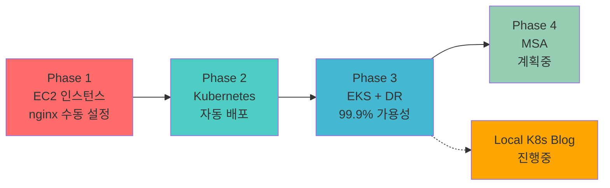

# 클라우드 엔지니어 성장 여정

> 수동 작업 4시간의 고통에서 시작해, **99.9% 가용성**을 달성하기까지

모든 프로젝트는 **실제 문제 해결**에서 시작했습니다.

- "왜 이렇게 오래 걸리지?" → Terraform으로 15분에 해결
- "왜 배포할 때마다 긴장해야 하지?" → Canary로 리스크 최소화
- "왜 클라우드도 장애가 나지?" → Multi-Cloud DR로 99.9% 가용성

---

## 🎯 전체 학습 여정



| Phase | 문제 | 해결 | 성과 |
|-------|------|------|------|
| **1. EC2** | 수동 배포 4시간 | nginx 인스턴스 + Terraform | 재현 가능 100% |
| **2. K8s** | 배포 30분 소요 | Kubernetes + Helm | 배포 83% 단축 |
| **3. EKS** | 단일 클라우드 SPOF | Multi-Cloud DR | 99.9% 가용성 |
| **4. MSA** | Monolith 한계 | Service Mesh + Istio (계획) | - |
| **Local K8s** ✅ | 블로그를 K8s로! | Hugo Pod + GitHub Actions | **완료** (55일 운영) |

---

## 📌 프로젝트 둘러보기

### 🏗️ Phase 1: EC2 인스턴스 기반 nginx 구축

> **기간**: 2025.09 ~ 2025.10 | **역할**: 인프라 자동화

수동 배포 4시간 → Terraform 자동화 (**94% 단축**)

**핵심 성과**: 재현 가능성 0% → 100% | 실수율 30% → 0%

**[상세 보기 →](./phase1-ec2/)**

---

### 🐳 Phase 2: Kubernetes 온프레미스

> **기간**: 2025.10 ~ 2025.11 | **역할**: K8s 클러스터 구축

EC2 수동 배포 30분 → Helm Chart 자동 배포 5분 (**83% 단축**)

**핵심 성과**: 롤백 시간 30분 → 1분 | 설정 일관성 100%

**[상세 보기 →](./phase2-k8s/)**

---

### ☁️ Phase 3: AWS EKS + Multi-Cloud DR

> **기간**: 2025.11 ~ 2026.01 (3개월) | **역할**: 인프라 전체 설계 및 구축

단일 클라우드 95% 가용성 → Multi-Cloud **99.9% 가용성** 달성

**핵심 성과**: DR RTO 없음 → 2분 | WAS 스케일 1개 → 2-10개

**[상세 보기 →](./phase3-eks-dr/)**

---

### 🚀 Phase 4: MSA (계획 중)

> **예상 기간**: 2026.02 ~ (Phase 3 완료 후)

Monolith 한계 극복 - Service Mesh로 기능별 독립 배포

**핵심 목표**: Istio + Kafka + Spring Cloud Gateway

**[상세 보기 →](./phase4-msa/)**

---

## 🆕 독립 프로젝트

### ✅ Local K8s Blog (완료!)

> **기간**: 2025.11 ~ 2026.01 (완료) | **역할**: GitOps 자동화 & 모니터링

Netlify에서 내 Kubernetes로! 블로그를 K8s Pod로 운영

**핵심 성과**:
- ✅ PLG Stack 모니터링 (55일 운영, 4 대시보드, 8 Alert Rules)
- ✅ GitHub Actions CI/CD (35초 배포)
- ✅ HPA 자동 스케일링 (WAS 2-10, WEB 2-5)
- ✅ ArgoCD GitOps 설치 완료

**[상세 보기 →](./local-k8s-blog/)**

---

## 📊 전체 성과 요약

| 항목 | Phase 1 | Phase 2 | Phase 3 | 총 개선 |
|------|---------|---------|---------|---------|
| **배포 시간** | - | 30분 → 5분 | 30분 → 10분 | **67-83%** |
| **인프라 구축** | 4시간 → 15분 | - | - | **94%** |
| **가용성** | - | - | 95% → 99.9% | **+4.9%** |
| **재현 가능성** | 0% → 100% | 100% | 100% | **100%** |

---

## 🔗 Live Demo

<div style="background: var(--entry); border-radius: 8px; padding: 20px; margin: 20px 0;">

### 실제 운영 중인 서비스

| 서비스 | URL | 상태 |
|--------|-----|------|
| **PetClinic** | [www.goupang.shop/petclinic](https://www.goupang.shop/petclinic/) | 🟢 운영 중 |
| **Grafana** | [www.goupang.shop/grafana](https://www.goupang.shop/grafana/) | 🟢 운영 중 |
| **ArgoCD** | [www.goupang.shop/argocd](https://www.goupang.shop/argocd/) | 🟢 운영 중 |
| **DR (Blob)** | [www.goupang.shop](https://www.goupang.shop/) | 🟡 Failover 대기 |
| **DR (VM)** | [dr.goupang.shop/petclinic](https://dr.goupang.shop/petclinic/) | 🟡 POC 테스트 |

</div>

---

## 📚 문서화

모든 프로젝트는 **214개 이상의 문서**로 기록되어 있습니다:

| 카테고리 | 문서 수 | 내용 |
|---------|--------|------|
| **Monitoring** | 41개 | Prometheus, Grafana, CloudWatch |
| **DR** | 27개 | Failover, CloudFront, Lambda@Edge |
| **Presentation** | 22개 | 발표 자료, 아키텍처 문서 |
| **Troubleshooting** | 9개 | 문제 해결 과정 |
| **Operations** | 9개 | Canary, HPA, Probe |
| **CI/CD** | 6개 | Jenkins, ArgoCD, Layer Cache |

---

## 💡 핵심 교훈

### 1. 문제 중심 사고

> "기술은 도구일 뿐. 문제를 먼저 이해하라."

- Phase 1: 재현 불가능 → IaC
- Phase 2: 수동 배포 → 선언적 인프라
- Phase 3: SPOF → Multi-Cloud

### 2. 점진적 개선

```
EC2 (Phase 1) → K8s (Phase 2) → EKS (Phase 3) → MSA (Phase 4)
```

한 번에 완벽하려 하지 않고, **단계별로 개선**

### 3. "왜?"를 항상 질문

모든 기술 선택에 **Trade-off**가 있음:
- Canary Deployment: 리스크 ↓, 배포 시간 ↑
- Multi-Cloud: 가용성 ↑, 비용 ↑

---

## 🎯 다음 목표

1. ~~**ArgoCD GitOps 전환**~~ → ✅ **완료** (Auto-Sync, Prune, SelfHeal)
2. **Prometheus Alert 실전 테스트** (Slack 연동, 알림 훈련)
3. **Phase 4 MSA 구축** (2026.02~)
4. **Cost 최적화** (Spot Instance, Karpenter)
5. **Security 강화** (IRSA, Secrets Manager)
6. **Observability 개선** (Distributed Tracing, OpenTelemetry)

---

**Last Updated**: 2026-01-20 (Local K8s Blog 완료, 모니터링 55일 운영 반영)
