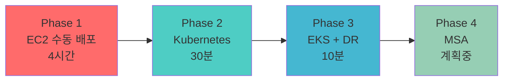
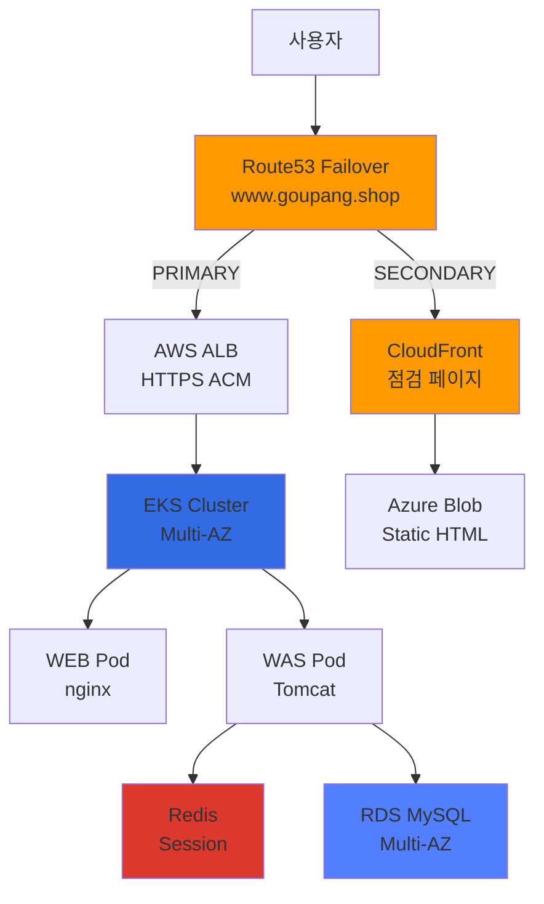

# 클라우드 엔지니어 성장 여정

> 수동 작업 4시간의 고통에서 시작해, **99.9% 가용성**을 달성하기까지

모든 프로젝트는 **실제 문제 해결**에서 시작했습니다.

"왜 이렇게 오래 걸리지?" → Terraform으로 15분에 해결
"왜 배포할 때마다 긴장해야 하지?" → Canary로 리스크 최소화
"왜 클라우드도 장애가 나지?" → Multi-Cloud DR로 99.9% 가용성

---

## 🎯 전체 학습 여정



| Phase | 문제 | 해결 | 성과 |
|-------|------|------|------|
| **1. EC2** | 수동 배포 4시간 | Terraform IaC | 재현 가능 100% |
| **2. K8s** | 배포 30분 소요 | Helm Chart | 배포 83% 단축 |
| **3. EKS** | 단일 클라우드 SPOF | Multi-Cloud DR | 99.9% 가용성 |
| **4. MSA** | Monolith 한계 | Service Mesh (계획) | - |

---

## ☁️ Phase 3: AWS EKS + Multi-Cloud DR (현재)

> **기간**: 2025.11 ~ 2026.01 (3개월)
> **역할**: 인프라 전체 설계 및 구축

### 한 줄 요약

**단일 클라우드 95% 가용성 → Multi-Cloud 99.9% 가용성 달성**

### 왜 이 프로젝트를?

**문제 상황 (2025-11-07):**
- 온프레미스 서버실 전원 장애 → **1시간 30분 다운타임**
- 단일 클라우드 의존 → AWS 장애 시 대응 불가

**목표:**
- ✅ 99.9% 가용성 (월 43분 이하 다운타임)
- ✅ DR RTO 2분 (Route53 Failover)
- ✅ GitOps 자동화 (ArgoCD)

### 아키텍처



### 핵심 성과

| 지표 | Before | After | 개선 |
|------|--------|-------|------|
| **가용성** | 95% (월 36시간) | **99.9%** (월 43분) | +4.9% |
| **DR RTO** | 없음 (백업 4시간) | **2분** | 신규 |
| **배포 시간** | 30분 | **10분** (Canary) | 67% 단축 |
| **WAS 스케일** | 1개 (세션 문제) | **2-10개** (Redis) | 신규 |

### Tech Stack

<div class="tech-stack-badges">


</div>

**[Phase 3 상세 보기 →](./phase3-eks-dr/)**

---

## 🐳 Phase 2: Kubernetes 온프레미스 (완료)

> **기간**: 2025.10 ~ 2025.11 (1개월)

### 한 줄 요약

**EC2 수동 배포 30분 → Helm Chart 자동 배포 5분**

### 왜 이 프로젝트를?

**문제:**
- EC2 SSH 2대 접속 → WAR 파일 복사 → Tomcat 재시작 (30분)
- 롤백 어려움 (30분), 스케일링 불가

**해결:**
- Kubernetes 선언적 인프라
- Helm Chart 재사용
- HPA Auto Scaling

### 핵심 성과

| 지표 | Before | After | 개선 |
|------|--------|-------|------|
| 배포 시간 | 30분 | **5분** | 83% 단축 |
| 롤백 시간 | 30분 | **1분** | 97% 단축 |
| 설정 일관성 | 수동 | **코드 기반** | 100% |

**[Phase 2 상세 보기 →](./phase2-k8s/)**

---

## 🏗️ Phase 1: Terraform IaC (완료)

> **기간**: 2025.09 ~ 2025.10 (1개월)

### 한 줄 요약

**AWS Console 수동 구축 4시간 → Terraform 15분**

### 왜 이 프로젝트를?

**문제:**
- AWS Console 클릭 → 4시간 소요
- Security Group 실수 → 30분 디버깅
- 재현 불가능 (매번 다름)

**해결:**
- Terraform IaC
- S3 + DynamoDB Backend
- 모듈화 재사용

### 핵심 성과

| 지표 | Before | After | 개선 |
|------|--------|-------|------|
| 인프라 구축 | 4시간 | **15분** | 94% 단축 |
| 재현 가능성 | 0% | **100%** | +100% |
| 실수율 | 30% | **0%** | -30% |

**[Phase 1 상세 보기 →](./phase1-ec2/)**

---

## 🚀 Phase 4: MSA (계획 중)

> **예상 기간**: 2026.02 ~

### 왜 필요한가?

**현재 한계 (Monolithic):**
- 전체 애플리케이션 하나의 WAR
- 작은 변경에도 전체 재배포
- 기능별 독립 스케일링 불가

### 계획

**목표:**
- Microservices 아키텍처 (User, Pet, Vet, Visit)
- Service Mesh (Istio) - mTLS, Circuit Breaker
- Event-Driven (Kafka) - 비동기 통신
- API Gateway (Spring Cloud Gateway)

**기대 효과:**
- 기능별 독립 배포
- 장애 격리 (Circuit Breaker)
- 독립 스케일링

---

## 📊 전체 성과 요약

| 항목 | Phase 1 | Phase 2 | Phase 3 | 총 개선 |
|------|---------|---------|---------|---------|
| **배포 시간** | - | 30분 → 5분 | 30분 → 10분 | **67-83%** |
| **인프라 구축** | 4시간 → 15분 | - | - | **94%** |
| **가용성** | - | - | 95% → 99.9% | **+4.9%** |
| **재현 가능성** | 0% → 100% | 100% | 100% | **100%** |

---

## 🔗 Live Demo

<div style="background: var(--entry); border-radius: 8px; padding: 20px; margin: 20px 0;">

### 실제 운영 중인 서비스

| 서비스 | URL | 상태 |
|--------|-----|------|
| **PetClinic** | [www.goupang.shop/petclinic](https://www.goupang.shop/petclinic/) | 🟢 운영 중 |
| **Grafana** | [www.goupang.shop/grafana](https://www.goupang.shop/grafana/) | 🟢 운영 중 |
| **ArgoCD** | [www.goupang.shop/argocd](https://www.goupang.shop/argocd/) | 🟢 운영 중 |
| **DR (Blob)** | [www.goupang.shop](https://www.goupang.shop/) | 🟡 Failover 대기 |
| **DR (VM)** | [dr.goupang.shop/petclinic](https://dr.goupang.shop/petclinic/) | 🟡 POC 테스트 |

</div>

---

## 📚 문서화

모든 프로젝트는 **214개 이상의 문서**로 기록되어 있습니다:

| 카테고리 | 문서 수 | 내용 |
|---------|--------|------|
| **Monitoring** | 41개 | Prometheus, Grafana, CloudWatch |
| **DR** | 27개 | Failover, CloudFront, Lambda@Edge |
| **Presentation** | 22개 | 발표 자료, 아키텍처 문서 |
| **Troubleshooting** | 9개 | 문제 해결 과정 |
| **Operations** | 9개 | Canary, HPA, Probe |
| **CI/CD** | 6개 | Jenkins, ArgoCD, Layer Cache |

---

## 💡 핵심 교훈

### 1. 문제 중심 사고

> "기술은 도구일 뿐. 문제를 먼저 이해하라."

- Phase 1: 재현 불가능 → IaC
- Phase 2: 수동 배포 → 선언적 인프라
- Phase 3: SPOF → Multi-Cloud

### 2. 점진적 개선

```
EC2 (Phase 1) → K8s (Phase 2) → EKS (Phase 3) → MSA (Phase 4)
```

한 번에 완벽하려 하지 않고, **단계별로 개선**

### 3. "왜?"를 항상 질문

모든 기술 선택에 **Trade-off**가 있음:
- Canary Deployment: 리스크 ↓, 배포 시간 ↑
- Multi-Cloud: 가용성 ↑, 비용 ↑

---

## 🎯 다음 목표

1. **Phase 4 MSA 구축** (2026.02~)
2. **Cost 최적화** (Spot Instance, Karpenter)
3. **Security 강화** (IRSA, Secrets Manager)
4. **Observability 개선** (Distributed Tracing)

---

**Last Updated**: 2026-01-12
