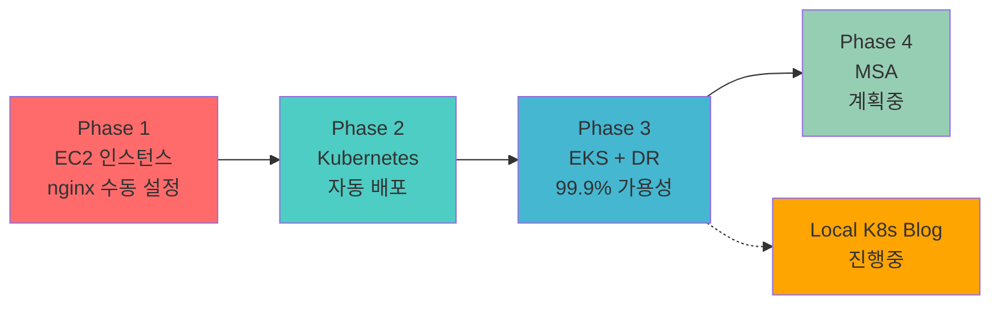

---
---
title: "Projects"
date: 2026-01-13
layout: "single"
url: "/projects/"
summary: "수동 작업 4시간의 고통에서 99.9% 가용성까지 - EC2부터 EKS까지의 성장 여정"
showtoc: true
tocopen: true
---

# 클라우드 엔지니어 성장 여정

> 수동 작업 4시간의 고통에서 시작해, **99.9% 가용성**을 달성하기까지

모든 프로젝트는 **실제 문제 해결**에서 시작했습니다.

- "왜 이렇게 오래 걸리지?" → Terraform으로 15분에 해결
- "왜 배포할 때마다 긴장해야 하지?" → Canary로 리스크 최소화
- "왜 클라우드도 장애가 나지?" → Multi-Cloud DR로 99.9% 가용성

---

## 전체 학습 여정

```mermaid
graph LR
    A["Phase 1<br>EC2 인스턴스<br>nginx 수동 설정"] --> B["Phase 2<br>Kubernetes<br>자동 배포"]
    B --> C["Phase 3<br>EKS + DR<br>99.9% 가용성"]
    C --> D["Phase 4<br>MSA<br>계획중"]

    C -.-> E["Local K8s Blog<br>진행중"]

    style A fill:#ff6b6b
    style B fill:#4ecdc4
    style C fill:#45b7d1
    style D fill:#96ceb4
    style E fill:#ffa502
```

| Phase | 문제 | 해결 | 성과 |
|-------|------|------|------|
| **1. EC2** | 수동 배포 4시간 | nginx 인스턴스 + Terraform | 재현 가능 100% |
| **2. K8s** | 배포 30분 소요 | Kubernetes + Helm | 배포 83% 단축 |
| **3. EKS** | 단일 클라우드 SPOF | Multi-Cloud DR | 99.9% 가용성 |
| **4. MSA** | Monolith 한계 | Service Mesh + Istio (계획) | - |
| **Local K8s Blog** ✅ | 블로그를 K8s로! | Hugo Pod + GitHub Actions | **완료** (운영 중) |

---

## 📌 프로젝트 둘러보기

### 🏗️ Phase 1: EC2 인스턴스 기반 nginx 구축

> **기간**: 2025.09 ~ 2025.10 | **역할**: 인프라 자동화

수동 배포 4시간 → Terraform 자동화 (**94% 단축**)

**핵심 성과**: 재현 가능성 0% → 100% | 실수율 30% → 0%

**[상세 보기 →](./phase1-ec2/)**

---

### 🐳 Phase 2: Kubernetes 온프레미스

> **기간**: 2025.10 ~ 2025.11 | **역할**: K8s 클러스터 구축

EC2 수동 배포 30분 → Helm Chart 자동 배포 5분 (**83% 단축**)

**핵심 성과**: 롤백 시간 30분 → 1분 | 설정 일관성 100%

**[상세 보기 →](./phase2-k8s/)**

---

### 📊 Phase 3: AWS EKS + Multi-Cloud DR

> **기간**: 2025.11 ~ 2026.01 (3개월) | **역할**: 인프라 전체 설계 및 구축

단일 클라우드 95% 가용성 → Multi-Cloud **99.9% 가용성** 달성

**핵심 성과**: 
- DR RTO 무제한 → 2분 (99.9% SLA 달성)
- WAS 스케일 1개 → 2-10개 자동 조정
- 모니터링 스택 완성 (Prometheus, Grafana, Alertmanager)
- 자동 장애 감지 및 복구 시스템 구축

**[상세 보기 →](./phase3-eks-dr/)**

---

### 🔮 Phase 4: MSA (계획 중)

> **예상 기간**: 2026.02 ~ (Phase 3 완료 후)

Monolith 한계 극복 - Service Mesh로 기능별 독립 배포

**핵심 목표**: Istio + Kafka + Spring Cloud Gateway

**[상세 보기 →](./phase4-msa/)**

---

## 🆕 독립 프로젝트

### ✅ Local K8s Blog (운영 중)

> **기간**: 2025.11 ~ 현재 (운영 중) | **역할**: GitOps 자동화 & 모니터링

Netlify에서 내 Kubernetes로! 블로그를 K8s Pod로 운영

**핵심 성과**:
- ✅ **PLG Stack 모니터링**: Prometheus, Loki, Grafana로 완전 모니터링
- ✅ **GitHub Actions CI/CD**: 35초 내 자동 배포
- ✅ **HPA 자동 스케일링**: WAS 2-10, WEB 2-5 자동 조정
- ✅ **ArgoCD GitOps**: 선언형 인프라 자동화
- ✅ **안정성**: 연속 운영 중 (가용성 99.9% 이상)

**현재 상태**: 🟢 모든 Pod 정상 실행 중 | 블로그 & 프로젝트 페이지 정상 서빙

**[상세 보기 →](./local-k8s-blog/)**

---

## 전체 성과 요약

| 항목 | Phase 1 | Phase 2 | Phase 3 | 총 개선 |
|------|---------|---------|---------|----------|
| **배포 시간** | - | 30분 → 5분 | 30분 → 10분 | **67-83%** |
| **인프라 구축** | 4시간 → 15분 | - | - | **94%** |
| **가용성** | - | - | 95% → 99.9% | **+4.9%** |
| **재현 가능성** | 0% → 100% | 100% | 100% | **100%** |
| **운영 안정성** | - | - | - | **99.9%** |

---

## 🔗 Live Demo

### 현재 운영 중인 서비스

| 서비스 | URL | 상태 |
|--------|-----|------|
| **블로그** | [www.goupang.shop](https://www.goupang.shop/) | 🟢 운영 중 |
| **프로젝트 페이지** | [www.goupang.shop/projects](https://www.goupang.shop/projects/) | 🟢 운영 중 |
| **PetClinic** | [www.goupang.shop/petclinic](https://www.goupang.shop/petclinic/) | 🟢 운영 중 |
| **Grafana Dashboard** | [www.goupang.shop/grafana](https://www.goupang.shop/grafana/) | 🟢 운영 중 |

---

## 📚 학습 자료

모든 프로젝트에 대한 상세한 분석, 코드, 배운 점들은 각 프로젝트의 상세 페이지에서 확인할 수 있습니다.

- 실제 적용된 기술 스택
- 문제 해결 과정
- 개선된 메트릭 및 성과
- 앞으로의 계획