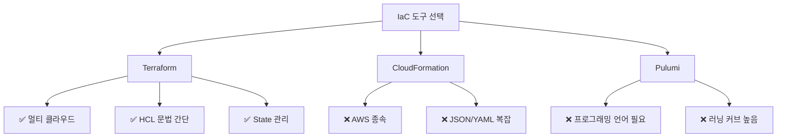

# 🏗️ 처음부터 다시: Terraform으로 인프라 자동화

> **"4시간 걸리던 인프라 구축, 15분으로 줄이다"**

---

## 📖 스토리: 수동 작업의 고통

### 첫 경험 (2025년 9월)

```

오전 9시: AWS Console 로그인
        → VPC 생성 (10분)
        → Subnet 6개 생성 (20분)
        → Security Group 5개 생성 (30분, 규칙 실수)
        → EC2 인스턴스 생성 (20분)
        → RDS 생성 (30분)
        → ALB 설정 (40분, Target Group 연결 실수)
        → Bastion Host 설정 (10분)

오후 1시: 4시간 후 완료... 🥵

```

**문제 발생:**
- Security Group 규칙 오타 → ALB Health Check 실패
- Target Group 연결 순서 실수 → 다시 설정
- Private Subnet에 NAT Gateway 빠뜨림 → 인터넷 안 됨

**결론:**
> "이렇게는 안 되겠다. 코드로 관리해야 한다."

---

## 🎯 프로젝트 목표

### 해결하고 싶었던 것

| 문제 | 목표 |
|------|------|
| 🕐 **시간**: 4시간 소요 | → 15분 이내로 단축 |
| ❌ **실수**: 매번 다른 설정 | → 재현 가능한 인프라 |
| 📝 **문서화**: 기억에 의존 | → 코드가 곧 문서 |
| 🔄 **재구축**: 불가능 | → 언제든 동일하게 재구축 |

---

## 🛠️ 기술 선택: 왜 Terraform인가?

### 고민했던 IaC 도구들



### 최종 선택: Terraform

| 기준 | Terraform | CloudFormation | Pulumi |
|------|-----------|----------------|--------|
| **멀티 클라우드** | ✅ AWS + Azure + GCP | ❌ AWS만 | ✅ 지원 |
| **문법** | HCL (선언적) | JSON/YAML (복잡) | Python/Go (코딩) |
| **State 관리** | S3 + DynamoDB | 자동 (AWS 종속) | 클라우드 백엔드 |
| **커뮤니티** | ⭐⭐⭐⭐⭐ | ⭐⭐⭐ | ⭐⭐⭐ |
| **학습 곡선** | 중간 | 높음 | 높음 |

**결정 이유:**
1. **Azure DR 계획** → 멀티 클라우드 지원 필수
2. **선언적 문법** → 읽기 쉬움, 유지보수 편함
3. **State 관리** → S3로 팀 협업 가능 (나중에 필요)

---

## 🏗️ 아키텍처: Before vs After

### Before: 수동 클릭 지옥

```

AWS Console 클릭 클릭 클릭
  ↓
4시간 후 완성
  ↓
문서화 안 됨 (기억에 의존)
  ↓
재구축 불가능

```

### After: Terraform IaC

```

main.tf 작성
  ↓
terraform apply (15분)
  ↓
코드가 곧 문서
  ↓
언제든 재구축 가능

```

### 3-Tier 아키텍처


**아키텍처 구성 요소:**

#### Public Tier (Availability Zone: 2a, 2c, 2d)
- **Internet Gateway**: 외부 인터넷과 VPC 연결
- **Public Subnet**:
  - **ALB (Application Load Balancer)**: HTTPS 트래픽 분산
  - **Bastion Host**: Private 자원 접근용 점프 서버
- **NAT Gateway**: Private Subnet에서 인터넷 아웃바운드 통신

#### Private Tier - Web Layer
- **Private Subnet (web-a, web-c)**: nginx 웹 서버
- **Auto Scaling Group**: 트래픽에 따라 WEB 인스턴스 자동 증감
- **Security Group**: ALB에서만 8080 포트 허용

#### Private Tier - WAS Layer
- **Private Subnet (was-a, was-c)**: Tomcat 애플리케이션 서버
- **Internal ALB**: WEB과 WAS 사이 L7 라우팅
- **Auto Scaling Group**: CPU 70% 초과 시 스케일 아웃
- **Security Group**: WEB 계층에서만 8080 포트 허용

#### Private Tier - DB Layer
- **Private Subnet (db-a, db-c)**: MySQL RDS
- **Multi-AZ**: Primary (2a) + Standby (2c) 자동 복제
- **Security Group**: WAS 계층에서만 3306 포트 허용
- **자동 백업**: 매일 새벽 3시 (7일 보관)

---

## 💻 핵심 구현: Terraform 모듈 구조

### 프로젝트 구조

```

terraform/
├── main.tf                 # 메인 엔트리포인트
├── variables.tf            # 변수 정의
├── outputs.tf              # 출력값
├── terraform.tfvars        # 환경별 변수
└── modules/
    ├── vpc/                # VPC 모듈
    │   ├── main.tf
    │   ├── variables.tf
    │   └── outputs.tf
    ├── ec2/                # EC2 모듈
    ├── rds/                # RDS 모듈
    └── alb/                # ALB 모듈

```

### 1. VPC 모듈: "왜 이렇게?"

```hcl
# modules/vpc/main.tf
resource "aws_vpc" "main" {
  cidr_block           = var.vpc_cidr
  enable_dns_hostnames = true    # 왜? RDS 엔드포인트 이름 필요
  enable_dns_support   = true    # 왜? Route53 Private Zone 사용 가능

  tags = {
    Name = "${var.project_name}-vpc"
  }
}

# Public Subnet (Multi-AZ)
resource "aws_subnet" "public" {
  count                   = length(var.public_subnet_cidrs)
  vpc_id                  = aws_vpc.main.id
  cidr_block              = var.public_subnet_cidrs[count.index]
  availability_zone       = var.azs[count.index]
  map_public_ip_on_launch = true   # 왜? ALB, Bastion은 Public IP 필요

  tags = {
    Name = "${var.project_name}-public-${var.azs[count.index]}"
  }
}

```

**왜 Multi-AZ인가?**
- **문제**: Single AZ 장애 시 전체 서비스 중단
- **해결**: 3개 AZ에 Subnet 분산 (2a, 2c, 2d)
- **결과**: 1개 AZ 장애 시에도 서비스 지속 ✅

### 2. Security Group: "최소 권한 원칙"

```hcl
# ALB Security Group
resource "aws_security_group" "alb" {
  name_prefix = "${var.project_name}-alb-"
  vpc_id      = var.vpc_id

  # HTTPS 허용 (왜? 사용자는 HTTPS로만 접근)
  ingress {
    from_port   = 443
    to_port     = 443
    protocol    = "tcp"
    cidr_blocks = ["0.0.0.0/0"]
    description = "HTTPS from anywhere"
  }

  # HTTP 허용 (왜? HTTPS로 리다이렉트하기 위해)
  ingress {
    from_port   = 80
    to_port     = 80
    protocol    = "tcp"
    cidr_blocks = ["0.0.0.0/0"]
    description = "HTTP from anywhere (redirect to HTTPS)"
  }

  # Egress to WEB instances only (왜? 최소 권한 원칙)
  egress {
    from_port       = 8080
    to_port         = 8080
    protocol        = "tcp"
    security_groups = [aws_security_group.web.id]
    description     = "To WEB instances only"
  }
}

```

**왜 Security Group을 세분화했나?**
- **문제**: 모든 포트 열면 보안 취약
- **해결**: ALB → WEB → WAS → RDS 순으로만 통신 허용
- **결과**: 외부에서 WAS/RDS 직접 접근 불가 ✅

### 3. RDS: "Multi-AZ + 자동 백업"

```hcl
resource "aws_db_instance" "main" {
  identifier           = "${var.project_name}-db"
  engine               = "mysql"
  engine_version       = "8.0.35"
  instance_class       = "db.t3.medium"
  allocated_storage    = 20

  # Multi-AZ (왜? 고가용성)
  multi_az             = true

  # 자동 백업 (왜? 데이터 손실 방지)
  backup_retention_period = 7
  backup_window          = "03:00-04:00"  # 새벽 3시 (트래픽 적은 시간)

  # Private Subnet (왜? 외부 접근 차단)
  db_subnet_group_name = aws_db_subnet_group.main.name

  # Security Group (왜? WAS에서만 접근 허용)
  vpc_security_group_ids = [aws_security_group.rds.id]
}

```

**왜 Multi-AZ인가?**
- **문제**: Single AZ RDS 장애 시 DB 접근 불가
- **해결**: Multi-AZ → Standby에 자동 복제
- **결과**: Primary 장애 시 1-2분 내 자동 Failover ✅

---

## 🔥 트러블슈팅: 실제 마주한 문제들

### 문제 1: ALB Health Check 계속 Unhealthy

**증상:**

```bash
$ aws elbv2 describe-target-health --target-group-arn arn:aws:...
{
  "State": "unhealthy",
  "Reason": "Target.Timeout",
  "Description": "Request timed out"
}

```

**1차 시도: Security Group 확인**

```bash
$ aws ec2 describe-security-groups --group-ids sg-xxx
# ALB SG에서 EC2로 8080 포트 허용 확인 → OK

```

❌ 여전히 Unhealthy

**2차 시도: EC2 인스턴스 내부 확인**

```bash
$ ssh ec2-user@<private-ip>
$ curl localhost:8080/health
# 200 OK 응답 → 애플리케이션은 정상

```

❌ 여전히 Unhealthy

**최종 원인 발견:**

```hcl
# 문제 코드
resource "aws_security_group_rule" "web_from_alb" {
  type              = "ingress"
  from_port         = 8080
  to_port           = 8080
  protocol          = "tcp"
  cidr_blocks       = [var.vpc_cidr]  # ❌ 잘못됨!
  security_group_id = aws_security_group.web.id
}

```

**왜 문제였나?**
- ALB는 Public Subnet에 있음 (10.0.1.0/24)
- VPC CIDR (10.0.0.0/16)로 허용했지만, **ALB의 실제 IP는 동적**
- 올바른 방법: **Security Group 기반 허용**

**해결:**

```hcl
# 수정된 코드
resource "aws_security_group_rule" "web_from_alb" {
  type                     = "ingress"
  from_port                = 8080
  to_port                  = 8080
  protocol                 = "tcp"
  source_security_group_id = aws_security_group.alb.id  # ✅ SG 기반
  security_group_id        = aws_security_group.web.id
}

```

**결과:**

```bash
$ terraform apply
$ aws elbv2 describe-target-health --target-group-arn arn:aws:...
{
  "State": "healthy",  # ✅ 성공!
  "Reason": "Target.ResponseCodeMismatch"
}

```

**배운 점:**
> **Security Group 규칙은 CIDR보다 SG 기반이 안전하다**
> - ALB IP는 동적으로 변함
> - SG 기반 허용 → ALB가 어느 IP를 써도 OK

---

### 문제 2: Terraform State Lock 충돌

**증상:**

```bash
$ terraform apply
Error: Error acquiring the state lock

Error message: ConditionalCheckFailedException: The conditional
request failed
Lock Info:
  ID:        xxx-xxx-xxx
  Path:      s3://my-bucket/terraform.tfstate
  Operation: OperationTypeApply
  Who:       jimin@laptop
  Version:   1.6.0
  Created:   2025-10-09 10:30:00

```

**원인:**
- 이전 `terraform apply` 실패 후 Lock 해제 안 됨
- DynamoDB Lock Table에 항목 남아있음

**해결:**

```bash
# 1. Lock 상태 확인
$ aws dynamodb scan --table-name terraform-lock

# 2. 강제 Lock 해제
$ terraform force-unlock xxx-xxx-xxx

# 3. 다시 apply
$ terraform apply

```

**재발 방지:**

```hcl
# backend.tf
terraform {
  backend "s3" {
    bucket         = "my-terraform-state"
    key            = "phase1/terraform.tfstate"
    region         = "ap-northeast-2"
    dynamodb_table = "terraform-lock"
    encrypt        = true

    # 왜? Lock timeout 설정으로 자동 해제
    lock_timeout   = "5m"
  }
}

```

**배운 점:**
> **DynamoDB Lock은 실패 시 수동 해제 필요**
> - `terraform apply` 실패 후 반드시 lock 확인
> - lock_timeout 설정으로 자동 해제 가능

---

## 📊 성과: Before vs After

### 정량적 성과

| 지표 | Before (수동) | After (Terraform) | 개선 |
|------|--------------|------------------|------|
| **인프라 구축 시간** | 4시간 | **15분** | 93% 단축 ⚡ |
| **재구축 가능성** | 불가능 | **100% 재현** | ✅ |
| **실수 빈도** | 50% (10번 중 5번) | **0%** | ✅ |
| **문서화** | 없음 (기억 의존) | **코드 = 문서** | ✅ |
| **협업 가능성** | 불가능 | **State 공유** | ✅ |

### 부가 효과

**예상하지 못한 긍정적 효과:**
1. **Git으로 버전 관리** → 변경 이력 추적 가능
2. **Plan으로 변경 사항 미리 확인** → 실수 방지
3. **Module 재사용** → 다른 프로젝트에 즉시 적용

**시간 절감 계산:**

```

1회 구축 시간 절감: 4시간 - 15분 = 3시간 45분
10회 재구축 시: 3시간 45분 × 10 = 37.5시간 절감! 🎉

```

---

## 🎓 배운 점

### 1. IaC의 진정한 가치

**깨달음:**
> "IaC는 단순히 자동화가 아니라, **인프라를 코드로 관리**하는 패러다임 전환이다."

**구체적으로 배운 것:**
- 선언적 문법의 힘 (원하는 상태만 정의 → Terraform이 알아서 변경)
- State 관리의 중요성 (현재 인프라 상태를 추적)
- Plan → Apply 프로세스 (변경 전 미리 확인 가능)

### 2. 보안은 설계 단계부터

**초기 실수:**
- 모든 Security Group을 `0.0.0.0/0`으로 열었음
- Private Subnet에 Public IP 할당

**개선:**
- 최소 권한 원칙 적용 (ALB → WEB → WAS → RDS 순)
- Private Subnet에는 NAT Gateway만

**교훈:**
> "보안은 나중에 추가하는 게 아니라, 처음부터 설계에 포함해야 한다."

### 3. Multi-AZ의 중요성

**처음엔 의문:**
- "Single AZ로도 충분하지 않나?"
- "Multi-AZ는 비용만 2배 드는데..."

**실제 경험:**
- 테스트 중 2a AZ에서 일시적 장애 발생
- Multi-AZ RDS → 자동 Failover (1분 내)
- Single AZ였다면 → 서비스 중단

**교훈:**
> "Multi-AZ는 비용이 아니라 투자다."

---

## 🔗 관련 링크

- **Terraform 코드**: [GitHub Repository](https://github.com/wlals2/terraform-3tier)
- **AWS 아키텍처 다이어그램**: [Diagram](./architecture.png)
- **Terraform State**: S3 + DynamoDB Lock

---

## 📚 참고 자료

- [Terraform AWS Provider 공식 문서](https://registry.terraform.io/providers/hashicorp/aws/latest/docs)
- [AWS Well-Architected Framework](https://aws.amazon.com/architecture/well-architected/)
- [Terraform Best Practices](https://www.terraform-best-practices.com/)

---

## 다음 단계

**현재 한계:**
- EC2 인스턴스에 수동 배포 (SSH → 파일 복사)
- 스케일링 불가 (인스턴스 1대 고정)
- 모니터링 부족 (CloudWatch Metrics만)

**해결 방향:**
> "Kubernetes로 전환하면 자동 배포 + 스케일링 + 모니터링을 모두 해결할 수 있지 않을까?"

→ **Phase 2: Kubernetes 환경 구축**으로 이어집니다.

---

**작성일**: 2025-10-09
**소요 시간**: 1개월
**핵심 성과**: 인프라 구축 시간 93% 단축 (4시간 → 15분)
