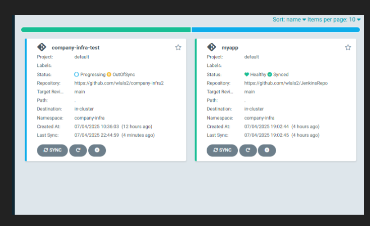

## 🧭 개요
우리는 실습 과정의 순서가 뒤바뀌었다.  
**전체 인프라 구조 설계 → IaC 구성 → Kubernetes 배포 → 자동화 준비 → 애플리케이션 배포**  
그러나 우리는 **K8s 서버 올리기부터** 시작했다.  
VirtualBox 스냅샷을 찍어두었지만, 이는 **코드를 지키는 환경**은 아니었다.  
그래서 지금이라도 **ArgoCD / Jenkins**를 구현하려 했다.


## 🎯 목표
- ArgoCD 구현 및 트러블슈팅  
- Jenkins 구현 및 트러블슈팅  
- 완벽한 IaC 구성  


## 📦 기본 디렉토리 구성

```bash
~/test/company-infra/
├─ templates/                   
│   ├─ mysql/
│   ├─ prometheus/
│   ├─ grafana/
│   ├─ apache2/
│   ├─ ftp/
│   ├─ mysqld-exporter/
│   ├─ nginx/
│   ├─ openvpn/
│   ├─ samba/
│   └─ jenkins/
├─ charts/
├─ values.yaml
├─ Chart.yaml
├─ helm-chart/
├─ docker-compose/
│   └─ docker-compose.yml (SFTP)
├─ argocd-values.yaml
├─ jenkins-values.yaml

~/test/company-infra-c/
├─ templates/
│   ├─ Elasticsearch/
│   ├─ Fluentbit/
│   ├─ Kibana/
├─ charts/
├─ values.yaml
├─ Chart.yaml
├─ helm-chart/

~/test/myapp/
├─ app.js
├─ Dockerfile
├─ Jenkinsfile
├─ k8s-deploy.yaml
```
---
🎤 **IaC  코드인프라에 더 가까이 다가갔다. 이번에는 Jenkins 와 ArgoCD 구현해 CI/CD를 완벽히 구현해냈다.
Jenkins와 argoCD를 이용한 스트럭쳐는 다음과 같이 동작한다.**

> 코드 (앱,Dockerfile,manifet) → Git에 등록 \
소스/인프라 코드화 (GitOps의 핵심) \
Jenkins CI로 Docker 빌드 & Push (자동화) \
실무 CI의 전형 (테스트,빌드,배포 이미지관리) \
ArgoCD로 Git기반 CD, k8s 자동배포 \
CD를 자동화 \
변경 = 자동배포 실시간 상태 동기화 \
프로덕션 수준의 배포 및 운영 효율성

## ⚙️ 서버 구축 및 완벽한 IaC  구축
```
🎤 이번 구현은 어렵거나 힘든 부분은 없었다. 그러나 새로운 것을 시도하는 거기 때문에 
모르는 것이 투성이였다 하나하나 걸음마 떼듯이 시작했다. 이건 무슨뜻이며 저건 무슨 뜻이며 곱씹으면서 했다.
실습 할때는  이 곳에 뭐가 뭔지 궁금해하면서 해봤으면 좋겠다.

jenkins 구현하는 과정에서 pipeline을 사용할 수없어 svn 을 사용 하는 둥 
무엇인지 하나도 몰랐지만 시작이 반이다.
구축을 다하고 생각을해보자 
이번 argoCD와 Jenkins는 helm repo에서 가져오는 방식을 사용하였다. 문제는 Cluster IP를 사용하기 때문에 
values.yaml 파일을 만들어   nodeport  를 따로 지정해주었다.
```
### ✅ Jenkins ArgoCD 서버 구축 
```yaml
# jenkins  파일 및 구현 helm repo를 이용한다.
# jenkins.values.yaml
controller:
  serviceType: NodePort
  nodePort: 30800        # 원하는 포트
  admin:
    password: "jenkinsadmin"
  persistence:
    enabled: true
    storageClass: "hostpath"    # 위에서 만든 StorageClass 이름
    size: 8Gi
   
helm upgrade --install jenkins jenkinsci/jenkins \
  --namespace company-infra \
  -f jenkins.values.yaml
  
  
#argoCd 파일 및 구현 helm repo를 이용한다.
~/test/company-infra/argocd.values.yaml
server:
  service:
    type: NodePort
    nodePort: 32080        # 원하는 포트

helm upgrade --install argocd argo/argo-cd \
  --namespace company-infra \
  -f argocd-values.yaml
  
  
  
# git repo에 git push 시작

git init
echo "# company-infra" > README.md
git add .
git commit -m "초기 클린 상태 최초 업로드"
git branch -M main
git remote add origin <git repo 주소>
git push -u origin main

# git 아이디와 비밀번호 필요 비밀번호는 토큰으로 대체해야한다.

#.gitignore
*.bak
*.swp
*.tmp
.DS_Store
```
### 🔥 중요
> 코드가 정말 완벽할때 `git commit` 을 하는 것이다. 필자는 코드가 섞이면서 .git 를 삭제하고 다시 init하는 둥 문제를 일으켜 \
`merge` 를 했었다. 그 과정에서 코드들이 뒤죽박죽이 되고 yaml 파일들이 망가지는 경험을 했다. \
다행인건 스냅샷을 찍어놓았다는 것 이었다. 코드를 보호하려다가 오히려 다 망가트린 것이다. \
스냅샷을 안찍어놨으면 이 글은 안쓰여질 수도 있었다. \
코드가 완벽할때 확실히 `commit` `push` 가 중요하다 \
이번 글은 우리가 지금까지 구현해놓은 인프라를 `jenkins`와 `argoCD`에 맡기는 않았다. \
충분한 백업을 한뒤 시도 해볼 것이다. 연습이라고 생각했으면 좋겠다. 

### ✅ 연습용 my.app 생성
```yaml
# myapp-appjs   종속성을 감안하여 nodejs를 사용하였다. 
const http = require('http');
const port = 3000;
http.createServer((req, res) => {
  res.end('Hello, Docker & Jenkins Lab!\n');
}).listen(port, () => {
  console.log('Server running at port', port);
});


# myapp-Dockerfile
FROM node:20
WORKDIR /app
COPY app.js .
EXPOSE 3000
CMD ["node","app.js"]


# myapp-Jenkinsfile
pipeline {
    agent {
        kubernetes {
            label 'docker-agent'
            defaultContainer 'docker'
            yaml """
apiVersion: v1
kind: Pod
spec:
  containers:
  - name: docker
    image: docker:20.10.17-dind
    command:
    - cat
    tty: true
    volumeMounts:
      - name: docker-sock
        mountPath: /var/run/docker.sock
      - name: workspace-volume
        mountPath: /home/jenkins/agent
  volumes:
  - name: docker-sock
    hostPath:
      path: /var/run/docker.sock
  - name: workspace-volume
    emptyDir: {}
"""
        }
    }
    environment {
        IMAGE_NAME = "jjmin/myapp:1"
    }
    stages {
        stage('Checkout Source') {
            steps {
                // 만약 GitHub 등에서 체크아웃 필요하면 아래 라인 추가
                checkout scm
                // 또는 직접 git 명령어 사용
                // git branch: 'main', url: 'https://github.com/jjmin/your-repo.git'
            }
        }
        stage('Build Docker Image') {
            steps {
                container('docker') {
                    sh 'docker build -t $IMAGE_NAME .'
                }
            }
        }
        stage('Push Docker Image') {
            steps {
                container('docker') {
                    withCredentials([usernamePassword(credentialsId: 'dockerhub-jjmin2', usernameVariable: 'DOCKER_USER', passwordVariable: 'DOCKER_PASS')]) {
                        sh """
                            echo \$DOCKER_PASS | docker login -u \$DOCKER_USER --password-stdin
                            docker push \$IMAGE_NAME
                        """
                    }
                }
            }
        }
    }
}

# /myapp-k8s-deploy.yaml
apiVersion: apps/v1
kind: Deployment
metadata:
  name: myapp
spec:
  replicas: 1
  selector:
    matchLabels:
      app: myapp
  template:
    metadata:
      labels:
        app: myapp
    spec:
      containers:
        - name: myapp
          image: jjmin/myapp:1
          ports:
            - containerPort: 3000
---
apiVersion: v1
kind: Service
metadata:
  name: myapp
spec:
  type: NodePort
  ports:
    - port: 3000
      targetPort: 3000
      nodePort: 32000
  selector:
    app: myapp
```
### 🔥 우리는 values.yaml 파일에 jenkins 비밀번호를 담아놓았기 때문에 그대로 사용하면된다.
> **ID**: admin \
**Passwd**: jenkinsadmin    접속하면된다. 

환경적인 변수 때문에 오류가 생길 수있다. 필자는 virtualbox에 git에 올리는 코드를 가져오는 방식을 사용하기에 scm을 사용하였다. jenkins 웹에서 코드를 작성하려 했으나 jenkins file만 존재할 뿐 우리는 deploy 등 다른 여분의 파일이 존재하기 때문에scm을 사용하였다.

### ✅ Jenkins 설정

```
1. jenkins 대시 보드에서 새로운 item 클릭 
2. item 이름 입력및 유형 선택 . item 이름 : Pipeline-docker  생성 
3. pipeline 설정 화면에서 pipeline script from scm 선택 
Definition (정의) 부분에서 변경한다. 
4. SCM : Git 선택
Repository URL : 깃허브 주소 * 무조건 https를 작성
Credentials : 공개 repo 라면 생략 가능
Braches to build:  */main 
Script path : Jenkinsfile 
5. 설정 저장 및 완료
6. Build Now 지금 빌드를 통해 파이프라인 실행됨
```

🔥 만약 오류가 났다면 트러블 슈팅을 위해 빌드 기록 Console Output (콘솔 출력) 클릭해서 상세 오류 확인 바란다. \
Jenkinsfile, Dockerfile 등 변경시 → 코드를 Github에 푸시해야 jenkins가 감지한다. \
사실 scm을 찾기까지 우여곡절이 있었지만 에러 메시지를 트러블 슈팅하다보니 금방 해결되었다. \
CI jenkins를 통해 이미지 코드 배포를 완료했으니 이제 실제로 실행 시켜주는 argoCD를 구현할 것이다.


### ✅ ArgoCD 설정 및 실행

- `kubectl -n <namespace> get secret argocd-initial-admin-secret -o jsonpath="{.data.password}" | base64 -d`
- 초기 비밀번호를 통해 접속한다.
- ArgoCD UI 웹 접속
- New app 클릭
- 아래 내용을 입력한다.

| 항목 | 값 예시 |
|------|----------|
| **Application Name** | `myapp` |
| **Project** | `default` |
| **Sync Policy** | 자동(`Automatic`, `auto-sync` 도 가능) |
| **Repository URL** | 본인 GitHub 주소 |
| **Revision** | `main` |
| **Path** | 현재 디렉토리라면 `.` / `k8s manifest`가 들어있는 경로 |
| **Cluster** | 기본(`kubernetes.default.svc`) |
| **Namespace** | `Company-infra` *(현재 K8s 배포 네임스페이스)* |

-> 동기화 시작

## 🔓 트러블 슈팅

### 1. Jenkins Credentials 인식 문제

 

- 에러:
`ERROR: Could not find credentials matching dockerhub-jjmin2`
- 원인:
`credentialsld` 오타 , `credentials` 추가 위치/종류 오류
- 해결:
jenkins 관리 > Credentials > (global) > Add Credentials 에서 Username with passwd로 정확히 생성
`credentialsld`,`username`,`password` 정확히 입력해 생성해준다.
🔥 글을 작성을 하면서 위에 작성해야하지 않을까라는 생각이 들었다.  이 설정이 없다면 정상적으로 돌아가지 않는다.
만약 Jenkins 외부출력 로그에서 해당하는 오류 메시지가 나온다면 해보길 바란다.

 

### 2. Jenkinsfile Syntax/SCM 문제

 

- 에러:
`No such property: docker for class: groovy.lang.Binding
‘checkout scm’ is only available when using Multibranch Pipeline or Pipeline script from SCM`
- 원인:
Jekinsfile에 'docker' 명령 사용  파이프라인 타입/에인전트 미설정
SCM pipeline이 아닌 일반 Pipeline에서 코드 실행시 jenkinsfile 인식문제
- 해결:
`Pileline script from SCM`으로 새 item 생성
SCM 타입 : Git, GitHub 주소 ,credentials 등록
Jenkinsfile 경로 확인

### 3. Jenkins 빌드 에이전트 Docker in Docker 문제

- 에러 :
`docker: not found`, 빌드 에이전트에서 docker 명령 실행 실패
- 원인:
**Jenkins agent pod에 Docker 설치/권한 누락**
- 해결:
**docker:dind 이미지 사용** \
podTemplate에 docker.sock 마운트(호스트: `/var/run/docker.sock`)
Jenkins > 관리 > Kubernetes Plugin > podTemplate 직접 수정
`Docker-in-Docker` 환경 세팅

### 4. ArgoCD Application 상태 OutOfSync

- 에러: 
**ArgoCD UI에서 Application이 OutOfSync, Progressing 상태 오래지속**
- 원인:
Git 리포지토리의 매니페스트(예:`k8s-deploy.yaml`) 최신화 안 됨
커밋/푸시 안 된 상태에서 Sync 실행
K8s cluster 리소스 권한, 네임스페이스 미일치,manifest 오류
- 해결:
Manifest 파일 최신 상태로 커밋/푸시
Path,Namespace,Cluster 정확히 일치 확인
K8s 권한/네트워크, manifest YAML 문법오류 점검
---

### 🔥 앞에서 언급한 대로 코드가 완벽한 상태에서 commit 하고 push 하는건 굉장히 중요한 일이다.
>그렇지않다면 그 안에서 해결하기 위해서는 merge 든 다른 방법을 찾게 되면서 코드를 망가질 수 가 있다.
스냅샷이 없었다면 infra 코딩을 다시 해야할 것이다.
무턱대고 ArgoCD에 올리거나 Git push를 하면 오히려 망가질 수 있다.
유의 하길 바란다.. 


현재는 myapp 이라는 간단한 어플을 올렸지만  사실 company-infra 도 다 올려놓았으나 \
jenkins 와 완벽한 백업을 하고 시도 해볼 생각이다. \
다음은 rsnap backup tool 과 Openvpn 을 완성 시킨 이후 Jenkins ArgoCD에 통합해 올려 보도록 하겠다.


