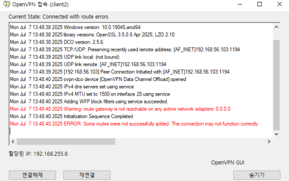

## 🧭 개요
이번에는 **OpenVPN**을 구현해보았다.  
이로써 더 이상 서버를 늘리지 않을 것이며, 이 상태로 Git에 데이터를 올리고 **ArgoCD를 통해 통합**을 해볼 생각이다.  

Kubernetes 환경에서의 긴 도전 끝에 깨달은 점은,  
확실한 이해 없이 많은 것을 억지로 만들기보다, **동작 원리를 익히는 것이 중요**하다는 것이다.  
그래서 이번에는 **Docker Compose 기반으로 OpenVPN을 구현**했다.  
나머지 K8s 실습은 숙제로 남겨둔다.


## 목표
- Docker-compose 기반 **OpenVPN 서버 구축**
- K8s 구현에 대한 **한계 및 고찰**

## 📦 디렉터리 구조

```bash
~/test/company-infra/
├─ tmemplates/                   
│   ├─ mysql/
│   ├─ prometheus/
│   ├─ grafana/
│   ├─ apache2
│   ├─ ftp
│   ├─ mysql
│   ├─ mysqld-exporter
│   ├─ nginx
│   ├─ openvpn
│   ├─ samba
│   └─ jenkins/
├─ charts/                    
├─ values.yaml
├─ Chart.yaml
├─ helm-chart
├─ docker-compose/
│   ├─ docker-compose.yml (SFTP, openvpn)
│   └─ openvpn-data/
│       ├─ openvpn-config files
│       └─ client.ovpn
├─ argocd-values.yaml
├─ jenkins-values.yaml

~/test/company-infra-c/
├─ tmemplates/
│   ├─ Elasticsearch/
│   ├─ Fluentbit/
│   ├─ Kibana/
├─ charts/                    
├─ values.yaml
├─ Chart.yaml
├─ helm-chart

~/test/myapp
│   ├─ app.js
│   ├─ Dockerfile
│   ├─ .git
│   ├─ .gitignore
│   ├─ Jenkinsfile
│   ├─ k8s-deploy.yaml

```

### ⚙️ 서버 구축 및 트러블 슈팅
 
**🎤 openvpn** 을 구현해본 경험이 있다. 이때는 docker만을 이용해서 구현했다. \
 `Docker-compose` 와 `Docker` 환경은 굉장히 유사지만 **docker-compose.yml** 라는 다른점이 존재하지만
전체적인 구조로 봤을 때는 큰 차이는 없다고 생각한다. \
두번 다 이미지는 **openvpn/kylemanna**  사용했으며, 이전에는 상세한 설명이 눈에 들어오지 않았다. \
`openvpn.conf` 에 대한 상세한 고찰을 했으며  이전 K8s 에서는 동작하지 않았던 이유에 대해 짐작이 갔다. \
그 이야기는 밑에서 다루겠다

 ### ✅  openvpn  / docker-compose.yml

 ```yaml
 # docker-compose.yml

openvpn:
    image: kylemanna/openvpn:2.4
    container_name: openvpn-server
    cap_add:
      - NET_ADMIN
    devices:
      - /dev/net/tun:/dev/net/tun
    privileged: true
    ports:
      - "1194:1194/udp"
    volumes:
      - ./openvpn-data:/etc/openvpn
    command:
      - openvpn
      - --config
      - /etc/openvpn/openvpn.conf
    restart: unless-stopped

 ```

 🎤 우리가 사용하는  `openvpn/kylemanna`   이미지는 docker run 을 통해 config을 생성 했다. \
PKI init 을 해야하는데 github에 나와있는 것처럼 비밀번호 없이 pki를 생성했다. \
이후 **Client.ovpn**을 생성했다.

### docker run config 설정파일 생성

```yaml
# 1) 서버 설정 템플릿 생성
docker run --rm \
  -v "$PWD/openvpn-data:/etc/openvpn" \
  --cap-add NET_ADMIN \
  kylemanna/openvpn:2.4 \
  ovpn_genconfig -u udp://192.168.56.103:1194
  
  # 2) PKI (CA/서버키) 자동 생성
docker run --rm \
  -v "$PWD/openvpn-data:/etc/openvpn" \
  --cap-add NET_ADMIN \
  -e EASYRSA_BATCH=1 \
  kylemanna/openvpn:2.4 \
  ovpn_initpki nopass
  
  # 3) 클라이언트 키/인증서 자동 생성
docker run --rm \
  -v "$PWD/openvpn-data:/etc/openvpn" \
  --cap-add NET_ADMIN \
  -e EASYRSA_BATCH=1 \
  kylemanna/openvpn:2.4 \
  easyrsa build-client-full client nopass

# 4) client.ovpn 프로파일 뽑기
docker run --rm \
  -v "$PWD/openvpn-data:/etc/openvpn" \
  --cap-add NET_ADMIN \
  kylemanna/openvpn:2.4 \
  ovpn_getclient client > openvpn-data/client.ovpn

# 실행
docker-compose up -d

```

(2).  에서 init-pki complete \
(3). 에서 client.crt/client.key 생성 \
(4).  후 openvpn-data/client.ovpn 파일이 제대로 생성 완료 해야함

#### Compose로 컨테이너 가동  →  터널 인터페이스 tun0 생성 →  NodePort:1194로 바인딩

🎤 client.ovpn windows로 가져와 실행하면 된다.

> **docker run … kylemanna/openvpn ovpn_genconfig, ovpn_initpki, ovpn_getclient** 등은 이미지에 안에 들어 있는 쉘 스크립드 또는 Easy-Rsa 스크립트 이다.



## 🔓 트러블 슈팅
### 1. PKI 생성중 Failed to build the CA


- 에러: ovpn_initpki 하단에서 `"Unable to find client"` 또는 `"Missing expected CAfile:ca.crt"` 에러
- 원인: Easy-RSA가 대화식으로 DN 입력을 요구 하며 멈춤
- 해결: 
```bash
-e EASYRSA_BATCH=1 \
ovpn_initpki nopass

```

환경변수 `EASYRSA_BATCH=1` 을 주어 "모든 질문에 기본 값 사용" 으로 비대화식 배치 모드 실행

### 2. /dev/net/tun 디바이스 없음
- 에러: `ERROR: Cannot open TUN/TAP dev /dev/net/tun: No such file or directory`
- 원인: 컨테이너에 TUN 디바이스가 바인딩 되지 않음 → 네트워크 터널을 못 만듦
- 해결:
```bash
cap_add: ["NET_ADMIN"]
devices:
  - /dev/net/tun:/dev/net/tun
privileged: true   # (필요 시 추가)

```

### 3. Cipher 협상 경고 & 실패 `( --cipher is not set )`
- 에러: 클라이언트 로그에 `"Note: --cipher is not set..."` 반복
- 원인: OpenVPN 2.4.x버전은 `data-ciphers` 옵션 미지원 → 클라이언트가 어떤 암호를 제안할지 모름
- 해결: (2.4.x 호환)
```bash
dev tun
- data-ciphers AES-256-GCM:AES-128-GCM
- data-ciphers-fallback BF-CBC
+ cipher AES-256-CBC
+ ncp-ciphers AES-256-GCM:AES-128-GCM

```

 

### 4. Compression 에러 (comp-lzo)

- 에러: OPTIONS ERROR: server pushed compression settings… Compression or compression stub framing is not allowed…
- 원인: OpenVPN DCO(Data Channel Offload) 모드에서는 LZO 압축이 금지 
  주석처리도 문제가 되기 때문에 해당 구문은 아예 삭제 하는게 편하다.
- 해결:
해당 구문 다 삭제 .
### 5. 서브넷 충돌 & 패킷 미전달

 

- 에러: TLS 핸드 쉐이크 시간 초과`( TLS key negotiation failed... )`
- 원인: `server 192.168.255.0/24`가 `VM NAT (192.168.56.0/24)`와 충돌 → 패킷 라우팅 실패
- 해결: 네트워크 대역을 변경한다. VPN 터널용 대역을 완전히 분리한다.
```
- server 192.168.255.0 255.255.255.0
+ server 10.8.0.0 255.255.255.0
push "route 192.168.56.0 255.255.255.0"

```