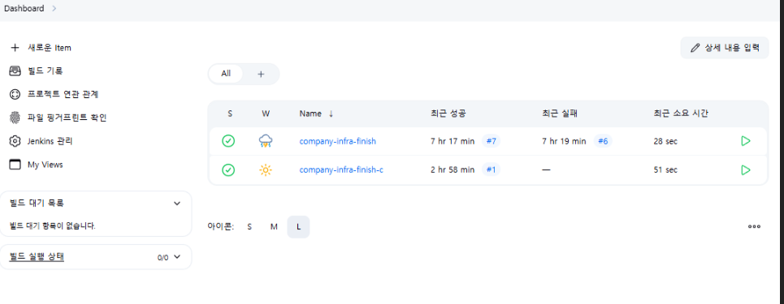
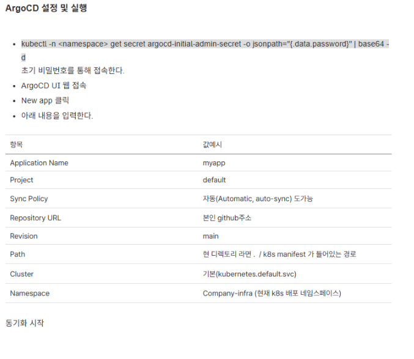
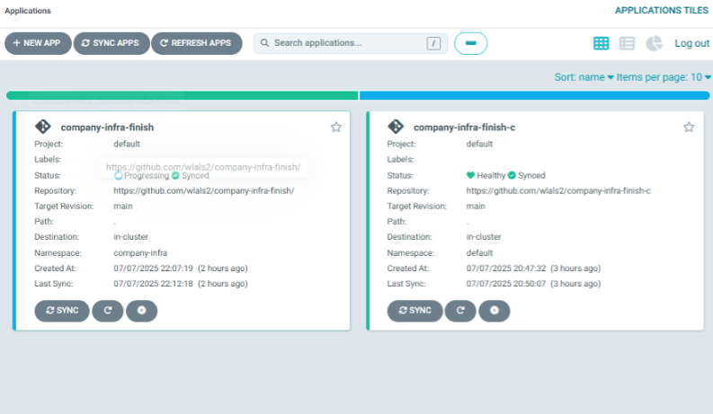

## 🧭 개요
우리는 실습 과정의 순서가 뒤바뀌었다.  
**전체 인프라 구조 설계 → IaC 구성 → Kubernetes 배포 → 자동화 준비 → 애플리케이션 배포**  
그러나 우리는 **K8s 서버 올리기부터** 시작했다.  
VirtualBox 스냅샷을 찍어두었지만, 이는 **코드를 지키는 환경**은 아니었다.  
그래서 지금이라도 **ArgoCD / Jenkins**를 구현하려 했다.


## 🎯 목표
- ArgoCD 구현 및 트러블슈팅  
- Jenkins 구현 및 트러블슈팅  
- 완벽한 IaC 구성  


## 📦 기본 디렉토리 구성

```bash
~/test/company-infra/
├─ templates/                   
│   ├─ mysql/
│   ├─ prometheus/
│   ├─ grafana/
│   ├─ apache2/
│   ├─ ftp/
│   ├─ mysqld-exporter/
│   ├─ nginx/
│   ├─ openvpn/
│   ├─ samba/
│   └─ jenkins/
├─ charts/
├─ values.yaml
├─ Chart.yaml
├─ helm-chart/
├─ docker-compose/
│   └─ docker-compose.yml (SFTP)
├─ argocd-values.yaml
├─ jenkins-values.yaml

~/test/company-infra-c/
├─ templates/
│   ├─ Elasticsearch/
│   ├─ Fluentbit/
│   ├─ Kibana/
├─ charts/
├─ values.yaml
├─ Chart.yaml
├─ helm-chart/

~/test/myapp/
├─ app.js
├─ Dockerfile
├─ Jenkinsfile
├─ k8s-deploy.yaml
```
---
### ⚙️ IaC와 CI/CD 구조

Jenkins와 ArgoCD를 이용한 구조는 다음과 같다:

1. 코드(앱, Dockerfile, Manifest) → Git에 등록
2. 소스/인프라 코드화 (GitOps 핵심)
3. Jenkins(CI) → Docker 빌드 및 Push
4. ArgoCD(CD) → Git 변경 감지 → 자동배포
5. 배포 자동화 및 상태 동기화
---
### ⚙️ CI/CD 완성 및 트러블 슈팅
 
> 🎤 우리가 염두해야하는 것은 무조건 code를 git에 올리고 시작해야한다이다. \
무조건 code 백업을 위해 git에 올린다. \
그럼에도 더 안전성을 위해 Virutal box snap shot까지 찍는 것을 추천한다.

```bash
cd ~/test/company-infra
git add .
git commit -m "최종 수정 완"
git push 
# 아이디와 토큰을 입력

cd ~/test/company-infra-c
git add .
git commit -m "최종 수정 완"
git push 
# 아이디와 토큰을 입력

# 우리는 이전에 git를 올린 적이 있기 때문에 해당 명령어만을 작성한다.
# 만약 처음이라면 git init 부터 다시 실행 하길 바란다. repo등록까지
```
### ⚙️ Jenkins 설정
```yaml
# ~/test/company-infra/Jenkinsfile
pipeline {
  agent {
    kubernetes {
      yaml """
apiVersion: v1
kind: Pod
spec:
  containers:
    - name: docker
      image: docker:24.0.2-dind
      command:
        - cat
      tty: true
      volumeMounts:
        - mountPath: /var/run/docker.sock
          name: docker-sock
  volumes:
    - name: docker-sock
      hostPath:
        path: /var/run/docker.sock
        type: Socket
"""
      defaultContainer 'docker'
    }
  }
  stages {
    stage('Checkout') {
      steps {
        checkout scm
      }
    }
    stage('Build Docker Image') {
      steps {
        sh 'docker version'
        sh 'docker build -t wlals2/company-infra-finish:$BUILD_NUMBER .'
      }
    }
    stage('Push Docker Image') {
      steps {
        echo 'Push Docker Image 단계 - 임시 실행'
        // 실제 push 명령은 이후 추가
      }
    }
  }
}


# ~/test/company-infra-c/Jenkinsfile
pipeline {
    agent any
    environment {
        REPO_URL = 'https://github.com/wlals2/company-infra-finish-c.git'
    }
    stages {
        stage('Checkout') {
            steps {
                // Github 저장소에서 최신 소스 체크아웃
                git branch: 'main', url: "${env.REPO_URL}"
            }
        }
        // 필요하면 아래에 빌드/테스트 단계 추가 가능
        // stage('Build') { ... }
        // stage('Test') { ... }
        stage('Push to GitHub') {
            steps {
                // 예시: 파일 수정 후 자동 푸시까지 할 수 있음
                // sh 'git config --global user.email "you@example.com"'
                // sh 'git config --global user.name "Your Name"'
                // sh 'git add .'
                // sh 'git commit -m "Auto commit from Jenkins" || echo "No changes"'
                // sh 'git push origin main'
                echo "Push는 CLI에서 수동으로, Jenkins는 빌드만 담당 (실습 기준)"
            }
        }
    }
    post {
        always {
            echo 'Jenkins 파이프라인 완료'
        }
    }
}

# http://<'젠킨스 서버주소'>:30800 접속해 item을 똑같이 만들어 주면된다.
# 여기서 기억해야할 부분은 item 내에 git 주소는 맞게 작성을 해야한 다는 것이다. 
# 만약 git 저장소가 없다면 저장소부터 만들고 코드 푸쉬까지 하는 것을 추천한다.
```

#### 🎤 item 작성할 때는 기본 pipe 생성 후 git scm 추가 옵션을 사용해 알맞게 인자 넣고 작성해야한다.
Jenkinsfile 마저 git에 올릴 것이기 때문에 scm 옵션을 사용하여야한다.
 
#### 🎤 두 파일은 같은 *jenkinsfile* 이지만 내용은 다르다.
여러 이유 들이있겠지만 기본적으로는 company-infra 에서는 docker-compose로 로컬 구동이 존재한다. \
이후 K8s Manifest에서 새로 빌드된 이미지도 사용한다. \
그럼에 `company-infra-c `직접 빌드할 필요 없이 yaml만 변경하며 공식이미지만을 사용한다. \
**GitOps/ArgoCD**에서 manifest만 읽어 자동배포한다. 최소구조라고 볼 수있다.

### 정리
| 구분 | company-infra | company-infra-c |
|---|---|---|
| **목적** | 앱 컨테이너 직접 빌드/배포 | 순수 K8s manifest 기반 GitOps |
| **Jenkins Agent** | K8s 기반 (Docker-in-Docker) | any / 어디서나 |
| **Build 단계** | `docker build/push` | 없음 |
| **대상** | Dockerfile, docker-compose, K8s | K8s manifest (Helm) |
| **아키텍처** | CI(빌드+배포) + CD | GitOps CD (ArgoCD 활용) |
---

### ✅ Jenkins 를 알아 가보자

- SCM 연동(Checkout)
check scm 또는 git ... 단계
- 빌드/테스트/배포 단계
컨테이너 빌드: docker build
테스트 : sh 'pytest ...'
배포: kubectl apply (주로 argoCD가 담당)
- 이미지 푸시 단계
이미지를 직접 푸쉬 필요할때 : docker push ...
- 에러 핸들링 / Post 처리
성공/실패 후 처리 : post {always/fauilure/success}
- 실행 환경 명시
k8s agent / any

### ✅ Jenkins 대표 오류들

- steps: {} 비어있음 → 에러 발생 (반드시 echo 라도 넣어야한다.)
- docker build/push 관련에러 (도커 데몬,권한,dind 환경,credential 문제)
- 파이프라인 sytax 오류 (if,stage,agent 등 오타/누락)
- 빌드가 없는 manifest repo 인데 build/push 단계가 남아있을때 
- 환경변수 ,credential,도커 네트워크 문제 \

**필자는 steps:{} 에러와 docker 권한 문제로 인해 image dind 환경을써 만들었다.**

### ✅ dind(docker in docker) 를 쓰는 이유


> 필자 company-infra/Jenkinsfile 을보면 dind를 사용하고 있다. Jenkins는 Docker 명령을 사용할 수 없기 때문이다.
현재 Jenkins는 helm 을 통해 container 형식으로 구현이 되어 있기 때문이다.
그렇기에 Jenkins가 docker를 사용하려면 두 가지의 접근 방식이 있다.

 1. Host의 Docker socket를 마운트 (hostpath /var/run/docker.sock)
Jenkins Pod에 host의 도커 소켓을 직접 마운트 host 머신의 docker 데몬을 그대로 사용
속도는 빠를 수있나 Pod가 전체 docker 권한을 갖게되어 보안성 위험이 생긴다.
 2. dind 방식
Jenkins 파이프라인 실행용 Pod 내부에 별도의 Docker 데몬을 띄어서 그안에서 build/push 작업을 수행한다.
docekr 명령은 내부의 사용할 수있게 된다.

ex)
```yaml
agent {
  kubernetes {
    yaml """
    apiVersion: v1
    kind: Pod
    spec:
      containers:
        - name: docker
          image: docker:24.0.2-dind
          ...
    """
    defaultContainer 'docker'
  }
}
```
> 즉 K8s 기반 Jenkins Agent가 독립적으로 docker build/push 작업을 하기 위해서이다.




### ✅ argoCD  application 작성 및 구현
#### 🎤  argoCD는 application을 만드는 두 가지의 방법이 있다.

 

- 웹 UI 에서 application 작성
- 로컬에서 application.yaml 파일 작성

실무에서는 application.yaml 파일 작성을 권장한다.
- Git로 인프라 이력 관리 IaC 가능
- 환경마다 반복 자동화에 강하다.(dev,staging,prod 등)
- 문제가 생겨도 application.yaml apply로 복구

```yaml
# ~/test/company-infra/application.yaml
apiVersion: argoproj.io/v1alpha1
kind: Application
metadata:
  name: company-infra-finish                # Application 이름, 마음대로 정해도 됨
  namespace: argocd                        # ArgoCD가 설치된 네임스페이스 (보통 argocd)
spec:
  project: default                         # 그냥 default로 둬도 됨
  source:
    repoURL: 'https://github.com/wlals2/company-infra-finish'  # 내 repo 주소
    targetRevision: main                   # main 브랜치 기준
    path: templates                        # manifest/helm chart가 있는 디렉터리
    # helm:
    #   valueFiles:
    #     - values.yaml                    # Helm chart로 배포할 땐 이 옵션도 쓴다
  destination:
    server: https://kubernetes.default.svc # 고정값(K8s 내부 서비스 URL)
    namespace: company-infra               # 실제 배포할 네임스페이스!
  syncPolicy:
    automated:
      prune: true                          # 필요 없는 리소스 자동 삭제
      selfHeal: true                       # 상태 안 맞으면 자동 복구


# ~/test/company-infra-c/application.yaml
apiVersion: argoproj.io/v1alpha1
kind: Application
metadata:
  name: company-infra-c
  namespace: argocd   # ArgoCD 설치 namespace (일반적으로 argocd)
spec:
  project: default
  source:
    repoURL: 'https://github.com/wlals2/company-infra-finish-c.git'
    targetRevision: main
    path: .
    helm:
      valueFiles:
        - values.yaml
  destination:
    server: 'https://kubernetes.default.svc'
    namespace: company-infra
  syncPolicy:
    automated:
      prune: true
      selfHeal: true
```

> 웹 UI 실행 방법은 이전 글과 동일하여 그대로 발췌해왔다.




### 🔓 트러블 슈팅
ArgoCD 쿠버네티스 앱을 배포 하였으나 OutOfsync를 상태가 유지되었다.

그러나 실제 앱은 정상적으로 돌아고 Pod역시 Running 이지만 ArgoCD 에서만 OutOfSync계속 남아있음

- 오류:
Git 선언(manifest)와 실제 클러스터 상태 불일치 -  무조건 OutOfSync 
manifests에 오타 및 잘못된 필드가 있으면 K8s는 필드를 무시 (적용되지 않음)
이전 helm 으로 배포한 애플리케이션들 때문에 설정 오류 발생
- 오류 찾기:
웹 UI 에서 DIFF 탭을 확인해 무엇이 다른지 확인을함
desired(manifest) vs live(cluster) 상태의 차이점을 비교
logs 확인 및 kubectl live 상태 직접 덤프

```yaml
kubectl get deploy <name> -n <namespace> -o yaml > live.yaml
```
- 해결 :
실제 내 사례는 **manifest의 initcontainer**에 securityContext 필드가 오타났다. \
→ **Git**에는 제대로 있으나 실제 k8s 적용 안됨 아무리 sync,재배포 되어도 `Out of Sync`상태로 남아있음 \
이전 helm  배포 삭제 이후 오타를 찾아서 수정해 다시 git에 코드를 올림 이후 sync 하면
syned 상태로 변환  

코드 내용에 오타가 있어 `K8s`와 `argoCD`D가 필드를 빼주어 배포를 해준 것이다 .
그러나 argoCD에서는 실제 배포된 내용과 git 내용이 다르기에 계속 **Out of Sync**가 나온 것이다.

#### OutOfsync 해결 순서 체크리스트

1. ArgoCD DIFF로 차이 확인
2. live.yaml, manifest 직접비교
3. yaml 오타/필드 점검
4. 필요시 기본 리소스 삭제/정리
5. sync 후 정상 확인