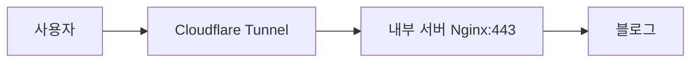
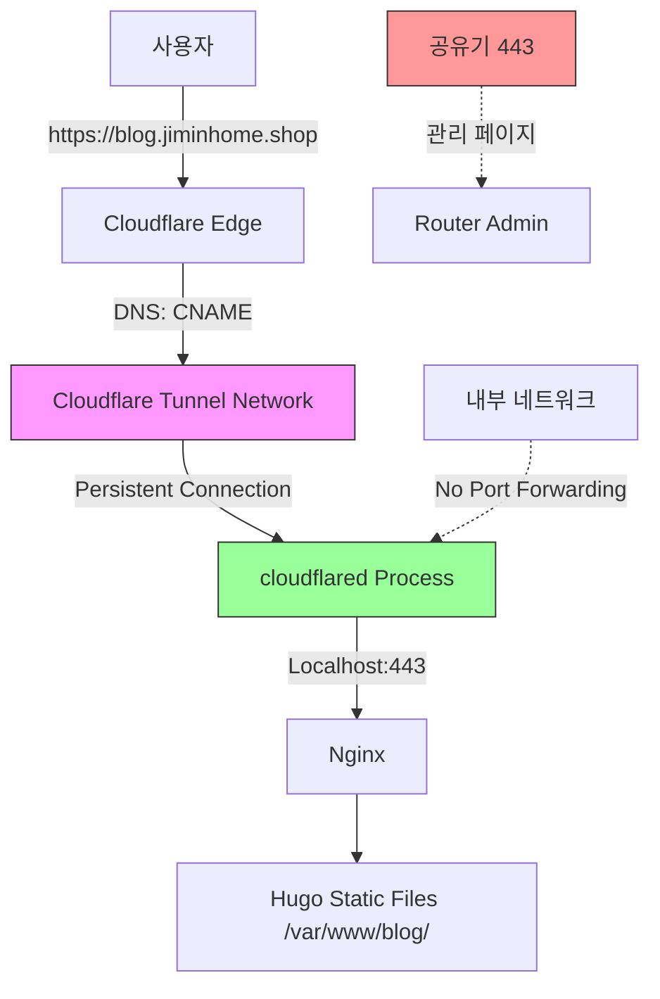

## 문제 상황

어느 날 갑자기 블로그에 접속이 안 되는 거예요. 당황스러웠죠. 로컬에서는 잘 되는데 외부에서 접속하면 **공유기 관리 페이지**가 표시되거나 **522 에러**가 발생하더라구요.

```

https://blog.jiminhome.shop 접속
→ 공유기 관리 페이지 또는 522 Connection Timed Out

```

---

## 원인 분석

### 1. 이전 작동 방식 (정상)

원래는 이렇게 작동했어요:



**설정:**
- Cloudflare Tunnel 실행
- `/etc/cloudflared/config.yml`에 ingress 규칙 존재
- DNS: CNAME → Tunnel
- **포트포워딩 불필요**

정말 편했어요. 포트포워딩 없이도 외부에서 접속이 되니까요.

### 2. 변경 후 문제 발생

**무엇이 바뀌었나?**

#### A. Cloudflare Tunnel 설정 초기화

```yaml
# 이전 (정상)
ingress:
  - hostname: blog.jiminhome.shop
    service: https://localhost:443
  - service: http_status:404

# 변경 후 (문제)
ingress:
  - service: http_status:404  # 모든 요청에 404 반환
```

**원인:** CI/CD 설정 또는 설정 파일 수정 중 ingress 규칙 삭제

처음엔 "왜 ingress가 사라졌지?"라고 한참 고민했어요.

#### B. DNS 레코드 변경

```

# 이전
blog.jiminhome.shop → CNAME → <tunnel-id>.cfargotunnel.com

# 변경 후
blog.jiminhome.shop → A 레코드 → 122.46.102.190 (Proxy 모드)

```

#### C. 공유기 포트 충돌

```

외부 접속 → 122.46.102.190:443
            ↓
       공유기가 443 포트 사용 중 (관리 페이지)
            ↓
       포트포워딩 규칙 없음
            ↓
       블로그 서버(192.168.1.187)로 전달 안 됨

```

알고 보니 공유기가 443 포트를 이미 쓰고 있었어요. 그래서 포트포워딩이 불가능했던 거죠.

---

## Cloudflare 연결 방식 비교

### 방법 1: Cloudflare Proxy (A 레코드)

```

사용자 → Cloudflare (Proxy) → 외부 IP:443 → 공유기 포트포워딩 → 내부 서버

```

**필요 조건:**
- ✅ DNS: A 레코드 + Proxy ON (주황색 구름)
- ✅ 공유기 포트포워딩: 443 → 192.168.1.187:443
- ❌ **문제:** 공유기가 443 사용 중이면 불가능

**장점:**
- 간단한 설정
- 빠른 속도

**단점:**
- 포트포워딩 필수
- 외부 IP 노출
- 공유기 의존성

### 방법 2: Cloudflare Tunnel (CNAME)

```

사용자 → Cloudflare → Tunnel (아웃바운드) → 내부 서버

```

**필요 조건:**
- ✅ cloudflared 서비스 실행
- ✅ config.yml 설정
- ✅ DNS: CNAME → Tunnel 또는 CLI로 route 생성
- ❌ 포트포워딩 불필요

이게 진짜 좋은 점이에요. 공유기 설정을 건드릴 필요가 없으니까요!

**장점:**
- 포트포워딩 불필요
- 공유기 설정 불필요
- 외부 IP 노출 안 됨
- NAT 뒤에서도 작동
- Zero Trust 보안

**단점:**
- 초기 설정 복잡
- HTTP/HTTPS(80/443)만 지원
- 약간의 성능 오버헤드

---

## 트러블슈팅 과정

### 1단계: 문제 확인

```bash
# 로컬 서버 정상 확인
curl -I https://localhost
# HTTP/2 200 OK ✅

# 외부 접속 테스트
curl -I https://blog.jiminhome.shop
# HTTP/2 522 ❌
```

**결론:** 내부는 정상, 외부 연결 문제

로컬에서는 잘 되는데 외부에서만 안 되는 게 정말 이상했어요.

### 2단계: Cloudflare Tunnel 확인

```bash
# Tunnel 실행 확인
systemctl status cloudflared
# Active: active (running) ✅

# Config 확인
cat /etc/cloudflared/config.yml
# ingress 규칙 없음! ❌
```

**발견:** Tunnel은 실행 중이지만 ingress 규칙 없음

"어? Tunnel은 돌고 있는데 왜 안 되지?"라고 한참 고민했어요.

### 3단계: DNS 확인

```bash
nslookup blog.jiminhome.shop
# 172.67.191.32, 104.21.60.34 (Cloudflare Proxy IP)
```

**의미:** A 레코드 + Proxy 모드 = 직접 원본 IP로 연결 시도

### 4단계: 원본 IP 테스트

```bash
curl -Ik https://122.46.102.190
# HTTP/1.1 200 OK
# Content-Type: text/html
# Content-Length: 272
```

**결과:** 공유기 관리 페이지 응답 (블로그 아님)

이때 깨달았어요. "아, 공유기가 443 포트를 쓰고 있구나!"

---

## 해결 과정

### Step 1: Tunnel Config 수정

```yaml
# /etc/cloudflared/config.yml
tunnel: 65759494-dae6-4287-b92d-02a918b34722
credentials-file: /etc/cloudflared/65759494-dae6-4287-b92d-02a918b34722.json

warp-routing:
  enabled: true

ingress:
  - hostname: blog.jiminhome.shop
    service: https://localhost:443
    originRequest:
      noTLSVerify: true  # 자체 서명 인증서 허용
  - service: http_status:404
```

```bash
sudo systemctl restart cloudflared
```

### Step 2: DNS A 레코드 삭제

**Cloudflare Dashboard:**
- DNS → Records
- `blog` A 레코드 (122.46.102.190) 삭제

**왜?** A 레코드와 CNAME이 충돌하여 Tunnel route 생성 불가

처음엔 "A 레코드를 왜 지워야 하지?"라고 궁금했는데, 알고 보니 CNAME과 충돌하더라구요.

### Step 3: Tunnel DNS Route 생성

```bash
sudo cloudflared tunnel route dns 65759494-dae6-4287-b92d-02a918b34722 blog.jiminhome.shop
# Added CNAME blog.jiminhome.shop ✅
```

**자동 생성:**
```

blog.jiminhome.shop → CNAME → 65759494-dae6-4287-b92d-02a918b34722.cfargotunnel.com

```

### Step 4: 확인

```bash
curl -I https://blog.jiminhome.shop
# HTTP/2 200 ✅
# server: cloudflare
# cf-cache-status: DYNAMIC
```

드디어 접속이 됐어요! 정말 후련했죠.

---

## 포트 제약사항

### Cloudflare Tunnel 지원 포트

**자동 지원 (Public Hostname):**
- HTTP: 80
- HTTPS: 443

**추가 프로토콜 (Cloudflare Access 필요):**
- SSH: 22
- RDP: 3389
- SMB: 445

### 커스텀 포트 사용하려면?

#### 방법 1: 포트포워딩 방식 사용

```

사용자 → http://blog.jiminhome.shop:8080
        ↓
    Cloudflare Proxy OFF (DNS only)
        ↓
    공유기 포트포워딩: 8080 → 192.168.1.187:8080

```

**설정:**
```bash
# Nginx에서 8080 포트 추가
server {
    listen 8080;
    server_name blog.jiminhome.shop;
    # ...
}

# 공유기 포트포워딩
8080 → 192.168.1.187:8080
```

#### 방법 2: Cloudflare Spectrum (유료)

**Enterprise 플랜에서만 사용 가능**
- 모든 포트 지원
- TCP/UDP 프로토콜 지원

Enterprise 플랜은 너무 비싸서... 개인 블로그에는 무리예요.

#### 방법 3: WARP + Private Network

```yaml
# config.yml
warp-routing:
  enabled: true

ingress:
  - hostname: custom-app.jiminhome.shop
    service: tcp://localhost:8080  # 커스텀 포트
  - service: http_status:404
```

**사용:**
- Cloudflare WARP 클라이언트 설치 필요
- Private Network로만 접근 가능
- 공개 인터넷 접근 불가

---

## 핵심 교훈

### 1. Cloudflare 연결 방식 선택 기준

| 조건 | Proxy (A 레코드) | Tunnel (CNAME) |
|------|------------------|----------------|
| 포트포워딩 가능 | ✅ 추천 | ⚠️ 선택 |
| 포트포워딩 불가능 | ❌ 불가능 | ✅ 필수 |
| 80/443만 사용 | ✅ OK | ✅ OK |
| 커스텀 포트 사용 | ✅ OK | ❌ 제한적 |
| Zero Trust 보안 | ⚠️ 기본만 | ✅ 완벽 |

제 경우는 공유기가 443을 쓰고 있어서 Tunnel이 필수였어요.

### 2. DNS 레코드 타입 이해

```

A 레코드: 도메인 → IP 주소
blog.jiminhome.shop → 122.46.102.190

CNAME: 도메인 → 다른 도메인
blog.jiminhome.shop → 65759494-xxx.cfargotunnel.com

```

**충돌:**
- 같은 호스트명에 A + CNAME 동시 존재 불가
- Tunnel 사용 시 A 레코드 삭제 필수

처음엔 "A 레코드와 CNAME이 뭐가 다르지?"라고 궁금했는데, 이제는 완전히 이해했어요.

### 3. 522 에러의 의미

**HTTP 522: Connection Timed Out**

Cloudflare가 원본 서버에 연결할 수 없음

**가능한 원인:**
1. 원본 서버 다운
2. 포트포워딩 미설정
3. 방화벽 차단
4. 잘못된 IP 주소
5. **공유기가 해당 포트 사용 중** ← 우리 케이스

### 4. Tunnel Config의 중요성

```yaml
# 잘못된 설정
ingress:
  - service: http_status:404

# 올바른 설정
ingress:
  - hostname: blog.jiminhome.shop
    service: https://localhost:443
    originRequest:
      noTLSVerify: true
  - service: http_status:404  # catch-all
```

**주의:**
- 첫 번째 ingress가 catch-all이면 모든 요청 차단
- hostname 매칭 규칙을 먼저 배치
- 마지막은 항상 catch-all

Ingress 순서가 정말 중요하다는 걸 깨달았어요.

---

## 최종 구성도



**구성 요소:**
1. DNS: `blog.jiminhome.shop` → CNAME → Tunnel
2. Cloudflared: 4개 연결 유지 (HA)
3. Ingress: blog.jiminhome.shop → https://localhost:443
4. Nginx: 443 포트 리스닝, SSL 인증서
5. Hugo: /var/www/blog/에서 정적 파일 제공

---

## 참고 자료

- [Cloudflare Tunnel Documentation](https://developers.cloudflare.com/cloudflare-one/connections/connect-apps/)
- [DNS Record Types](https://www.cloudflare.com/learning/dns/dns-records/)
- [Cloudflare Error 522](https://developers.cloudflare.com/support/troubleshooting/cloudflare-errors/troubleshooting-cloudflare-5xx-errors/#error-522-connection-timed-out)
- [Tunnel Ingress Rules](https://developers.cloudflare.com/cloudflare-one/connections/connect-apps/install-and-setup/tunnel-guide/local/local-management/ingress/)

---

## 결론

**문제 발생 이유:**
1. Tunnel config에서 ingress 규칙 삭제됨
2. DNS가 A 레코드로 변경됨 (Tunnel 대신 직접 연결)
3. 공유기가 443 포트 사용 중
4. 포트포워딩 미설정

**해결 방법:**
1. Tunnel config 복구
2. A 레코드 삭제
3. Tunnel DNS route 생성
4. CNAME으로 Tunnel 연결

처음엔 당황스러웠지만, 하나씩 분석하다 보니 원인을 찾을 수 있었어요. 트러블슈팅 과정에서 Cloudflare Tunnel의 작동 원리를 완전히 이해하게 됐죠.

**선택 기준:**
- 웹 서비스 (80/443만): **Tunnel 추천**
- 커스텀 포트 필요: **포트포워딩 + Proxy**
- 완벽한 보안: **Tunnel + Zero Trust**

이 경험 덕분에 Cloudflare Tunnel을 제대로 이해하게 됐어요. 다음에 비슷한 문제가 생기면 바로 해결할 수 있을 것 같아요!
