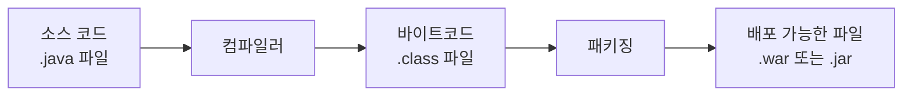
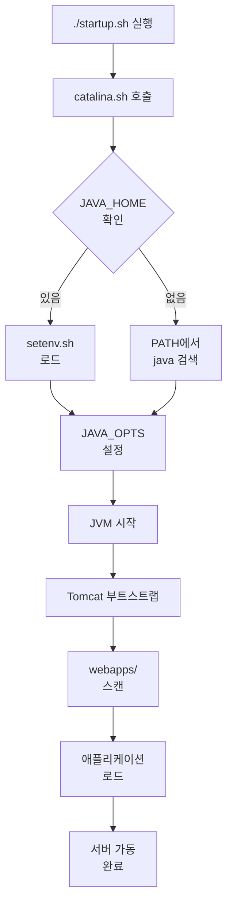
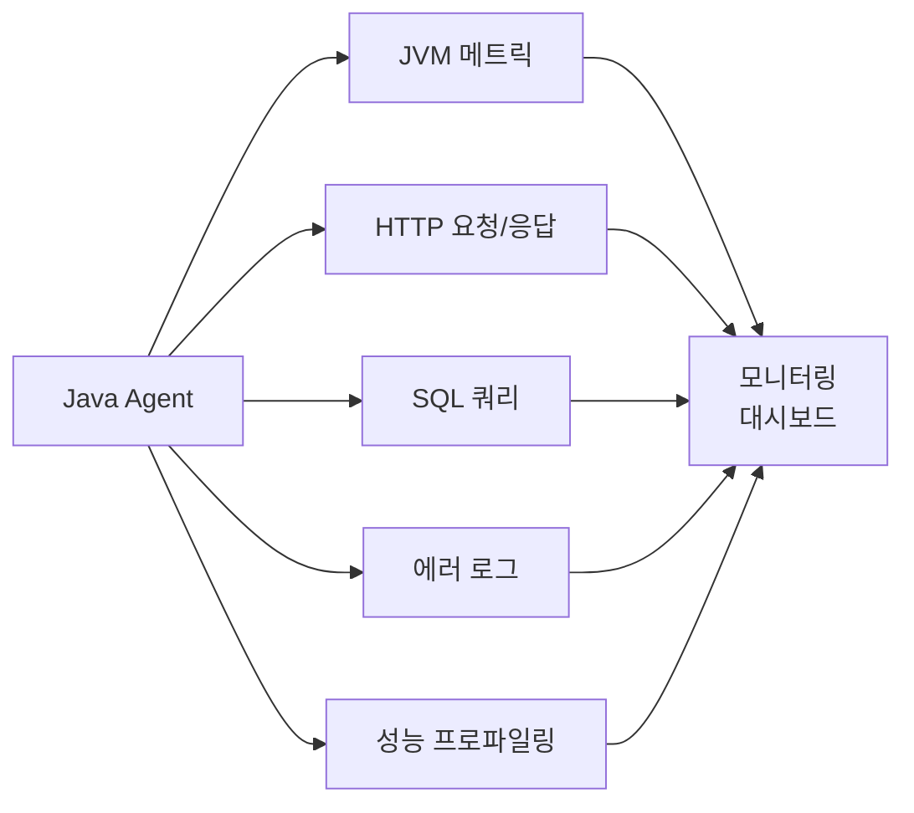
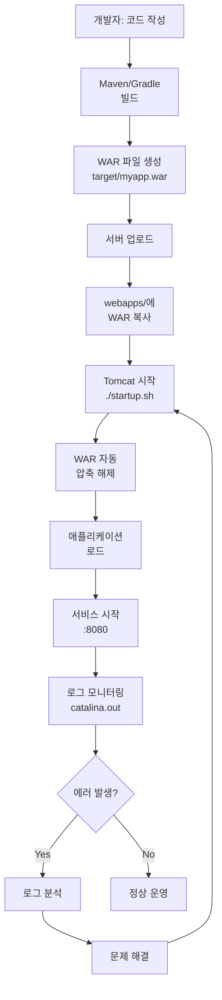

## 들어가며

Java 애플리케이션을 운영하다 보면 빌드 과정이나 Tomcat 서버 관리에서 문제가 발생하곤 합니다.
특히 Java 개발자가 아닌 경우, 에러 메시지를 보고도 어디서부터 해결해야 할지 막막할 때가 많죠.

이 글에서는 **Java 코드를 몰라도** 이해할 수 있도록 빌드 프로세스와 Tomcat 운영 방식을 쉽게 설명합니다.

---

## 1. Java 빌드 프로세스 이해하기

### 빌드가 뭔가요?

간단히 말하면, **사람이 작성한 코드를 컴퓨터가 실행할 수 있는 형태로 변환하는 과정**입니다.



### 주요 빌드 도구

#### Maven 방식

```bash
# pom.xml 파일 기반으로 빌드
mvn clean package

# 결과물 생성 위치
# target/myapp.war
```

**프로젝트 구조:**
```
myproject/
├── pom.xml              # 빌드 설정 파일 (중요!)
├── src/
│   ├── main/
│   │   ├── java/        # Java 소스 코드
│   │   └── resources/   # 설정 파일 (properties, xml 등)
│   └── test/            # 테스트 코드
└── target/              # 빌드 결과물 (자동 생성)
    └── myapp.war        # 최종 배포 파일
```

#### Gradle 방식

```bash
# build.gradle 파일 기반
./gradlew build

# 결과물: build/libs/myapp.war
```

---

## 2. WAR vs JAR 파일 이해하기

### WAR 파일 (Web Application Archive)

**웹 애플리케이션 전용 패키지**입니다. Tomcat 같은 서블릿 컨테이너에 배포합니다.

```
myapp.war (압축 파일)
├── WEB-INF/
│   ├── web.xml          # 웹 애플리케이션 설정
│   ├── classes/         # 컴파일된 클래스 파일
│   └── lib/             # 필요한 라이브러리들
├── META-INF/
└── index.html, *.jsp    # 웹 페이지 파일들
```

**배포 방법:**
```bash
# Tomcat webapps 디렉토리에 복사하면 끝!
cp myapp.war /path/to/tomcat/webapps/
# Tomcat이 자동으로 압축 해제하고 실행
```

### JAR 파일 (Java Archive)

**Java 라이브러리 또는 독립 실행 애플리케이션**입니다.

```bash
# 직접 실행 가능
java -jar myapp.jar
```

---

## 3. Tomcat 디렉토리 구조 완벽 이해

```
apache-tomcat-7.0.67/
├── bin/                 # 실행 스크립트 모음
│   ├── catalina.sh      # 핵심 실행 엔진
│   ├── startup.sh       # 시작 스크립트
│   ├── shutdown.sh      # 종료 스크립트
│   └── setenv.sh        # 환경변수 설정 (직접 생성)
│
├── conf/                # 설정 파일
│   ├── server.xml       # 포트, 커넥터 설정
│   ├── web.xml          # 서블릿 기본 설정
│   └── context.xml      # 데이터베이스 연결 등
│
├── lib/                 # Tomcat 라이브러리
│
├── logs/                # 로그 파일 (없으면 생성 필요!)
│   └── catalina.out     # 가장 중요한 로그
│
├── temp/                # 임시 파일
│
├── webapps/             # 애플리케이션 배포 디렉토리
│   ├── ROOT/            # 기본 앱 (http://localhost:8080/)
│   ├── myapp/           # 배포된 앱 (http://localhost:8080/myapp)
│   └── myapp.war        # WAR 파일 (자동 압축 해제됨)
│
└── work/                # JSP 컴파일 결과
```

### 중요 포인트

- **`logs/` 디렉토리가 없으면 Tomcat이 시작되지 않습니다!**
- **`webapps/`에 WAR 파일을 넣으면 자동으로 배포됩니다**
- **`conf/server.xml`에서 포트 번호를 변경할 수 있습니다**

---

## 4. Tomcat 시작 과정 들여다보기

### 명령어 하나의 여정

```bash
./startup.sh
```

이 간단한 명령어가 실행되면 어떤 일이 벌어질까요?



### 실제 실행 명령어

내부적으로 이런 명령어가 실행됩니다:

```bash
java $JAVA_OPTS \
     -Djava.endorsed.dirs=$JAVA_ENDORSED_DIRS \
     -classpath $CLASSPATH \
     -Dcatalina.base=$CATALINA_BASE \
     -Dcatalina.home=$CATALINA_HOME \
     org.apache.catalina.startup.Bootstrap start
```

---

## 5. 핵심 환경 변수 가이드

### 필수 환경 변수

| 변수 | 역할 | 우선순위 | 예시 |
|------|------|----------|------|
| **JRE_HOME** | JRE 위치 지정 | 1순위 | `/sw/openjdk8` |
| **JAVA_HOME** | JDK 위치 지정 | 2순위 | `/usr/lib/jvm/java-17-openjdk-amd64` |
| **PATH** | 명령어 검색 경로 | 3순위 | `/usr/bin:...` |


**우선순위:** `JRE_HOME` > `JAVA_HOME` > `PATH`에서 java 검색


### Tomcat 전용 환경 변수

| 변수 | 설명 | 기본값 |
|------|------|--------|
| `CATALINA_HOME` | Tomcat 설치 경로 | 자동 감지 |
| `CATALINA_BASE` | Tomcat 작업 경로 | CATALINA_HOME과 동일 |
| `CATALINA_OPTS` | Tomcat 전용 JVM 옵션 | 없음 |
| `JAVA_OPTS` | 모든 Java 프로세스 옵션 | 없음 |

### 환경 변수 설정 방법

**방법 1: setenv.sh 생성 (권장)**

```bash
# bin/setenv.sh 파일 생성
cat > bin/setenv.sh << 'EOF'
#!/bin/sh

# 메모리 설정
export CATALINA_OPTS="-Xms1024m -Xmx2048m"

# 인코딩 설정
export JAVA_OPTS="-Dfile.encoding=UTF-8"

# Java 17 호환성 설정 (Tomcat 7 사용 시)
export JAVA_ENDORSED_DIRS=""
EOF

chmod +x bin/setenv.sh
```

**방법 2: 시스템 환경 변수 (.bashrc)**

```bash
# ~/.bashrc에 추가
export JAVA_HOME=/usr/lib/jvm/java-17-openjdk-amd64
export PATH=$PATH:$JAVA_HOME/bin
```

---

## 6. Java 버전 호환성 문제 해결

### 문제 상황

```
Tomcat 7 + Java 17 = 에러 발생!
```

**에러 메시지:**
```
-Djava.endorsed.dirs=/path/to/endorsed is not supported.
Error: Could not create the Java Virtual Machine.
```

### 원인

Java 9부터 `endorsed.dirs` 옵션이 제거되었습니다.
하지만 Tomcat 7은 2015년에 개발되어 이 옵션을 사용합니다.

### 해결 방법

**Option 1: setenv.sh로 옵션 비활성화**

```bash
# bin/setenv.sh
export JAVA_ENDORSED_DIRS=""
```

**Option 2: JMeter 등에서 모듈 접근 허용**

```bash
export JVM_ARGS="--add-opens java.base/java.util=ALL-UNNAMED \
                 --add-opens java.base/java.lang=ALL-UNNAMED \
                 --add-opens java.base/java.lang.reflect=ALL-UNNAMED \
                 --add-opens java.base/java.text=ALL-UNNAMED \
                 --add-opens java.desktop/java.awt.font=ALL-UNNAMED"
```

---

## 7. 애플리케이션 배포 실전 가이드

### 배포 방법 1: WAR 파일 자동 배포

```bash
# 1. WAR 파일을 webapps에 복사
cp myapp.war /path/to/tomcat/webapps/

# 2. Tomcat이 자동으로:
#    - myapp.war 감지
#    - myapp/ 디렉토리로 압축 해제
#    - 애플리케이션 로드
#    - http://localhost:8080/myapp 접근 가능
```

### 배포 방법 2: ROOT 애플리케이션 (기본 경로)

```bash
# 기본 ROOT 삭제
rm -rf webapps/ROOT webapps/ROOT.war

# 새 앱을 ROOT로 배포
cp myapp.war webapps/ROOT.war

# 이제 http://localhost:8080/ 으로 접근
```

### 배포 방법 3: 디렉토리 직접 배포

```bash
# 압축 해제된 디렉토리 복사
cp -r myapp/ /path/to/tomcat/webapps/
```

---

## 8. 로그 분석 마스터하기

### 주요 로그 파일

```bash
logs/
├── catalina.out              # ⭐ 가장 중요! 표준 출력
├── catalina.2025-12-02.log   # Tomcat 내부 로그
├── localhost.2025-12-02.log  # 로컬호스트 관련
└── host-manager.*.log        # 관리자 앱 로그
```

### 실전 로그 명령어

**실시간 로그 모니터링:**
```bash
tail -f logs/catalina.out
```

**에러만 필터링:**
```bash
grep -i error logs/catalina.out
```

**애플리케이션 시작 시간 확인:**
```bash
grep "Server startup in" logs/catalina.out
# 출력: Server startup in 3245 ms
```

**특정 애플리케이션 로드 확인:**
```bash
grep "Deploying web application" logs/catalina.out
```

---

## 9. 일반적인 문제 해결 (Troubleshooting)

### 문제 1: `logs/catalina.out: No such file or directory`

**원인:** `logs` 디렉토리가 없음

**해결:**
```bash
mkdir -p logs temp
```


Tomcat은 `logs` 디렉토리를 자동으로 생성하지 않습니다!


---

### 문제 2: `java: command not found`

**원인:** JAVA_HOME이 잘못 설정되었거나 Java가 설치되지 않음

**진단:**
```bash
# Java 위치 확인
which java

# Java 버전 확인
java -version

# 실제 Java 경로 확인
readlink -f $(which java)
```

**해결:**
```bash
# 올바른 경로로 설정
export JAVA_HOME=/usr/lib/jvm/java-17-openjdk-amd64
export PATH=$PATH:$JAVA_HOME/bin
```

---

### 문제 3: `Address already in use (port 8080)`

**원인:** 8080 포트가 이미 사용 중

**진단:**
```bash
# 포트 사용 확인
netstat -tlnp | grep 8080
# 또는
ss -tlnp | grep 8080
```

**해결 방법 1: 프로세스 종료**
```bash
# PID 확인 후
kill -9 <PID>
```

**해결 방법 2: 포트 변경**
```bash
# conf/server.xml 수정
<Connector port="9090" protocol="HTTP/1.1"
           connectionTimeout="20000"
           redirectPort="8443" />
```

---

### 문제 4: 애플리케이션이 로드되지 않음

**체크리스트:**

1. WAR 파일 위치 확인
   ```bash
   ls -lh webapps/*.war
   ```

2. 로그 확인
   ```bash
   tail -100 logs/catalina.out | grep -i error
   ```

3. 권한 확인
   ```bash
   ls -l webapps/
   # Tomcat 실행 사용자가 읽기 권한 있어야 함
   ```

4. 압축 해제 상태 확인
   ```bash
   ls -d webapps/myapp/
   # 디렉토리가 생성되어야 정상
   ```

---

## 10. 모니터링 에이전트 이해하기

### Whatap, Scouter 같은 에이전트의 작동 원리

**설정 방법 (catalina.sh):**
```bash
# Whatap 에이전트 설정 예시
WHATAP_HOME=/sw/whatap
WHATAP_JAR=$(ls ${WHATAP_HOME}/whatap.agent-*.jar | sort -V | tail -1)
JAVA_OPTS="${JAVA_OPTS} -javaagent:${WHATAP_JAR}"
```

**실제 실행 명령어:**
```bash
java -javaagent:/sw/whatap/whatap.agent-2.2.66.jar \
     -Dcatalina.home=/path/to/tomcat \
     org.apache.catalina.startup.Bootstrap start
```

### 에이전트가 수집하는 정보



**수집 데이터:**
- CPU, 메모리 사용률
- GC (Garbage Collection) 통계
- API 응답 시간
- 데이터베이스 쿼리 성능
- 에러 발생 현황

---

## 11. 전체 플로우 정리

### 개발부터 배포까지



---

## 12. 실전 운영 시나리오

### 시나리오 1: 신규 버전 배포

```bash
# 1. 기존 애플리케이션 백업
cp webapps/myapp.war webapps/myapp.war.backup.$(date +%Y%m%d)

# 2. Tomcat 중지
./shutdown.sh

# 3. 5초 대기 (완전 종료 대기)
sleep 5

# 4. 기존 압축 해제 디렉토리 삭제
rm -rf webapps/myapp

# 5. 새 WAR 파일 배포
cp /path/to/new/myapp.war webapps/

# 6. Tomcat 시작
./startup.sh

# 7. 로그 실시간 모니터링
tail -f logs/catalina.out

# 8. 애플리케이션 시작 확인 (별도 터미널)
# "Server startup in XXX ms" 메시지 대기
```

### 시나리오 2: 성능 튜닝

```bash
# bin/setenv.sh 생성
cat > bin/setenv.sh << 'EOF'
#!/bin/sh

# 힙 메모리 설정
# -Xms: 초기 메모리
# -Xmx: 최대 메모리
export CATALINA_OPTS="-Xms2048m -Xmx4096m"

# GC 로그 활성화
export CATALINA_OPTS="$CATALINA_OPTS -verbose:gc"
export CATALINA_OPTS="$CATALINA_OPTS -XX:+PrintGCDetails"
export CATALINA_OPTS="$CATALINA_OPTS -XX:+PrintGCDateStamps"
export CATALINA_OPTS="$CATALINA_OPTS -Xloggc:logs/gc.log"

# 인코딩 설정
export JAVA_OPTS="-Dfile.encoding=UTF-8"
EOF

chmod +x bin/setenv.sh

# 재시작
./shutdown.sh && sleep 3 && ./startup.sh
```

### 시나리오 3: 포트 변경

```bash
# 1. server.xml 백업
cp conf/server.xml conf/server.xml.backup

# 2. 포트 변경 (8080 → 9090)
sed -i 's/port="8080"/port="9090"/g' conf/server.xml

# 3. 설정 확인
grep 'Connector port' conf/server.xml

# 4. 재시작
./shutdown.sh && ./startup.sh

# 5. 포트 리스닝 확인
netstat -tlnp | grep 9090
```

---

## 13. 빠른 참조 (Cheat Sheet)

### 자주 쓰는 명령어

```bash
# Tomcat 시작
./startup.sh

# Tomcat 종료
./shutdown.sh

# 강제 종료 (shutdown이 안 될 때)
ps aux | grep tomcat | grep -v grep
kill -9 <PID>

# 로그 실시간 보기
tail -f logs/catalina.out

# 에러 로그만 보기
grep -i error logs/catalina.out | tail -50

# Tomcat 프로세스 확인
ps aux | grep tomcat

# 포트 사용 확인
netstat -tlnp | grep 8080

# Java 버전 확인
java -version

# Java 위치 확인
which java
readlink -f $(which java)

# 배포된 애플리케이션 목록
ls -lh webapps/

# 디스크 사용량 확인 (로그 파일)
du -sh logs/
```

### 필수 디렉토리 생성

```bash
# Tomcat 초기 설정
mkdir -p logs temp

# 권한 설정 (필요 시)
chmod +x bin/*.sh
```

---

## 마치며

이 가이드가 Tomcat 운영에 도움이 되었기를 바랍니다.
중요한 점은 **로그 파일을 읽는 습관**을 들이는 것입니다.

대부분의 문제는 `logs/catalina.out`에 명확히 기록되어 있습니다.

### 다음 단계

- [Tomcat 공식 문서](https://tomcat.apache.org/tomcat-7.0-doc/)
- [JVM 튜닝 가이드]()
- [로그 분석 도구 활용]()

---

**관련 글:**
- Java 환경 변수 완벽 가이드
- JMeter 부하 테스트 실전
- Scouter APM 모니터링 설정

