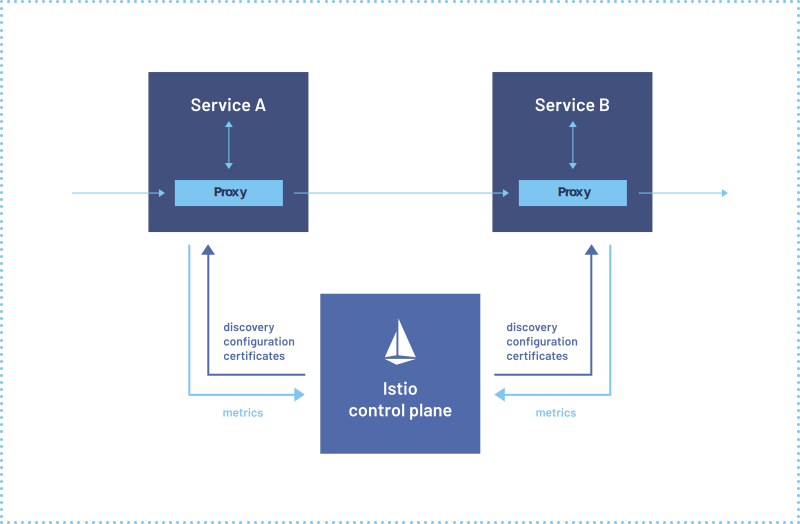

## Service Mesh란

분산 애플리케이션 간 네트워크 트래픽을 **투명하게** 관리하는 인프라 계층이다. 보안, 관찰 가능성, 신뢰성 기능을 애플리케이션 코드 밖에서 제공한다.


*출처: [istio.io](https://istio.io/latest/docs/concepts/what-is-istio/) — 각 서비스 옆에 프록시가 붙어 모든 트래픽을 제어한다*

---

## 등장 배경: 모놀리스에서는 없던 문제

모놀리스에서 서비스 간 호출은 같은 JVM 안에서 메서드 호출이다.

```java
// 모놀리스: 네트워크를 타지 않음
OrderService orderService = new OrderService();
orderService.createOrder(cart);
```

마이크로서비스로 전환하면 HTTP 호출로 바뀐다.

```java
// 마이크로서비스: 이 순간부터 네트워크 장애 가능
RestTemplate restTemplate = new RestTemplate();
restTemplate.post("http://order-service/orders", cart);
```

이 순간부터 쏟아지는 질문들:

| 상황 | 필요한 것 |
|------|----------|
| order-service 응답이 느림 | 타임아웃 |
| 일시적 네트워크 오류 | 재시도 |
| order-service 다운 | Circuit Breaking |
| 요청이 실제로 갔는지 | 분산 추적 |
| 인증된 서비스에서 온 건지 | 서비스 간 인증 |

---

## 기존 해결책과 그 한계

초기에는 각 서비스 코드 안에서 라이브러리로 해결했다.

```java
// Netflix OSS: 각 서비스에 반복되는 네트워크 처리 코드
@Retryable(maxAttempts = 3)
@CircuitBreaker(name = "order-service")
@HystrixCommand(fallbackMethod = "fallback")
public Order createOrder(Cart cart) {
    return restTemplate.post("http://order-service/orders", cart);
}
```

문제는 이 코드가 **모든 서비스에 반복**된다는 것이다.

| 문제 | 결과 |
|------|------|
| 재시도 정책 변경 | 30개 서비스 코드 전부 수정 |
| TLS 인증서 교체 | 모든 서비스 재배포 |
| Java 이외 언어 사용 | Hystrix가 작동 안 함 |
| 특정 서비스만 추적 활성화 | 불가능 |

Netflix의 Hystrix, Ribbon은 Java 전용이다. Python, Go 서비스에는 다른 라이브러리가 필요하다. 팀이 늘고 언어가 다양해질수록 관리는 불가능해진다.

---

## 해결책: 네트워크 처리를 애플리케이션 밖으로

Service Mesh의 핵심 아이디어:

> **"네트워크 처리 로직을 코드에서 꺼내서, 별도 프록시에게 맡긴다."**

각 Pod 옆에 **Sidecar 프록시**를 붙인다. 모든 네트워크 트래픽이 이 프록시를 통과한다.

```
Before: 서비스 간 직접 통신
  Service A ──────────── HTTP ────────────> Service B

After: 모든 트래픽이 Sidecar 통과
  Service A → [Envoy] ──── mTLS ────> [Envoy] → Service B
               ↑                          ↑
           아웃바운드 처리             인바운드 처리
        (재시도/타임아웃/추적)       (인증/메트릭 수집)
```

재시도, 타임아웃, 인증, 추적은 **프록시가 처리**한다. 애플리케이션 코드는 비즈니스 로직에만 집중한다. 언어와 무관하게.

---

## Service Mesh의 두 계층

Service Mesh는 **Data Plane**과 **Control Plane**으로 나뉜다.

**Data Plane (데이터 플레인)**:
- 실제 트래픽을 처리하는 Sidecar 프록시들
- 각 Pod마다 하나씩 붙어 인/아웃바운드를 가로챔

**Control Plane (컨트롤 플레인)**:
- 프록시들에게 설정(라우팅 규칙, 인증서, 정책)을 배포
- Istio에서는 `istiod`가 담당

이 구조가 Istio 아키텍처의 기초다. 다음 편에서 실제 Envoy 프록시가 어떻게 트래픽을 가로채는지 자세히 살펴본다.

---

## Service Mesh가 해결하는 것

### 신뢰성 (코드 변경 없이 YAML 설정만으로)

```yaml
# VirtualService: 재시도 + 타임아웃
http:
  - route:
      - destination:
          host: order-service
    retries:
      attempts: 3
      retryOn: "5xx"
    timeout: 10s
```

### 보안 (자동 mTLS)

```
Before: HTTP (평문)
  Pod A ──── 평문 텍스트 ────> Pod B

After: mTLS (암호화 + 상호 인증)
  Pod A → [Envoy] ── TLS 터널 ──> [Envoy] → Pod B
```

인증서 발급/교체는 Control Plane이 자동으로 처리한다.

### 관측성 (코드 한 줄 없이 자동 수집)

```bash
# Envoy가 자동으로 수집하는 메트릭 (홈랩에서 실제 확인)
$ kubectl exec -n blog-system web-xxx -c istio-proxy \
  -- curl -s localhost:15090/stats/prometheus \
  | grep istio_requests_total
# 출력:
# istio_requests_total{
#   destination_service="was-service.blog-system.svc.cluster.local",
#   response_code="200",...} 1247
```

---

## 홈랩에서 확인: Sidecar 주입 여부

Istio가 설치된 네임스페이스에서 Pod의 컨테이너 수를 보면 Sidecar 주입 여부를 알 수 있다.

```bash
$ kubectl get pods -n blog-system
# 출력:
# NAME                    READY   STATUS    RESTARTS
# web-xxx                 2/2     Running   0   ← 2/2: app + envoy sidecar
# was-xxx                 2/2     Running   0
# db-xxx                  1/1     Running   0   ← 1/1: sidecar 없음 (DB는 제외)
```

`2/2`는 컨테이너 2개가 Ready 상태. 하나는 애플리케이션, 하나는 Envoy Sidecar다.

Sidecar 주입 여부는 네임스페이스 레이블로 제어한다:

```bash
$ kubectl get namespace blog-system --show-labels
# 출력:
# NAME          STATUS   AGE    LABELS
# blog-system   Active   30d    istio-injection=enabled  ← 이 레이블이 있으면 Sidecar 자동 주입
```

---

## Service Mesh가 항상 필요한 건 아니다

Sidecar는 오버헤드가 있다.

```bash
# 홈랩에서 측정한 Envoy Sidecar 메모리 오버헤드
$ kubectl top pods -n blog-system
# 출력:
# NAME          CPU(cores)   MEMORY(bytes)
# web-xxx       5m           45Mi           ← Sidecar 없을 때
# web-xxx       8m           92Mi           ← Sidecar 있을 때 (47Mi 추가)
```

단일 서비스나 2~3개 규모에서는 Nginx 설정만으로 충분하다. Service Mesh는 다음 상황에서 가치가 있다:

- 서비스 수 5개 이상, 복잡한 상호 통신
- 팀이 나뉘어 언어/프레임워크가 다름
- 서비스 간 인증/암호화가 규정 요건
- 분산 추적으로 병목을 찾아야 할 때

---

## 다음 글

Data Plane의 핵심인 **Envoy**가 실제로 어떻게 트래픽을 가로채는지 — iptables, xDS API, 포트 구조를 살펴본다.

→ [Envoy — Istio의 심장, Sidecar 프록시 동작 원리](/study/2026-01-16-envoy-sidecar-proxy/)
