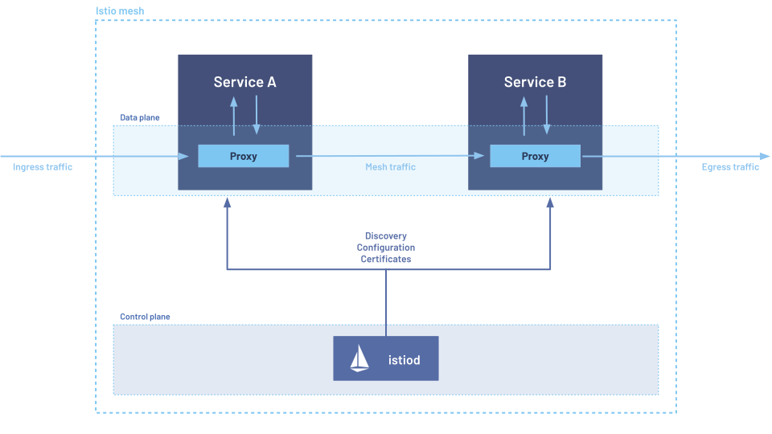

## Istio 아키텍처 전체 구조

먼저 전체 그림을 보고 시작한다.


*출처: [istio.io](https://istio.io/latest/docs/ops/deployment/architecture/) — Control Plane(istiod)이 설정을 배포하고, Data Plane(Envoy)이 실제 트래픽을 처리한다*

**두 개의 계층**:

| 계층 | 구성 요소 | 역할 |
|------|----------|------|
| **Control Plane** | istiod | 라우팅 규칙·인증서·정책을 관리하고 Envoy에 배포 |
| **Data Plane** | Envoy Sidecar | 실제 트래픽 처리 — 재시도, mTLS, 메트릭 수집 |

---

## Envoy란

Envoy는 C++로 작성된 고성능 L7 프록시다. Lyft가 마이크로서비스 네트워크 문제를 해결하기 위해 개발했고, 현재 CNCF 졸업 프로젝트다.

Istio에서 Envoy는 **Data Plane**을 담당한다. 각 Pod에 Sidecar로 붙어 모든 인/아웃바운드 트래픽을 처리한다.

```bash
$ kubectl get pods -n blog-system
# 출력:
# NAME                    READY   STATUS    RESTARTS
# web-xxx                 2/2     Running   0
# was-xxx                 2/2     Running   0
```

`2/2` — 컨테이너 2개가 Ready. 하나는 애플리케이션, 하나는 Envoy Sidecar.

---

## Sidecar 패턴: 어떻게 트래픽을 가로채나

의문: 애플리케이션은 `http://was-service/api`로 직접 보내는데, Envoy가 어떻게 가로채나?

### iptables 규칙

Pod가 시작될 때 `istio-init` 초기화 컨테이너가 iptables 규칙을 설정한다.

```bash
# Pod 내부 iptables 규칙 확인
$ kubectl exec -n blog-system web-xxx -c istio-proxy -- iptables -t nat -L -n
# 출력:
# Chain ISTIO_INBOUND (1 references)
#   RETURN  tcp  --  0.0.0.0/0  0.0.0.0/0  tcp dpt:22    # SSH는 제외
#   REDIRECT tcp  --  0.0.0.0/0  0.0.0.0/0               # 나머지 모두 → 15006
#
# Chain ISTIO_OUTPUT (1 references)
#   REDIRECT tcp  --  0.0.0.0/0  !127.0.0.1/32           # 아웃바운드 → 15001
```

모든 인/아웃바운드가 Envoy를 강제 통과하도록 iptables가 설정된다. 애플리케이션은 이 사실을 모른다.

```
애플리케이션이 보는 것:
  app → was-service:8080 (직접 연결처럼)

실제 흐름:
  app → [iptables] → Envoy(15001) ──mTLS──> Envoy(15006) → app
```

### Envoy 포트 구조

```bash
$ kubectl exec -n blog-system web-xxx -c istio-proxy -- ss -tlnp
# 출력:
# Port   용도
# 15000  Admin API (설정/통계 조회)
# 15001  아웃바운드 트래픽 수신
# 15006  인바운드 트래픽 수신
# 15020  통합 헬스체크 + Prometheus 메트릭
# 15090  Envoy 내부 통계 (Prometheus 포맷)
```

Admin API로 현재 Envoy 상태를 실시간 확인할 수 있다:

```bash
# Envoy가 알고 있는 업스트림 서비스 목록
$ kubectl exec -n blog-system web-xxx -c istio-proxy \
  -- curl -s localhost:15000/clusters | grep was-service
# 출력:
# outbound|8080||was-service.blog-system.svc.cluster.local::10.244.x.x:8080::cx_active::2
```

---

## xDS API: Control Plane이 설정을 배포하는 방식

Envoy는 설정 파일을 읽는 전통 프록시와 다르다. **동적으로 설정을 받아** 재시작 없이 적용한다.

istiod → Envoy 설정 배포 API가 **xDS (Discovery Service)**:

| API | 역할 |
|-----|------|
| **LDS** (Listener) | 어느 포트에서 들을 것인가 |
| **RDS** (Route) | 요청을 어디로 보낼 것인가 |
| **CDS** (Cluster) | 업스트림 서비스 목록 |
| **EDS** (Endpoint) | 각 서비스의 실제 Pod IP |

VirtualService를 `kubectl apply`하면:

```
1. kubectl apply -f virtualservice.yaml
        ↓
2. istiod가 변경 감지 (Kubernetes Watch API)
        ↓
3. istiod → 전체 Envoy에 xDS Push
        ↓
4. Envoy가 새 라우팅 규칙 즉시 적용 (재시작 없음)
        ↓
5. 다음 요청부터 새 규칙 적용
```

재시작이 필요 없기 때문에 Canary 배포에서 트래픽 비율을 바꿔도 즉시 적용된다.

---

## istiod: 세 역할이 하나로

Istio 1.5 이전에는 Pilot, Citadel, Galley가 별도 Pod였다. 1.5부터 `istiod` 하나로 통합됐다.

| 컴포넌트 | 역할 |
|---------|------|
| **Pilot** | 라우팅 규칙 관리, xDS API로 Envoy에 배포 |
| **Citadel** | 인증서 발급/갱신, SPIFFE 기반 서비스 ID 관리 |
| **Galley** | CRD(VirtualService 등) 설정 검증, Envoy 이해 가능 형태로 변환 |

```bash
$ kubectl get pods -n istio-system
# 출력:
# NAME                                READY   STATUS    RESTARTS
# istiod-xxx                          1/1     Running   0   ← 세 역할 통합
# istio-ingressgateway-xxx            1/1     Running   0   ← 외부 트래픽 진입점
```

---

## Envoy가 처리하는 것들

### 자동 메트릭 수집 (코드 변경 없음)

```bash
$ kubectl exec -n blog-system web-xxx -c istio-proxy \
  -- curl -s localhost:15090/stats/prometheus \
  | grep -E "istio_requests_total.*was-service"
# 출력:
# istio_requests_total{
#   connection_security_policy="mutual_tls",
#   destination_service="was-service.blog-system.svc.cluster.local",
#   response_code="200",...} 1842
```

### 인증서 자동 관리

```bash
$ kubectl exec -n blog-system web-xxx -c istio-proxy \
  -- curl -s localhost:15000/certs | python3 -m json.tool | grep -A 3 "subject_alt"
# 출력:
# "subject_alt_names": [
#   "spiffe://cluster.local/ns/blog-system/sa/default"
# ],
# "expiration_time": "2026-01-24T..."  ← 24시간마다 자동 갱신
```

istiod가 24시간마다 인증서를 자동 갱신한다. 서비스 재시작 없이.

---

## 홈랩에서 확인: Envoy 없었다면

홈랩 blog-system에서 web → was 호출이 Envoy를 통과하지 않았을 때의 실제 문제:

```
Before (Envoy 미통과, PassthroughCluster):
  Kiali 대시보드: web → was 연결이 검정색 (mesh 우회)
  mTLS 아이콘 없음
  istio_requests_total 메트릭 수집 안 됨
  VirtualService 라우팅 규칙 적용 안 됨

After (Envoy 통과):
  Kiali: 초록 연결선 + mTLS 자물쇠 아이콘
  Prometheus에서 요청 수, 응답 코드, 레이턴시 자동 수집
  Retry/Timeout/Circuit Breaking 적용 가능
```

이 문제를 해결한 과정은 → [PassthroughCluster 트러블슈팅](/study/2026-01-20-nginx-proxy-istio-mesh-passthrough/)에서 다룬다.

---

## 다음 글

istiod가 Envoy에게 배포하는 설정의 핵심 — **VirtualService와 DestinationRule**. 이 두 CRD가 왜 분리되어 있는지, Gateway는 무엇인지 살펴본다.

- 이전: [Service Mesh는 왜 탄생했나](/study/2026-01-15-why-service-mesh/)
- 다음: [VirtualService & DestinationRule — L7 라우팅의 두 축](/study/2026-01-17-virtualservice-destinationrule/)
