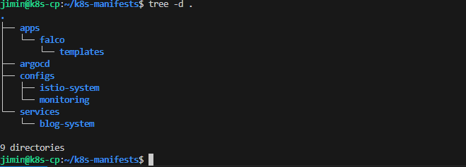

### 1. 매니페스트 파일들은 어떻게 관리해야하는가 ? \

홈을 구축하면서 istio 설정을 건드리고 있었다. 또 정책을 잘못 건드렸는지 블로그가 안 나오네.. \
gateway 설정을 찾아 수정했다. \
분명 이런 설정을 했었던 것 같다. 구체적인 역할없이 만들다보니 매 번 문제가 생기는 느낌 ?\
Falco는 Helmdㅡ로 설치 istio 설정은 YAMl로 블로그 앱은 폴더에 관리 \
홈 랩을 보다보니 argo가 관리하는 것들이 들쑥날쑥 했다. \
WEB,WAS blog 관련 source code만 그래서 관리의 기준을 만들기로 하였다! 

1. **Role-based(역할기반) 디렉터리 구조**
2. **Wrapper Chart 패턴**

- - -

### 2. 문제: Namespace 기준으로 정리

처음에는 단순히 쿠버네티스 **Namespace** 를 기준으로 폴더를 나누었다.

```yaml
k8s-manifests/
├── blog-system/      # 내 앱
├── istio-system/     # 인프라 (근데 Helm인지 YAML인지 모름)
├── monitoring/       # 프로메테우스 (여기도 섞여있음)
└── falco/            # 보안 툴
```

#### 문제점

* 정체성 모호 : falco 폴더만 봐서는 helm 차트인지 manifest 파일인지 확인 불가능
* 업그레이드 및 기록 부재 : Helm 으로 설치한 앱의 버전을 관리가 안되었다. 버전 기록이 안됨..
* 확장성 부족: 설정 파일이 늘어날수록 구분이 안되고 확인하기 어려웠다

### 3. 해결: 역할(Role)에 따른 명확한 분리

3가지로 역할을 나누었다. 



```
k8s-manifests/
├── apps/        # 📦 외부 솔루션 (Helm Wrapper Charts)
│   ├── falco/
│   ├── loki-stack/
│   └── argocd/
│
├── configs/     # ⚙️ 설정 및 커스텀 리소스 (Plain YAML)
│   ├── istio-system/  (Gateway, VirtualService)
│   └── monitoring/    (ServiceMonitor, Rules)
│
└── services/    # 🚀 직접 개발한 애플리케이션 (Plain YAML)
    └── blog-system/   (Deployment, Service)
```

* apps/: helm으로 버전관리 
* configs/:  설정 값 순수 YAML로 직관적으로 관리 
* services/ : 내가 만든 로직들(자주 바뀜)

### 핵심: Wrapper Chart 패턴

**무엇인가 ?**

```

Helm의 "Dependency(의존성)" 기능을 활용한 디자인 패턴이다.
소프트웨어 개발에서 라이브러리를 `import` 해서 쓰는 것과 원리가 똑같다.

* Upstream (Parent): 원본 차트 (예: Falco 공식 차트)
* Wrapper (Child/Consumer): 내가 만든 껍데기 차트

이 패턴의 핵심 목표는 \*\*"원본 코드는 1비트도 건드리지 않고(Immutable), 설정(Configuration)만 내 것으로 덮어씌우는(Override) 것"\*\*이다.

```

외부 helm 차트를 GitOps로 어떻게 관리할 것인가 ? 제일 큰 문제 였다.\
차트를 가져올 수는 없으니.. URL은 설정이 불편 \
해답은 **WrapperChart** 이었다. chart 와 values를 따로 구분해 chart와 나의 설정을 구분하였다.\

#### 예시

`apps/falco/chart.yaml`

```
apiVersion: v2
name: falco-wrapper
version: 0.1.0
dependencies:
  - name: falco
    version: 4.10.1  # ✅ 핵심: 외부 차트 버전을 여기서 명시적 관리!
    repository: https://falcosecurity.github.io/charts
```

`apps/falco/values.yaml`

```
falco:
  # 외부 차트의 설정 중 바꾸고 싶은 부분만 오버라이딩
  driver:
    kind: ebpf
  falco_rules:
    # ...
```

결론 : Falco 버전을 올리고 싶으면 Chart.yaml의 숫자만 바꾸고 git push -> Argo로 관리

### 마치며: 구조로 문화를 배운다.

단순히 폴더를 나누고 코드 정리 규칙을 만드는 과정이다. 하지만 나는 3초면 파일 위치를 찾고 Argo 를통한 모든 변경사항을 투명하게 추적 관리 가 가능해졌다.

* 외부 의존성은 `apps`에서 버전을 통제
* 복잡한 설정은 `configs` 파일 정리 및 가독성 확보
* `Services` 를 이용해 빠르게 배포한다.

### 다음에는 ArgoCD의 App of Apps 패턴으로 배포 하는 방법을 배울 예정이다.
