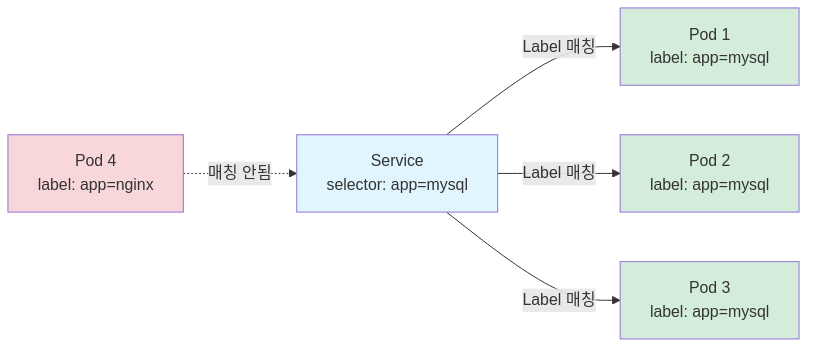
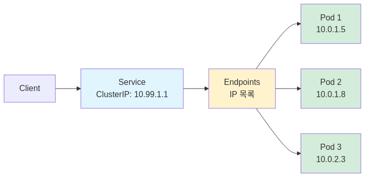
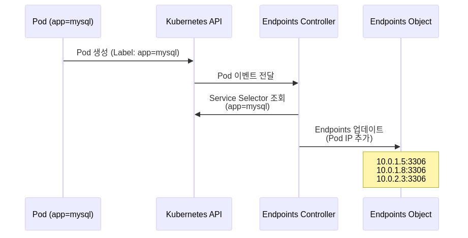
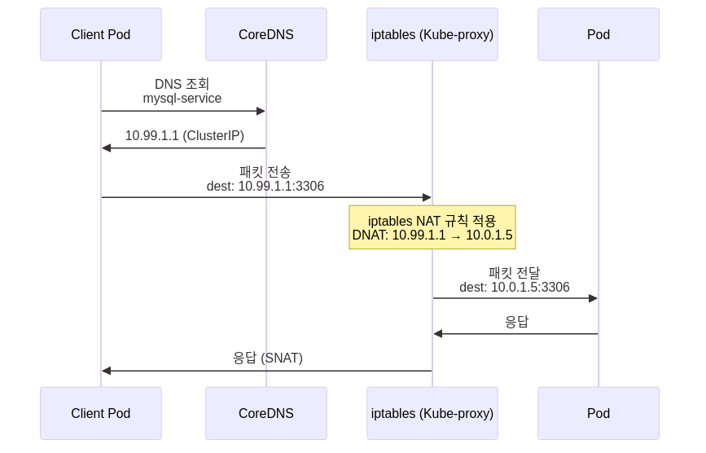
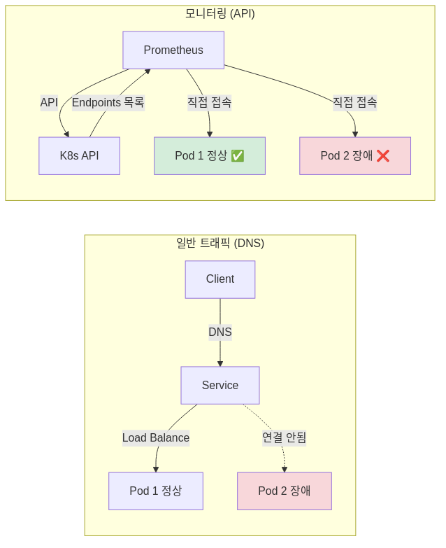

## 들어가며

Kubernetes 클러스터에 Prometheus를 구축하면서 한 가지 의문이 생겼다. MySQL Exporter의 메트릭을 수집하기 위해 ServiceMonitor를 설정했는데, Prometheus Target 목록에 Pod가 잡히지 않는 문제가 발생했다. Service는 정상적으로 생성되었고, Pod도 Running 상태였지만, Prometheus는 메트릭을 수집하지 못했다.

이 문제를 해결하는 과정에서 "Service가 Pod를 찾는 방식"에 대해 제대로 이해하지 못했다는 것을 깨달았다. 단순히 "Service 이름으로 연결하면 된다"고만 생각했는데, 실제로는 Label Selector, Endpoints, Kube-proxy 등 여러 컴포넌트가 협력하여 작동한다는 것을 알게 되었다.

이 글에서는 Kubernetes Service가 Pod를 찾고 연결하는 전체 과정을 단계별로 정리한다.

---

## 1. 논리적 연결: Label과 Selector

### Pod는 불멸이 아니다

Pod는 언제든 죽고 재생성된다. 이름도 바뀌고 IP도 바뀐다.

```bash
# Pod 재시작 전
mysql-7d9f8c6b4-abc12   10.0.1.5

# Pod 재시작 후
mysql-7d9f8c6b4-def34   10.0.1.8
```

이런 상황에서 클라이언트가 Pod의 이름이나 IP를 하드코딩할 수는 없다. 변하지 않는 엔드포인트가 필요하다. 이것이 Service의 역할이다.

### Service는 이름이 아니라 Label로 찾는다

Service가 Pod를 찾는 유일한 기준은 **Label**이다.

```yaml
# Service
apiVersion: v1
kind: Service
metadata:
  name: mysql-service
spec:
  selector:
    app: mysql        # Label Selector
  ports:
  - port: 3306
    targetPort: 3306
```

```yaml
# Pod
apiVersion: v1
kind: Pod
metadata:
  name: mysql-7d9f8c6b4-abc12
  labels:
    app: mysql        # 이 Label이 있으면 Service에 등록됨
spec:
  containers:
  - name: mysql
    image: mysql:8.0
```

Service의 `.spec.selector`와 Pod의 `.metadata.labels`가 **정확히 일치**해야 연결된다.

### Label Selector 동작 방식



**확인 방법**:

```bash
# Service가 사용하는 Selector 확인
kubectl get service mysql-service -o yaml | grep -A 2 selector

# 해당 Label을 가진 Pod 조회
kubectl get pods -l app=mysql
```

**내가 겪은 문제**:

Prometheus Target이 잡히지 않았던 이유는 ServiceMonitor의 `selector.matchLabels`와 Service의 Label이 일치하지 않았기 때문이다. Label 하나가 틀려도 연결되지 않는다.

---

## 2. 물리적 연결: Endpoints 객체

### Service는 껍데기다

많은 사람들이 Service가 Pod로 직접 연결된다고 생각하지만, 실제로는 중간에 **Endpoints**라는 객체가 있다.



### Endpoints란 무엇인가

Endpoints는 Service가 Selector로 찾은 **"실제 Pod들의 IP 리스트"**를 저장하는 Kubernetes 리소스다. Service와 이름이 같다.

```bash
# Endpoints 확인
kubectl get endpoints mysql-service

# 출력 예시:
# NAME             ENDPOINTS                                  AGE
# mysql-service    10.0.1.5:3306,10.0.1.8:3306,10.0.2.3:3306  5d
```

**Endpoints 구조**:

```yaml
apiVersion: v1
kind: Endpoints
metadata:
  name: mysql-service
subsets:
- addresses:
  - ip: 10.0.1.5    # Pod 1
  - ip: 10.0.1.8    # Pod 2
  - ip: 10.0.2.3    # Pod 3
  ports:
  - port: 3306
```

### 왜 Endpoints가 필요한가

Pod가 추가되거나 삭제될 때마다 Endpoints 객체가 자동으로 업데이트된다. Service는 이 Endpoints를 참조하여 현재 살아있는 Pod 목록을 알 수 있다.



**확인 방법**:

```bash
# Endpoints 상세 정보
kubectl describe endpoints mysql-service

# Pod IP와 Endpoints IP 비교
kubectl get pods -o wide -l app=mysql
kubectl get endpoints mysql-service
```

---

## 3. 트래픽 전달: Kube-proxy의 역할

### Service ClusterIP는 가상 IP다

Service의 ClusterIP (예: `10.99.1.1`)는 **실제로 존재하지 않는 가상 IP**다. 어떤 인터페이스에도 할당되지 않는다.

```bash
# Service ClusterIP 확인
kubectl get service mysql-service

# 출력:
# NAME             TYPE        CLUSTER-IP    EXTERNAL-IP   PORT(S)
# mysql-service    ClusterIP   10.99.1.1     <none>        3306/TCP
```

이 가상 IP로 패킷을 보내면 어떻게 실제 Pod에 도달할까? 이것이 Kube-proxy의 역할이다.

### Kube-proxy는 iptables 규칙을 관리한다

Kube-proxy는 각 노드에서 실행되며, Service와 Endpoints 정보를 기반으로 **iptables 규칙**을 생성한다.



### iptables 규칙 확인

```bash
# Service 관련 iptables 규칙 확인 (노드에서)
sudo iptables -t nat -L KUBE-SERVICES -n | grep mysql-service

# 출력 예시:
# KUBE-SVC-XXX  tcp  --  0.0.0.0/0  10.99.1.1  tcp dpt:3306
```

Kube-proxy는 Endpoints에 등록된 Pod IP 중 하나를 선택하여 NAT (주소 변환)을 수행한다. 클라이언트는 `10.99.1.1`로 요청을 보냈지만, 실제로는 `10.0.1.5`와 통신하게 된다.

### 패킷 흐름 전체 과정


---

## 4. DNS vs API: 두 가지 접근 방식

Service를 통해 Pod에 접근하는 방식은 크게 두 가지다.

### 방식 1: DNS 기반 (일반 트래픽)

**목적**: "누구든 좋으니 처리만 해줘" (Load Balancing)

```bash
# WAS Pod에서 MySQL 접속
mysql -h mysql-service.default.svc.cluster.local -u root -p
```

**흐름**:
1. DNS 조회 → ClusterIP 반환 (`10.99.1.1`)
2. Kube-proxy가 Endpoints 중 하나로 NAT
3. 단일 Pod로 트래픽 전달

**특징**: 클라이언트는 어느 Pod가 처리하는지 모른다 (추상화).

---

### 방식 2: API 기반 (모니터링 트래픽)

**목적**: "모든 Pod의 상태를 다 알아야 해" (Enumeration)

```bash
# Prometheus가 하는 일
kubectl get endpoints mysql-service -o json | jq '.subsets[].addresses[].ip'
```

**흐름**:
1. Prometheus → Kubernetes API Server 호출
2. API Server → Endpoints 객체 반환 (모든 Pod IP 리스트)
3. Prometheus → **각 Pod IP로 직접 접속** (`10.0.1.5:9104`, `10.0.1.8:9104`)

**특징**: Service를 우회하고 Pod IP로 직접 접근.

---

### 왜 Prometheus는 Service를 안 쓰는가



Service는 하나의 Pod로만 연결되므로, 장애가 발생한 Pod 2의 메트릭을 수집할 수 없다. Prometheus는 API를 통해 모든 Pod를 열거하고 각각 접속하여 상태를 확인한다.

---

## 5. 실습: 직접 확인해보기

### 실습 1: Service → Endpoints → Pod 추적

```bash
# 1. Service 정보 확인
kubectl get service mysql-service

# 2. Endpoints 확인 (실제 Pod IP 목록)
kubectl get endpoints mysql-service

# 3. Endpoints에 있는 IP가 실제 Pod IP인지 확인
kubectl get pods -n blog-system -l app=mysql -o wide

# 4. Service Selector 확인
kubectl get service mysql-service -o jsonpath='{.spec.selector}' | jq
```

**기대 결과**:
- Endpoints의 IP 목록 = Pod IP 목록
- Service Selector = Pod Labels

---

### 실습 2: DNS 조회 테스트

```bash
# 테스트 Pod 생성
kubectl run test-pod --image=busybox --rm -it -- sh

# Pod 안에서 DNS 조회
nslookup mysql-service.default.svc.cluster.local

# 출력:
# Name:      mysql-service.default.svc.cluster.local
# Address 1: 10.99.1.1 mysql-service.default.svc.cluster.local
```

ClusterIP가 정상적으로 반환되는지 확인한다.

---

### 실습 3: iptables 규칙 확인

```bash
# 노드 SSH 접속 후
sudo iptables -t nat -L KUBE-SERVICES -n | grep mysql-service

# 출력 예시:
# KUBE-SVC-XXX  tcp  --  0.0.0.0/0  10.99.1.1  tcp dpt:3306

# 체인 상세 확인
sudo iptables -t nat -L KUBE-SVC-XXX -n
```

Kube-proxy가 생성한 NAT 규칙을 직접 확인할 수 있다.

---

## 결론

Kubernetes Service는 단순히 "이름으로 Pod를 찾아준다"는 추상화 계층이 아니다. Label Selector, Endpoints 객체, Kube-proxy iptables 규칙 등 여러 컴포넌트가 협력하여 동작한다.

내가 겪었던 Prometheus Target 미등록 문제는 Label이 일치하지 않아서 발생했다. "그냥 된다"고 넘어가지 말고 "어떻게 찾는가?"를 이해하면 트러블슈팅 능력이 향상된다.

### 핵심 정리

1. **Service는 Label Selector로 Pod를 찾는다** (이름이 아님)
2. **Endpoints 객체가 실제 Pod IP 리스트를 저장한다**
3. **Kube-proxy가 iptables NAT 규칙으로 패킷을 전달한다**
4. **DNS 방식은 Load Balancing, API 방식은 Enumeration**

### 다음 단계

- Cilium CNI의 eBPF 기반 Service 구현 방식 이해
- Istio Service Mesh에서의 Service Discovery 방식
- Headless Service와 StatefulSet의 관계

---

**참고 자료**:
- Kubernetes 공식 문서: [Service](https://kubernetes.io/docs/concepts/services-networking/service/)
- Kubernetes 공식 문서: [Connecting Applications with Services](https://kubernetes.io/docs/tutorials/services/connect-applications-service/)
