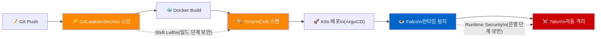
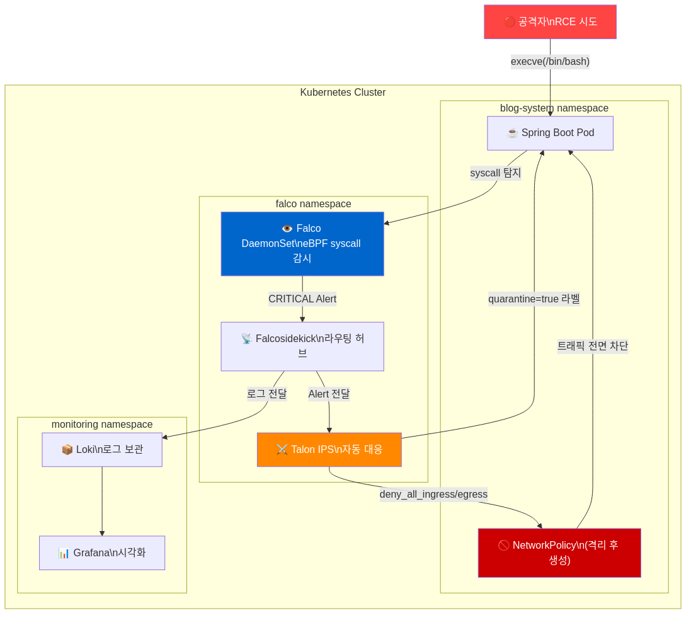

## 배경 — 왜 Runtime Security가 필요한가

CI/CD 파이프라인에 GitLeaks(Secrets 스캔)와 Trivy(이미지 취약점 스캔)를 붙였다. 코드가 Git에 올라가는 순간부터, Docker 이미지가 만들어지는 순간까지 보안 검사가 자동으로 돌아간다.

그런데 한 가지 빠진 부분이 있었다.

> "컨테이너가 실행 중인 상태에서 공격이 들어오면?"

Trivy는 **빌드 시점**의 스냅샷을 찍는다. 이미지에 알려진 CVE가 없어도, 실행 중인 컨테이너 안에서 공격자가 `execve("/bin/bash")` syscall을 호출하는 건 막지 못한다. 특히 Zero-day처럼 CVE 번호조차 없는 취약점은 Trivy로 잡을 수 없다.

이것이 **Runtime Security**가 필요한 이유다. DevSecOps의 마지막 단계, 운영 중인 시스템에서의 실시간 탐지와 자동 대응 체계를 구축했다.

---

## 개념 — 용어 정리

### DevSecOps 전체 파이프라인에서의 위치

DevSecOps는 "개발(Dev) + 보안(Sec) + 운영(Ops)을 통합"하는 방법론이다. 핵심 원칙은 **Shift Left** — 보안 검사를 가능한 한 이른 단계로 옮기는 것이다. 버그는 발견이 늦을수록 수정 비용이 기하급수적으로 늘어난다.



이 중 오늘 구축한 것은 가장 오른쪽 — **Runtime Security** 영역이다.

### IDS vs IPS

| 구분 | 역할 | 비유 | 우리 시스템 |
|------|------|------|------------|
| **IDS** | 탐지 + 알림 | CCTV 요원 | Falco, Wazuh |
| **IPS** | 탐지 + 차단 | 자동 잠금 출입문 | Talon, Wazuh Active Response |

IDS만으로는 부족하다. 탐지하고 알림을 보내도, 사람이 확인하고 대응하는 사이 공격자는 이미 내부를 돌아다닌다. IPS가 자동으로 차단해야 피해를 최소화할 수 있다.

### SIEM (Wazuh)

Wazuh는 단순한 로그 모니터링 도구가 아닌 **SIEM(Security Information and Event Management)**이다. 차이는 **상관 분석(Correlation)**에 있다.

단순 모니터링은 개별 이벤트를 본다. SIEM은 여러 이벤트를 연결해 패턴을 찾는다. 같은 IP가 며칠에 걸쳐 SSH 브루트포스 → 웹 스캔 → 침입 시도를 반복한다면, 각 도구는 각자의 알림만 낸다. SIEM은 이것을 하나의 공격 캠페인으로 식별한다.

---

## 과정 — Falco + Talon 구축

### 전체 대응 체계



공격이 성공한 직후 RCE가 발생하는 순간 Falco가 syscall 레벨에서 탐지한다. Talon이 자동으로 NetworkPolicy를 생성해 Pod를 격리하는 데까지 걸리는 시간은 수 초 이내다.

### Falco 탐지 규칙 3가지

Spring Boot 환경에 맞게 커스텀 규칙을 정의했다.

**Rule 1 — Java RCE 탐지 (CRITICAL)**

Java 프로세스가 Shell을 실행하면 Log4Shell/Spring4Shell 같은 RCE다. 정상적인 상황에서 Java가 `bash`나 `sh`를 실행할 이유가 없다.

```yaml
- rule: Java Process Spawning Shell
  condition: >
    spawned_process and
    proc.pname in (java, javac) and
    proc.name in (bash, sh, ksh, zsh) and
    container
  priority: CRITICAL
```

**Rule 2 — 패키지 관리자 실행 (WARNING)**

운영 중 컨테이너에서 `apt`, `yum`, `pip`이 실행되면 컨테이너 불변성 원칙 위반이다. 공격자가 공격 도구(netcat, nmap 등)를 설치하는 신호일 수 있다.

**Rule 3 — 바이너리 디렉토리 쓰기 (ERROR)**

`/bin`, `/sbin`에 파일을 쓰는 것은 백도어 또는 rootkit 설치 시도다.

### Talon 자동 대응 — Phase 전략

오탐(False Positive)이 있으면 IPS는 정상 서비스를 차단하는 역효과가 난다. Phase를 나눠서 점진적으로 활성화했다.

```yaml
# CRITICAL: 즉시 NetworkPolicy 격리 (Phase 1부터 활성화)
- rule: Java Process Spawning Shell
  actions:
    - actionner: kubernetes:label
      parameters:
        labels:
          quarantine: "true"
          isolated-reason: "java-rce-detected"
    - actionner: kubernetes:networkpolicy
      parameters:
        deny_all_ingress: true
        deny_all_egress: true
        allow_dns: true        # DNS는 허용 (정상 종료 가능)
        allow_monitoring: true # Prometheus 수집 유지

# WARNING: 라벨만 (Phase 2에서 격리 추가 예정)
- rule: Package Manager in Container
  actions:
    - actionner: kubernetes:label
      parameters:
        labels:
          analysis/status: suspicious
```

**Phase 1 (현재)**: CRITICAL은 즉시 격리. WARNING/ERROR는 라벨만 붙여 1주일 관찰.

**Phase 2 (1주 후)**: 오탐 없음 확인 후 WARNING/ERROR도 격리 추가.

### GitOps 배포 구조

```
k8s-manifests/
├── apps/talon/
│   ├── Chart.yaml    # falco-talon 0.4.0 Helm dependency
│   └── values.yaml   # 탐지 규칙 + 대응 액션
└── argocd/
    └── talon-app.yaml  # ArgoCD Application
```

ArgoCD root-app이 `argocd/` 디렉터리를 감시하므로, `talon-app.yaml`을 추가하는 것만으로 자동 배포된다.

### 트러블슈팅

배포 과정에서 3가지 오류가 있었다.

**1. `actionner: k8sevents` — 유효하지 않은 이름**

```
ERR rules error="incorrect actionner" actionner=k8sevents
```

`k8sevents`는 `defaultNotifiers`에서 쓰는 이름이다. `actions` 블록 안에서는 `kubernetes:label`, `kubernetes:networkpolicy` 형식을 써야 한다.

**2. `actions: []` — 빈 배열 불허**

```
ERR rules error="no action specified"
```

Talon은 rules에 최소 1개 action을 요구한다. 알림만 하려면 `kubernetes:label`로 의심 라벨을 붙이는 것으로 대체했다.

**3. `kubernetes:labelize` — 오타**

```
ERR rules error="unknown actionner" actionner=kubernetes:labelize
```

올바른 이름은 `kubernetes:label`이다. Chart 기본 `rules.yaml`에서 확인 후 수정했다.

---

## 성과

| 항목 | 구축 전 | 구축 후 |
|------|---------|---------|
| RCE 탐지 시간 | 수동 로그 확인 (분~시간) | syscall 레벨 실시간 (수 초) |
| 탐지 후 격리 | 수동 (`kubectl delete pod`) | Talon 자동 NetworkPolicy 생성 |
| Zero-day 대응 | 불가 (CVE 없으면 Trivy 미탐) | 행동 기반 탐지로 커버 |
| 보안 이벤트 보관 | 없음 | Loki → Grafana 영구 시각화 |

---

## 다음 단계

**Phase 2 전환** (1주일 후)

1주일간 의심 라벨이 붙은 Pod를 관찰한다.

```bash
# 의심 라벨 붙은 Pod 확인
kubectl get pods -A -l analysis/status=suspicious
```

False Positive가 없으면 WARNING/ERROR 규칙에도 `kubernetes:networkpolicy` 격리 액션을 추가한다.

**격리된 Pod 복구 방법**

```bash
# 1. 격리 NetworkPolicy 삭제
kubectl delete networkpolicy -l quarantine=true -n blog-system

# 2. 라벨 제거
kubectl label pod <pod-name> quarantine- falco-response- -n blog-system

# 3. GitOps로 정상 배포 교체
git commit -m "rollback: Replace compromised pod" && git push
```

---

## 관련 글

- [Wazuh SIEM 실전 보안 모니터링 - SSH Brute Force 탐지](/study/2026-02-16-wazuh-실전-보안-모니터링/)
- [Kubernetes CPU Requests 최적화](/study/2026-02-13-kubernetes-cpu-requests-optimization/)
