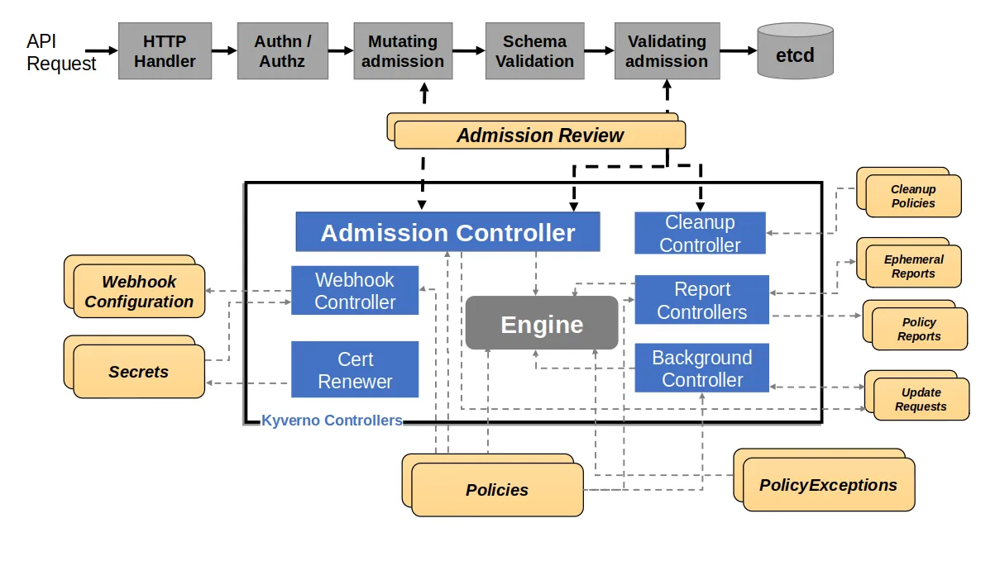

## 배경: CI/CD만으로 충분한가?

DevSecOps 파이프라인을 구축하면 코드 변경부터 배포까지 보안 검사가 자동으로 이루어진다.

```
git push → GitLeaks(Secrets 탐지) → Trivy(이미지 CVE 스캔) → ArgoCD 배포
```

문제는 이 흐름을 **우회하는 경로**가 존재한다는 것이다.

```bash
# 이 명령어 하나로 GitLeaks, Trivy 모두 건너뛰고 클러스터에 직접 배포됨
kubectl apply -f my-pod.yaml
```

현재 1인 운영이라 우회할 사람이 없지만, **"Git push 경로에만 보안이 있다"는 구조적 허점**은 존재한다. 면접에서 "kubectl로 직접 배포하면요?"라는 질문에 답할 수 없다면, 파이프라인이 아무리 훌륭해도 빈 구간이 있는 것이다.

이 빈 구간을 메우는 것이 Kubernetes의 **Admission Controller**이고, 이를 YAML로 선언적으로 관리할 수 있게 해주는 도구가 **Kyverno**이다.

---

## Kubernetes Admission Controller란?

### API 서버 요청 처리 흐름

kubectl이나 ArgoCD가 "Pod를 생성해줘"라고 요청하면, API 서버는 바로 etcd에 저장하지 않는다. 여러 단계의 **검문소(Admission)**를 거친다.

```
kubectl apply
    │
    ▼
┌─────────────────────┐
│  1. Authentication  │ ← "너는 누구인가?" (인증서, 토큰)
│  2. Authorization   │ ← "이 작업을 할 권한이 있는가?" (RBAC)
│  3. Mutating Webhook│ ← "요청을 수정해야 하는가?" (Istio sidecar 주입 등)
│  4. Schema          │ ← "YAML 문법이 맞는가?"
│  5. Validating      │ ← "정책을 위반하지 않는가?" ★ Kyverno는 여기
│      Webhook        │
└─────────────────────┘
    │
    ▼
  etcd 저장 → Scheduler → Pod 생성
```

**핵심**: Validating Webhook은 etcd에 저장되기 **전에** 실행된다. 정책을 위반하면 Pod는 아예 생성되지 않는다.

### Mutating vs Validating Webhook

| 종류 | 역할 | 예시 |
|------|------|------|
| **Mutating** | 요청을 **수정**해서 통과 | Istio가 Pod에 sidecar 컨테이너를 자동 주입 |
| **Validating** | 요청을 **검사**해서 허용/거부 | Kyverno가 "root 실행 금지" 정책 위반 시 거부 |

실행 순서가 중요하다. **Mutating이 먼저** 실행되고, 수정된 결과를 **Validating이 검사**한다.

```
원본 Pod (sidecar 없음)
  ↓ Mutating Webhook (Istio)
수정된 Pod (sidecar 추가됨)
  ↓ Validating Webhook (Kyverno)
정책 검증 → 통과/거부
```

이 순서 때문에 Istio가 주입한 sidecar 컨테이너도 Kyverno 정책의 검증 대상이 된다. 즉, Istio sidecar가 root로 실행되면 Kyverno의 `require-non-root` 정책에 걸릴 수 있다. 이것이 시스템 namespace를 정책에서 제외하는 이유 중 하나이다.

---

## Kyverno란?

### 왜 Kyverno인가 — OPA Gatekeeper와의 비교

Kubernetes Admission Controller를 구현하는 대표적인 도구가 두 가지 있다.

| 비교 항목 | OPA Gatekeeper | Kyverno |
|-----------|---------------|---------|
| **정책 언어** | Rego (별도 학습 필요) | YAML (Kubernetes 네이티브) |
| **학습 곡선** | 높음 (함수형 언어) | 낮음 (kubectl 사용자면 바로 가능) |
| **정책 정의** | ConstraintTemplate + Constraint (2개 리소스) | ClusterPolicy 1개로 완결 |
| **Mutate 지원** | 제한적 | 네이티브 지원 |
| **Generate 지원** | 없음 | 지원 (정책 위반 시 리소스 자동 생성) |
| **업계 점유율** | 대기업, 복잡한 환경 | 중소규모, Kubernetes 중심 |

**Kyverno를 선택한 이유**:
1. **YAML만으로 정책 작성** — Rego 언어를 배울 시간을 실제 보안 구현에 투자
2. **1인 운영** — 복잡한 ConstraintTemplate보다 ClusterPolicy 하나가 관리 효율적
3. **GitOps 친화** — YAML 파일이므로 ArgoCD로 그대로 배포 가능

> 대규모 엔터프라이즈에서 복잡한 cross-resource 정책이 필요하면 OPA Gatekeeper가 더 적합할 수 있다. 도구 선택은 환경과 팀 역량에 따른 트레이드오프이다.

### Kyverno 아키텍처


*출처: [Kyverno 공식 문서 — How Kyverno Works](https://kyverno.io/docs/introduction/how-kyverno-works/)*

Kyverno의 핵심 컴포넌트는 4가지이다:

| 컴포넌트 | 역할 |
|---------|------|
| **Admission Controller** | Webhook으로 API 요청을 받아 정책 검증/수정 |
| **Background Controller** | 이미 배포된 기존 리소스를 주기적으로 스캔 |
| **Reports Controller** | PolicyReport CRD로 정책 위반 결과를 기록 |
| **Cleanup Controller** | TTL 기반 리소스 자동 정리 |

**Admission Controller**가 가장 중요하다. Pod 생성 요청이 들어오면:

```
1. API Server → Kyverno Webhook 호출
2. Kyverno가 모든 ClusterPolicy의 rules를 순회
3. match/exclude 조건으로 대상 필터링
4. validate 규칙으로 검증
5. 통과 → 허용 응답 / 위반 → 거부 응답 + 에러 메시지
```

### 정책의 3가지 유형

Kyverno 정책은 3가지 동작을 수행할 수 있다:

| 유형 | 동작 | 예시 |
|------|------|------|
| **Validate** | 규칙 위반 시 거부 | "root 실행 금지", "latest 태그 금지" |
| **Mutate** | 리소스를 자동 수정 | "모든 Pod에 label 자동 추가" |
| **Generate** | 새 리소스 자동 생성 | "Namespace 생성 시 NetworkPolicy 자동 생성" |

이 시리즈에서는 **Validate** 유형만 다룬다. 우리 환경의 4개 정책이 모두 Validate이기 때문이다.

---

## Audit vs Enforce — 정책의 두 가지 모드

Kyverno 정책은 위반 시 두 가지로 동작할 수 있다:

| 모드 | 동작 | 비유 |
|------|------|------|
| **Audit** | 위반을 **기록만** 함 (거부 안 함) | CCTV — 촬영만 하고 막지 않음 |
| **Enforce** | 위반을 **거부** (Pod 생성 차단) | 경비원 — 위반 시 입장 차단 |

**실전 배포 전략**: 처음에는 Audit로 배포해서 기존 리소스가 얼마나 위반하는지 확인한 후, 문제가 없으면 Enforce로 전환한다.

```yaml
spec:
  # 기본값: 전체 클러스터에서 Audit (기록만)
  validationFailureAction: Audit

  # 특정 namespace에서만 Enforce (차단)
  validationFailureActionOverrides:
    - action: Enforce
      namespaces:
        - blog-system
```

우리 환경에서는 이 **하이브리드 방식**을 사용한다:
- `blog-system` namespace: **Enforce** — 우리가 직접 관리하는 앱이므로 정책 위반 시 차단
- 나머지 namespace: **Audit** — 시스템 컴포넌트(Prometheus, Cilium 등)는 기록만

**왜 전체 Enforce가 아닌가?**: 시스템 namespace의 Pod들은 우리가 제어하지 않는 공식 이미지를 사용한다. Falco는 eBPF를 위해 privileged가 필요하고, Cilium은 root로 실행된다. 이들을 Enforce하면 클러스터 자체가 동작하지 않는다.

---

## Kyverno 다운 시 어떻게 되는가? — failurePolicy

Admission Webhook은 API 서버의 요청 경로에 있으므로, Webhook 서버가 다운되면 **모든 Pod 생성이 막힐 수 있다**.

```
Pod 생성 요청 → Kyverno Webhook 호출 → 응답 없음(Timeout) → ???
```

이때 동작을 결정하는 것이 `failurePolicy`이다:

| 설정 | 동작 | 리스크 |
|------|------|--------|
| `Fail` (기본값) | Webhook 응답 없으면 요청 **거부** | Kyverno 다운 → 모든 배포 중단 |
| `Ignore` | Webhook 응답 없으면 요청 **허용** | Kyverno 다운 → 정책 검증 없이 통과 |

**프로덕션**(대규모 팀): `Fail` + Kyverno HA(3 replica) — 보안이 우선
**홈랩**(1인 운영): `Ignore` — 복구 가능성이 우선, Kyverno 장애 시에도 배포 가능

```yaml
# apps/kyverno/values.yaml
kyverno:
  features:
    # Why: Kyverno가 다운됐을 때 모든 배포가 막히는 상황 방지
    forceFailurePolicyIgnore:
      enabled: true
```

---

## 기존 리소스는 어떻게 되는가? — Background Scan

Kyverno 정책은 **새로 생성되는 리소스**에만 적용된다. 이미 실행 중인 Pod는 정책이 배포되어도 즉시 영향받지 않는다.

```
시점 1: mysql-exporter Pod 실행 중 (securityContext 없음)
시점 2: require-non-root 정책 Enforce 배포
시점 3: mysql-exporter Pod 여전히 Running ← 소급 적용 안 됨!
시점 4: 노드 장애로 Pod 재생성 시도
시점 5: Kyverno가 차단 ← 이때 비로소 걸림
```

이것이 바로 우리가 겪은 **잠복기 문제**이다 (Part 3 Incident Report에서 상세히 다룬다).

단, `background: true`를 설정하면 Kyverno의 **Background Controller**가 기존 리소스도 주기적으로 스캔하여 **PolicyReport**에 위반 사항을 기록한다.

```yaml
spec:
  background: true  # 기존 리소스 스캔 활성화
```

Background Scan은 **기록만** 한다. 실행 중인 Pod를 강제로 종료하지는 않는다. 하지만 이 리포트를 모니터링하면 **잠복 중인 위반**을 사전에 발견할 수 있다.

---

## 정리: Kyverno의 위치

전체 보안 파이프라인에서 Kyverno가 어디에 위치하는지 정리한다:

```
┌─────────────────────────────────────────────────────────┐
│              DevSecOps 보안 파이프라인                     │
├─────────────────────────────────────────────────────────┤
│                                                          │
│  [빌드 시점]                                              │
│    git push → GitLeaks(Secrets) → Trivy(CVE)            │
│                                                          │
│  [배포 시점] ★ Kyverno                                   │
│    API Server → Istio(Mutate) → Kyverno(Validate)       │
│    → "latest 태그?" → "privileged?" → "root?" → "limits?"│
│                                                          │
│  [런타임]                                                 │
│    Falco(syscall 감시) → Talon(자동 격리)                │
│    Wazuh(로그 분석) → SIEM                               │
│                                                          │
└─────────────────────────────────────────────────────────┘
```

CI/CD가 **Git push 경로**를 지키고, Kyverno가 **API Server 경로**를 지키고, Falco가 **런타임**을 지킨다. 빈 구간이 없다.

---

## 다음 글에서는

[Part 2](/study/2026-03-02-kyverno-4-policies-implementation/)에서는 우리 환경에 실제로 구현한 4개의 ClusterPolicy를 하나씩 살펴본다:

1. **disallow-latest-tag** — 이미지 태그 없음/latest 차단
2. **require-resource-limits** — CPU/Memory limits 필수
3. **disallow-privileged** — 특권 컨테이너 차단
4. **require-non-root** — root 실행 차단

각 정책이 **왜 필요한지**, **어떤 공격을 막는지**, **예외는 왜 두었는지**를 YAML과 함께 설명한다.

---

*이 글은 [Kyverno 실전 시리즈](/series/kyverno-실전-시리즈/)의 일부입니다.*
- **Part 1 (현재 글)**: Kyverno 개념 + Kubernetes Admission Controller 원리
- [Part 2: 4개 ClusterPolicy 구현기](/study/2026-03-02-kyverno-4-policies-implementation/)
- [Part 3: Incident Report — 정책 변경과 네트워크 장애가 빚어낸 연쇄 배포 실패](/study/2026-03-02-kyverno-incident-report-cascading-failure/)
