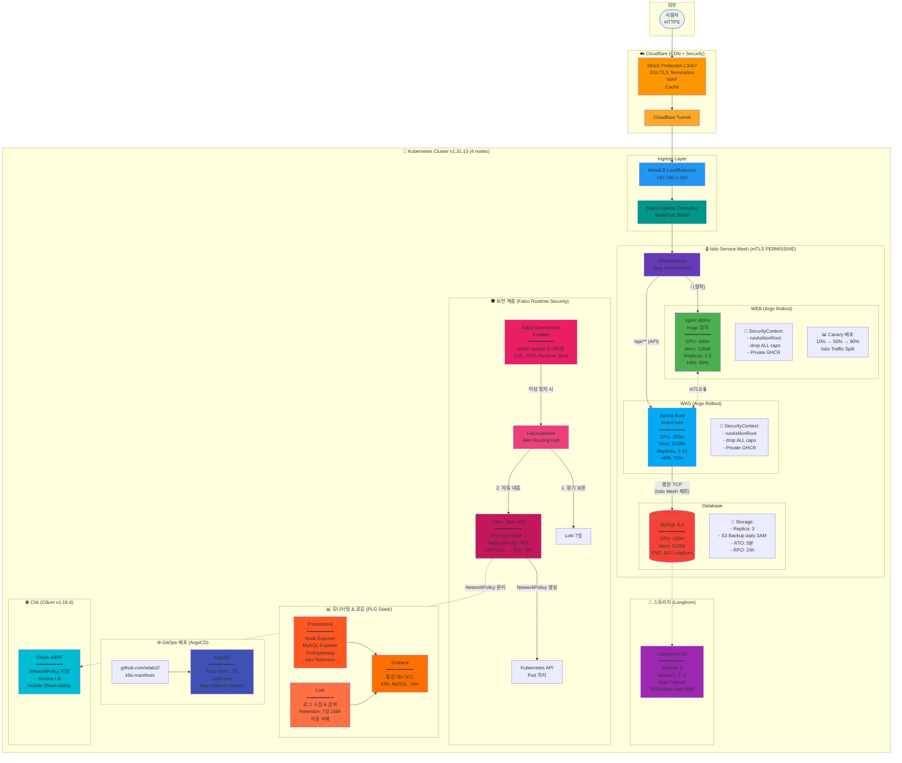
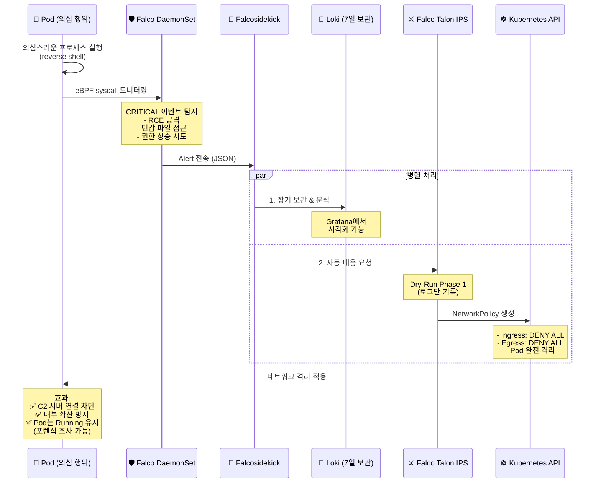
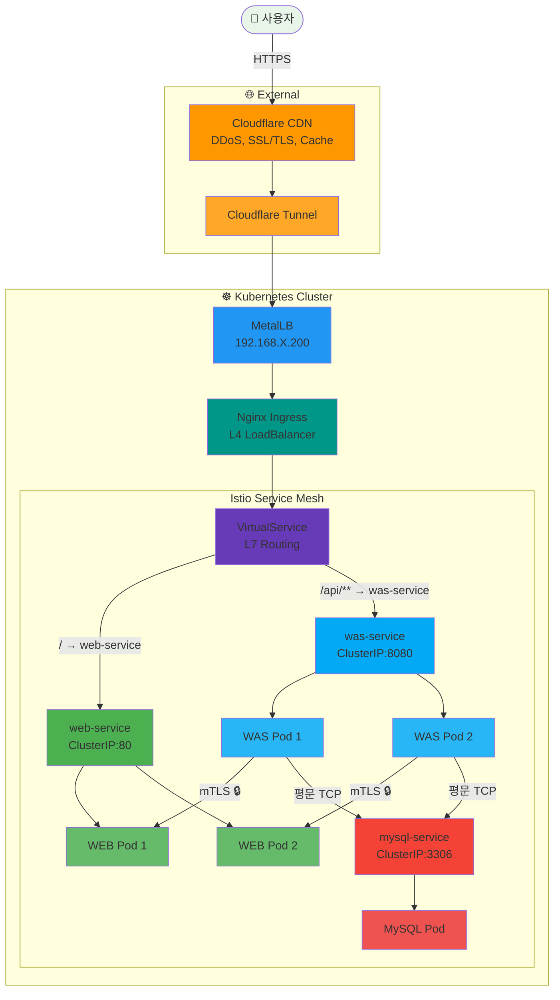
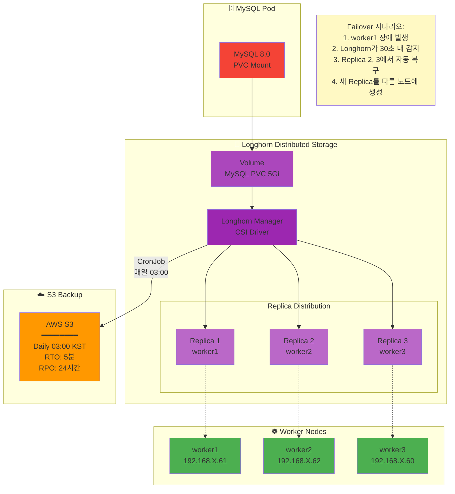

# 블로그 시스템 아키텍처 (Mermaid 버전)

> WEB + WAS 3-TIER 구조 (Hugo 정적 블로그 + Spring Boot API)

**작성일**: 2026-01-24
**상태**: ✅ Production 운영 중 (58일+)

---

## 전체 아키텍처 (Mermaid)



---

## 보안 이벤트 플로우 (Falco IDS/IPS)



---

## CI/CD 파이프라인

```mermaid
graph LR
    subgraph Developer["👨‍💻 개발자"]
        Code[코드 작성]
        Commit[Git Commit]
    end

    subgraph GitHub["🐙 GitHub"]
        Push[Git Push<br/>main branch]
        Actions[GitHub Actions]
    end

    subgraph Build["🔨 Build & Push"]
        Maven[Maven Build<br/>./mvnw clean package]
        Docker[Docker Build<br/>Dockerfile]
        GHCR[GHCR Push<br/>ghcr.io/wlals2/<br/>board-was:SHA]
    end

    subgraph GitOps["⚙️ GitOps"]
        Manifest[Manifest Update<br/>k8s-manifests repo]
        ArgoCD[ArgoCD Auto-Sync<br/>3초 이내 감지]
    end

    subgraph Deploy["🚀 배포"]
        Rollout[Argo Rollout<br/>Canary 배포]
        Traffic1[10% 트래픽<br/>30초 대기]
        Traffic2[50% 트래픽<br/>30초 대기]
        Traffic3[90% 트래픽<br/>30초 대기]
        Complete[100% 배포 완료]
    end

    Code --> Commit --> Push --> Actions
    Actions --> Maven --> Docker --> GHCR
    GHCR --> Manifest --> ArgoCD
    ArgoCD --> Rollout --> Traffic1 --> Traffic2 --> Traffic3 --> Complete

    style Code fill:#E8F5E9
    style Actions fill:#2196F3
    style Maven fill:#FF9800
    style Docker fill:#2196F3
    style GHCR fill:#9C27B0
    style ArgoCD fill:#3F51B5
    style Rollout fill:#4CAF50
    style Complete fill:#66BB6A
```



---

## 네트워크 플로우 (Traffic Routing)



---

## 스토리지 아키텍처 (Longhorn)



---

## 사용 방법

### 1. Hugo 블로그에 삽입
05-ARCHITECTURE.md 파일에 위 Mermaid 코드 블록을 복사해서 붙여넣으면 자동으로 렌더링됩니다.

### 2. GitHub README에 삽입
k8s-manifests/README.md에도 동일하게 사용 가능합니다.

### 3. PNG로 내보내기
```bash
# Mermaid CLI 설치 (Node.js 필요)
npm install -g @mermaid-js/mermaid-cli

# PNG 생성
mmdc -i architecture.md -o architecture.png
```

### 4. 온라인 에디터
https://mermaid.live/ 에서 실시간으로 편집하고 미리보기 가능

---

**작성:** Claude Code
**최종 수정:** 2026-01-24
**도구:** Mermaid.js
