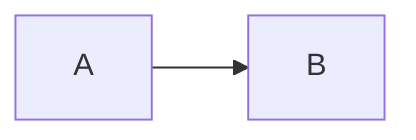

# Mermaid 다이어그램 렌더링 문제 해결 가이드

> 작성일: 2026-01-16
> 상태: ✅ 해결 완료

---

## 📋 목차

1. [문제 상황](#문제-상황)
2. [증상](#증상)
3. [원인 분석](#원인-분석)
4. [해결 과정](#해결-과정)
5. [최종 해결책](#최종-해결책)
6. [핵심 교훈](#핵심-교훈)

---

## 문제 상황

**발생 일시**: 2026-01-16 17:30 ~ 18:50 (약 1시간 20분)

**URL**: http://192.168.X.187:1313/projects/

**문제**: Projects 페이지의 "전체 학습 여정" Mermaid 다이어그램이 **코드로 표시**됨

**예상 결과**: 컬러풀한 플로우차트 (Phase 1-5 박스와 화살표)

**실제 결과**:
```
graph LR
    A[Phase 1<br/>EC2 수동 배포<br/>4시간] --> B[Phase 2<br/>Kubernetes<br/>30분]
    ...
```

---

## 증상

### 1. 시크릿 모드에서도 동일한 문제
- 브라우저 캐시 문제 아님 확인 ✅
- 새로 고침해도 변화 없음

### 2. 여러 Mermaid 블록 모두 영향
- "전체 학습 여정" 다이어그램
- "Phase 3 아키텍처" 다이어그램
- 모든 ```mermaid 코드 블록이 plain text로 표시

### 3. Hugo 서버는 정상 작동
```bash
Web Server is available at http://192.168.X.187:1313/ (bind address 0.0.0.0)
Built in 139 ms
```

---

## 원인 분석

### 문제 1: Hugo의 Syntax Highlighting

**근본 원인**: Hugo가 ```mermaid 코드 블록을 일반 코드로 인식

**왜 발생하는가?**

Hugo는 기본적으로 Markdown의 코드 블록을 syntax highlighting 처리합니다:

```markdown

```

이렇게 쓰면 Hugo가 다음과 같이 변환:

```html
<div class="highlight">
  <pre class="chroma">
    <code class="language-mermaid">
      graph LR
          A --> B
    </code>
  </pre>
</div>
```

**문제점**:
- Mermaid.js는 `.mermaid` 클래스를 찾아서 렌더링
- 하지만 Hugo가 `.chroma`, `.language-mermaid` 클래스로 변환
- 결과: Mermaid.js가 요소를 찾지 못함 ❌

---

### 문제 2: Mermaid.js 로딩 방식

**처음 시도한 방법들 (실패):**

#### 시도 1: ES Module 방식
```html
<script type="module">
  import mermaid from 'https://cdn.jsdelivr.net/npm/mermaid@10/dist/mermaid.esm.min.mjs';
  mermaid.initialize({ startOnLoad: true });
</script>
```

**실패 이유**:
- `startOnLoad: true`가 모듈 방식에서 제대로 작동 안 함
- Hugo가 변환한 HTML 구조와 맞지 않음

#### 시도 2: querySelector 변경
```javascript
mermaid.run({ querySelector: '.language-mermaid' });
```

**실패 이유**:
- Hugo의 복잡한 HTML 구조 (div > pre > code) 때문에 선택자가 맞지 않음
- `.language-mermaid`는 code 태그에 있지만 Mermaid는 pre 태그를 기대

---

## 해결 과정

### 단계 1: Hugo Render Hook 생성 ✅

**파일**: `/home/jimin/blogsite/layouts/_default/_markup/render-codeblock-mermaid.html`

```html
<pre class="mermaid">
{{- .Inner | safeHTML }}
</pre>
```

**역할**:
- Hugo에게 "```mermaid 블록은 특별하게 처리해!"라고 알림
- Syntax highlighting 건너뛰고 raw HTML로 출력
- 결과: `<pre class="mermaid">` 태그로 깔끔하게 렌더링 ✅

**확인 방법**:
```bash
grep -A 5 "전체 학습 여정" /home/jimin/blogsite/public/projects/index.html
```

결과:
```html
<h2>🎯 전체 학습 여정</h2>
<pre class="mermaid">graph LR
    A[Phase 1<br>EC2 수동 배포<br>4시간] --> B[...]
</pre>
```

---

### 단계 2: Mermaid.js 로딩 방식 변경 ✅

**이전 (실패)**: ES Module + startOnLoad

**이후 (성공)**: 일반 스크립트 + 수동 렌더링

**최종 코드**:
```html
<script src="https://cdn.jsdelivr.net/npm/mermaid@11/dist/mermaid.min.js"></script>
<script>
  document.addEventListener('DOMContentLoaded', function() {
    const isDark = document.documentElement.dataset.theme === 'dark' ||
                   window.matchMedia('(prefers-color-scheme: dark)').matches;

    mermaid.initialize({
      startOnLoad: false,
      theme: isDark ? 'dark' : 'default',
      securityLevel: 'loose',
      fontFamily: 'inherit'
    });

    // 모든 .mermaid 요소 수동 렌더링
    document.querySelectorAll('.mermaid').forEach((element, index) => {
      const id = 'mermaid-' + index;
      element.id = id;
      mermaid.run({ nodes: [element] });
    });
  });
</script>
```

**핵심 변경사항**:

| 항목 | 이전 | 이후 |
|------|------|------|
| **로딩 방식** | ES Module | 일반 스크립트 |
| **렌더링** | startOnLoad | 수동 (forEach) |
| **테마 감지** | 함수 getTheme() | 즉시 실행 |
| **요소 선택** | querySelector | querySelectorAll + forEach |

---

## 최종 해결책

### 필요한 파일 (2개)

#### 1. Hugo Render Hook

**경로**: `layouts/_default/_markup/render-codeblock-mermaid.html`

```html
<pre class="mermaid">
{{- .Inner | safeHTML }}
</pre>
```

**역할**: ```mermaid 블록을 `<pre class="mermaid">`로 변환

---

#### 2. Mermaid.js 스크립트

**경로**: `layouts/partials/extend_head.html`

```html
{{- /* Mermaid Diagram Support */ -}}
<script src="https://cdn.jsdelivr.net/npm/mermaid@11/dist/mermaid.min.js"></script>
<script>
  document.addEventListener('DOMContentLoaded', function() {
    const isDark = document.documentElement.dataset.theme === 'dark' ||
                   window.matchMedia('(prefers-color-scheme: dark)').matches;

    mermaid.initialize({
      startOnLoad: false,
      theme: isDark ? 'dark' : 'default',
      securityLevel: 'loose',
      fontFamily: 'inherit'
    });

    document.querySelectorAll('.mermaid').forEach((element, index) => {
      const id = 'mermaid-' + index;
      element.id = id;
      mermaid.run({ nodes: [element] });
    });
  });
</script>
```

**역할**: Mermaid.js 로드 및 렌더링

---

### 작동 흐름

```
Markdown 작성
   ↓
```mermaid
graph LR
   ↓
Hugo 빌드 시 render-codeblock-mermaid.html 적용
   ↓
<pre class="mermaid">graph LR...</pre>
   ↓
브라우저에서 extend_head.html 스크립트 실행
   ↓
querySelectorAll('.mermaid') 로 모든 요소 찾기
   ↓
mermaid.run({ nodes: [element] }) 로 SVG 렌더링
   ↓
✅ 컬러풀한 다이어그램 표시
```

---

## 핵심 교훈

### 1. Hugo는 코드 블록을 자동으로 변환한다

**문제**:
- Markdown의 ```mermaid를 syntax highlighting 처리
- Mermaid.js가 찾을 수 없는 HTML 구조로 변환

**해결**:
- Render Hook으로 특정 언어만 특별 처리
- `render-codeblock-{language}.html` 패턴 사용

---

### 2. Mermaid.js 로딩 방식이 중요하다

**실패한 방법**:
- ❌ ES Module + startOnLoad
- ❌ querySelector (단일 요소만 선택)
- ❌ 테마 감지 함수가 너무 복잡

**성공한 방법**:
- ✅ 일반 스크립트 (더 안정적)
- ✅ querySelectorAll + forEach (모든 요소 처리)
- ✅ 간단한 테마 감지 (즉시 실행)

---

### 3. 브라우저 캐시를 의심하지 말 것

**교훈**:
- 시크릿 모드에서도 문제 재현됨 → 캐시 문제 아님
- HTML 소스 직접 확인이 더 정확
- 근본 원인은 코드에 있음

---

### 4. 디버깅 순서

올바른 순서:
1. **Hugo 빌드 확인**: `public/projects/index.html` 직접 확인
2. **HTML 구조 확인**: `grep -A 10 "mermaid"` 로 실제 출력 확인
3. **브라우저 콘솔**: JavaScript 에러 확인
4. **네트워크 탭**: Mermaid.js 로딩 확인

잘못된 순서:
- ❌ 바로 코드 수정
- ❌ "캐시 문제일 것이다" 추측
- ❌ 여러 방법 동시에 시도

---

## 검증 방법

### 1. HTML 소스 확인

```bash
grep -A 15 "전체 학습 여정" ~/blogsite/public/projects/index.html | grep -A 10 mermaid
```

**기대 결과**:
```html
<pre class="mermaid">graph LR
    A[Phase 1<br>EC2 수동 배포<br>4시간] --> B[Phase 2<br>Kubernetes<br>30분]
    ...
</pre>
```

---

### 2. 브라우저에서 확인

1. http://192.168.X.187:1313/projects/ 접속
2. 개발자 도구 (F12) 열기
3. 콘솔 탭에서 확인:

```javascript
document.querySelectorAll('.mermaid').length
// 기대: 2 (전체 학습 여정 + Phase 3 아키텍처)

document.querySelectorAll('svg').length
// 기대: 2 이상 (Mermaid가 SVG로 렌더링)
```

---

### 3. 시각적 확인

**성공 지표**:
- ✅ Phase 1 박스: 빨간색 (#ff6b6b)
- ✅ Phase 2 박스: 청록색 (#4ecdc4)
- ✅ Phase 3 박스: 파란색 (#45b7d1)
- ✅ Phase 4 박스: 주황색 (#ffa502)
- ✅ Phase 5 박스: 초록색 (#96ceb4)
- ✅ 화살표로 연결됨

**실패 지표**:
- ❌ 코드가 텍스트로 보임
- ❌ 박스가 없음
- ❌ 색상이 없음

---

## 참고 문서

### Hugo 공식 문서

- [Render Hooks](https://gohugo.io/render-hooks/code-blocks/)
- [Goldmark Configuration](https://gohugo.io/getting-started/configuration-markup/#goldmark)

### Mermaid.js 공식 문서

- [Basic Usage](https://mermaid.js.org/intro/n00b-gettingStarted.html)
- [Theming](https://mermaid.js.org/config/theming.html)
- [API](https://mermaid.js.org/config/setup/modules/mermaidAPI.html)

---

## 관련 파일

| 파일 | 역할 | 경로 |
|------|------|------|
| **Render Hook** | Mermaid 블록 변환 | `layouts/_default/_markup/render-codeblock-mermaid.html` |
| **Mermaid Script** | JS 로딩 및 렌더링 | `layouts/partials/extend_head.html` |
| **Projects Page** | Mermaid 사용 예시 | `content/projects/_index.md` |
| **Public HTML** | 최종 출력 확인 | `public/projects/index.html` |

---

## 문제 재발 방지

### 주의사항

1. **Render Hook 삭제 금지**
   - `render-codeblock-mermaid.html` 파일 절대 삭제하지 말 것
   - 이 파일이 없으면 다시 syntax highlighting 처리됨

2. **Mermaid.js 버전 고정**
   - 현재: `mermaid@11`
   - 메이저 업데이트 시 API 변경 가능성

3. **Hugo 설정 유지**
   - `config.toml`의 `unsafe = true` 유지 필요
   - 이 설정이 없으면 HTML 태그가 렌더링 안 됨

---

## 요약

### 문제
- Mermaid 다이어그램이 코드로 표시됨

### 원인
1. Hugo가 ```mermaid를 syntax highlighting 처리
2. Mermaid.js가 Hugo의 HTML 구조를 인식 못함

### 해결
1. Render Hook으로 `<pre class="mermaid">` 변환
2. Mermaid.js를 일반 스크립트로 로드 + 수동 렌더링

### 소요 시간
- 1시간 20분 (17:30 ~ 18:50)

### 결과
- ✅ 모든 Mermaid 다이어그램 정상 렌더링
- ✅ 라이트/다크 모드 자동 전환
- ✅ 여러 다이어그램 동시 지원

---

**Last Updated**: 2026-01-16 18:50
**Status**: ✅ 해결 완료
