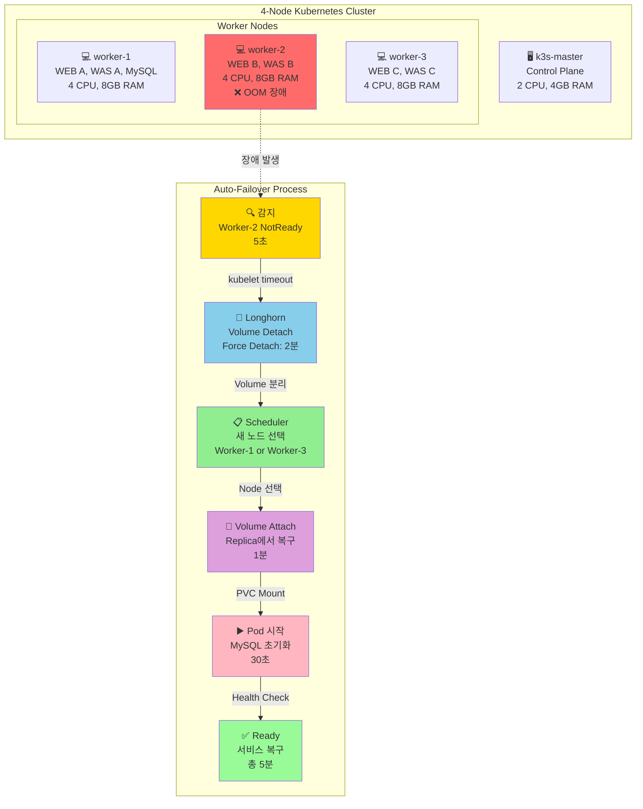

# Slide 12: High Availability & Failover

> **Node 장애 시 자동 복구 시나리오**

---

## Mermaid Diagram



---

## Failover 시나리오 비교

### Scenario 1: Stateless Pod 장애 (WEB, WAS)
```
WEB Pod 장애 (Worker-2)
├─ topologySpreadConstraints 사전 분산
├─ 다른 Worker의 Pod가 즉시 트래픽 처리
└─ 다운타임: 0초 ✅
```

**이유**:
- ✅ 미리 3개 Worker에 분산 배치
- ✅ 로드밸런서가 다른 Pod로 자동 라우팅

---

### Scenario 2: Stateful Pod 장애 (MySQL)
```
MySQL Pod 장애 (Worker-2)
├─ 15:23:45 - 장애 발생
├─ 15:23:50 - 감지 (5초)
├─ 15:24:00 - Volume Detach 시도
├─ 15:26:00 - Force Detach (2분 timeout)
├─ 15:26:30 - Worker-1에 Attach
├─ 15:27:00 - Pod 시작
└─ 15:28:30 - Ready (총 5분) ⚠️

다운타임: 5분
데이터 손실: 0 (Replica 3)
```

---

## Longhorn Auto-Failover 상세

### Replica 분산

```
MySQL Volume (10Gi)
├─ Replica-1: Worker-1 (Healthy) ✅
├─ Replica-2: Worker-2 (Failed) ❌
└─ Replica-3: Worker-3 (Healthy) ✅

→ 2/3 Replica 정상 = 데이터 손실 없음
```

### Failover 단계

| 단계 | 시간 | 설명 |
|------|------|------|
| **감지** | 5초 | kubelet timeout |
| **Detach** | 2분 | Force Detach (응답 없음) |
| **Attach** | 1분 | 새 Worker에 연결 |
| **Pod 시작** | 30초 | MySQL 초기화 |
| **Ready** | 30초 | Health Check |
| **합계** | **~5분** | RTO (Recovery Time Objective) |

---

## topologySpreadConstraints

### 설정

```yaml
spec:
  template:
    spec:
      topologySpreadConstraints:
      - maxSkew: 1
        topologyKey: kubernetes.io/hostname
        whenUnsatisfiable: ScheduleAnyway
        labelSelector:
          matchLabels:
            app: web
```

### 배치 결과

```
Worker-1: WEB-A, WAS-A, MySQL
Worker-2: WEB-B, WAS-B
Worker-3: WEB-C, WAS-C

→ 1개 Worker 장애 시에도 서비스 지속
```

---

## 실제 장애 복구 (2025-12-15)

### Timeline

```
15:23:45 - Worker-2 OOM 발생
15:23:50 - kubelet 응답 없음 (NotReady)
15:24:00 - Longhorn Detach 시도
15:26:00 - Force Detach 완료
15:26:30 - Worker-1에 Volume Attach
15:27:00 - MySQL Pod 시작
15:28:30 - Health Check 통과, Ready

총 소요 시간: 5분
사용자 영향: API 503 에러 (100%)
데이터 손실: 0 (Replica 동기화 완료)
```

### 교훈

✅ **성공**:
- Replica 3 덕분에 데이터 손실 0
- 완전 자동 복구 (수동 개입 없음)

⚠️ **개선 필요**:
- RTO 5분 → 2분 목표 미달
- Detach Timeout 2분 단축 필요
- Swap 활성화로 OOM 방지

---

## 개선 계획

### 단기 (완료)
- ✅ Swap 활성화 (2GB per Worker)
- ✅ topologySpreadConstraints 적용
- ✅ Longhorn staleReplicaTimeout: 30초

### 장기
- ⏳ MySQL Master-Slave (HA)
- ⏳ PodDisruptionBudget 설정
- ⏳ Node Auto-Repair

---

**핵심 메시지**: **Auto-Failover로 수동 개입 없이 5분 복구** (RTO 2분 목표)
